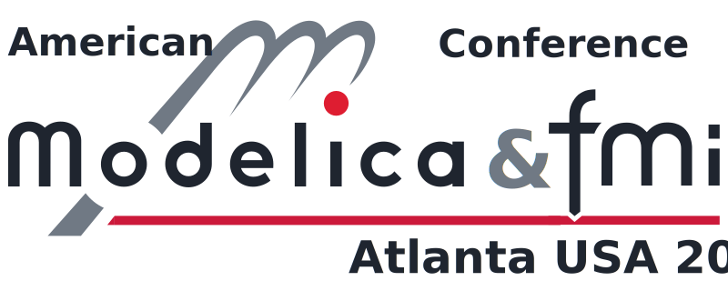
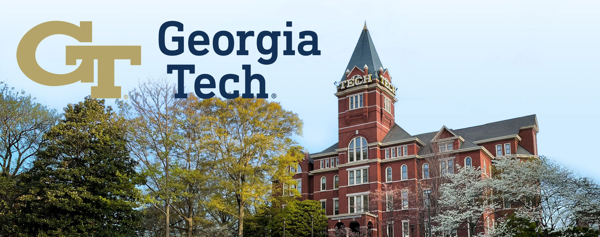
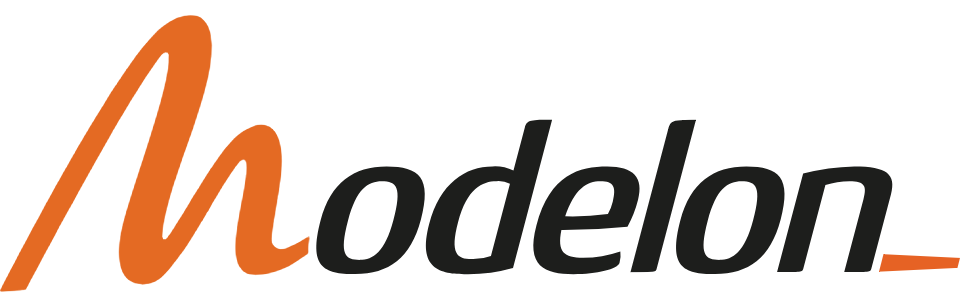
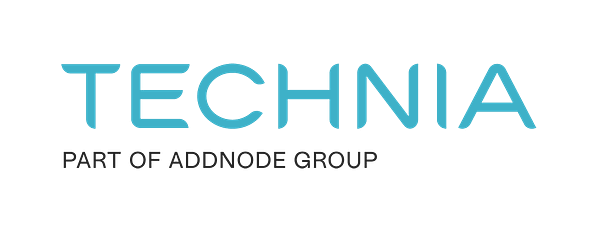
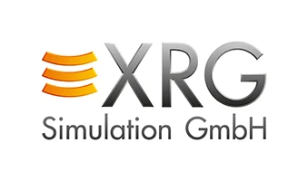
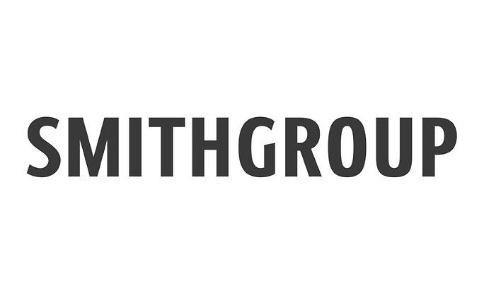
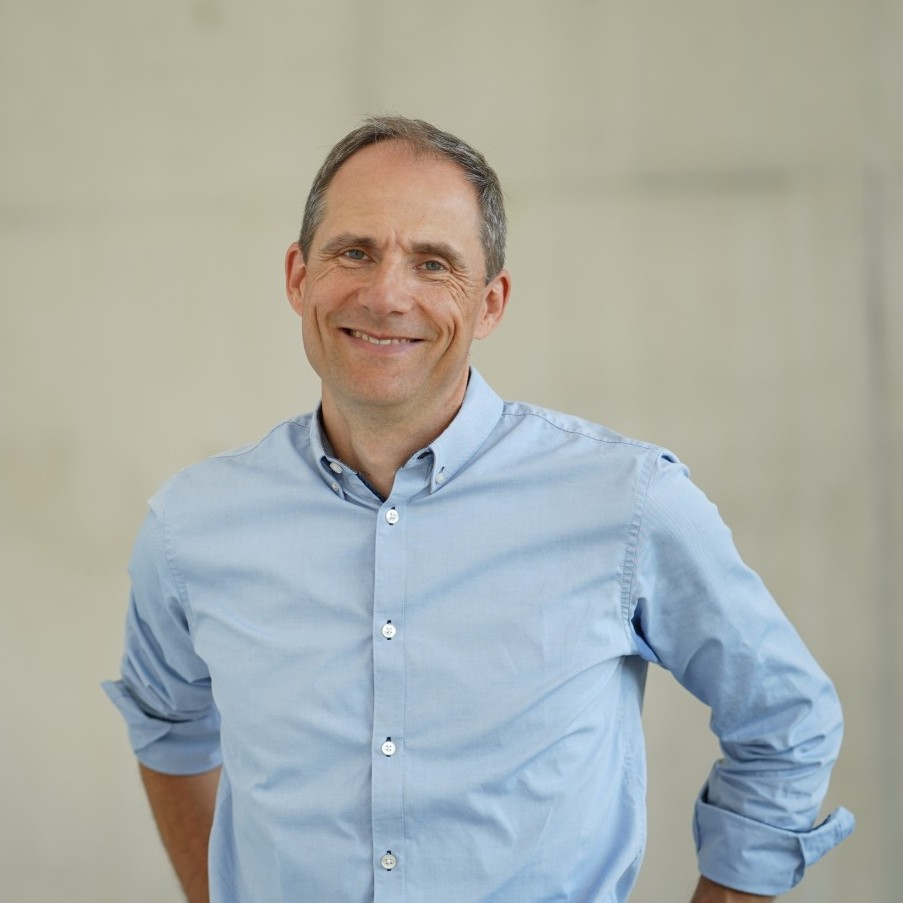
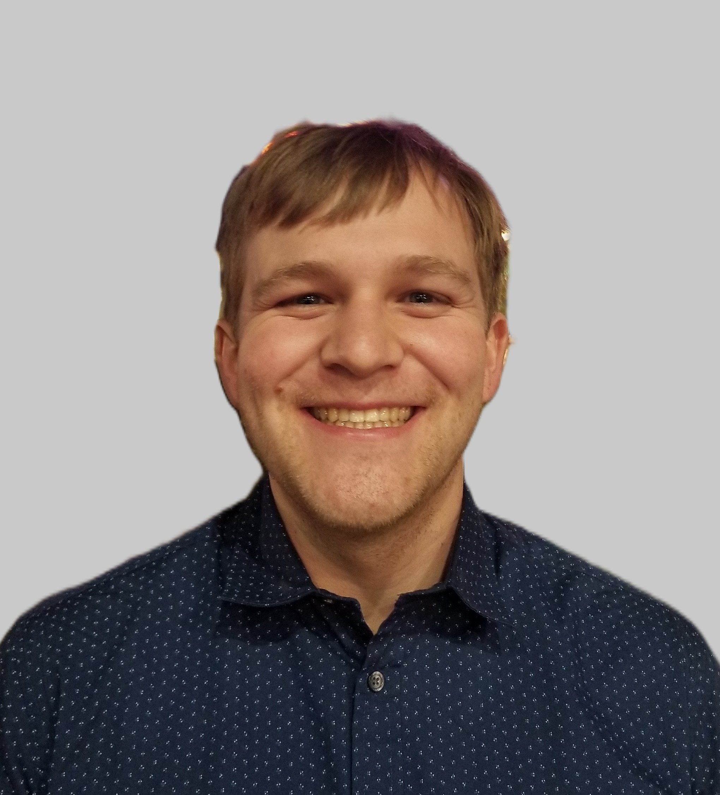


<picture>
  <source media="(prefers-color-scheme: light)" srcset="images/american-2026-logo-light.svg">
  <source media="(prefers-color-scheme: dark)" srcset="images/american-2026-logo-dark.svg">
  
</picture>


The **American Modelica & FMI Conference 2026** will be an in-person conference event. 
The conference will take place at the **Georgia Institute of Technology** in the [Aerospace Systems Design Laboratory](https://www.asdl.gatech.edu/) 
from **October 12–14, 2026**. It is organized by [NAMUG](https://namug.org/), the North American Modelica Users Group, 
in cooperation with the [Modelica Association](/association/). Join us in person in Atlanta!



## About the Conference

The Modelica & FMI Conference is the main event for users, library developers, tool vendors and language designers to share their knowledge and learn about the latest scientific and 
industrial progress related to [Modelica](/), [FMI](https://fmi-standard.org/), [SSP](https://ssp-standard.org/), [eFMI](http://efmi-standard.org/), [DCP](https://dcp-standard.org/)
and methods and tools for equation oriented languages. Please take a look at the [Call for Papers](cfp) if you are interested in submitting.

 1. The program will cover processes and tools for the modeling of complex physical and cyber-physical systems as applied to a wide range of research and industrial applications,
 and will have a new track in this conference that covers technical contributions from equation-oriented languages other than Modelica.  

 1. It is supported by many [Modelica and non-Modelica tools](https://modelica.org/tools/) and is the key to utilizing Modelica models in non-Modelica environments. 

For the 2026 conference we will include a new track on the structure and application of equation-oriented modeling languages other than Modelica into the program, 
since we see many similarities that will enrich a conversation centered on principles of equation-oriented modeling.  
We invite users of these other modeling languages to submit their technical publications to this conference, and hope 
that the broader scope will benefit the growth of equation-oriented modeling.   

In addition to paper presentations, the conference features several Modelica tutorials for beginners and advanced users, as well as user presentations, vendor sessions, and an exhibition.  
<!-- The previous [American Modelica conference in 2024](https://2022.american.conference.modelica.org/) was also streamed, giving many Modelicans in Europe the opportunity to watch presentations on the latest updates on Modelica-related research and innovation.  
In this version of the conference, we want to combine the ease of attendance by remote participants from other continents with the stimulating environment of an in person event with lively discussions in the breaks and an in-person conference dinner! 
Please note that **full paper presentations are required to be in person**, while industrial user presentations can be given remotely.-->

Workshops and Tutorials will be given on the afternoon of October 12th 2026, the keynotes, paper presentations and other parts of the program will be on October 13th and 14th. 

In building on the successes of the previous American Modelica conference, we are also happy to announce a Student Best Paper competition.  
Additional details are available in the [call for papers](cfp).

<!-- We are looking forward to seeing you in Dallas. As a first for a Modelica conference, we are planning to organize a **Modelica-oriented job fair** at the in-person event in Dallas that gives a unique opportunity for employers, students about to graduate, and Modelica practitioners to get to know each other. More details will be forthcoming at this site as the conference date comes closer.   -->

## Our Sponsors


<table>
    <tr>
        <td><b>Platinum</b></td>
        <td colspan="2" align="center"></td>
    </tr>
    <tr>
        <td><b>Gold</b></td>
        <td></td>
        <td></td>
    </tr>
    <tr>     
        <td><b>Gold</b></td>
        <td></td>
        <td></td>
    </tr>
    <tr>
        <td><b>Silver</b></td>
        <td  colspan="2" align="center"></td>
    </tr>
</table>


## Sponsorship opportunities

The American Modelica conference will be your opportunity to meet your customers again in a personal setting, at a great location. Please stay tuned for details about our sponsorship opportunities, we will post them here in the near future. 
Note that all sponsors will have the opportunity to exhibit at the conference, and that we don't offer a separate way to exhibit at the conference.  

The **American Modelica Conference 2026** relies heavily on sponsors to maintain the affordability of the ticket prices. If you are interested in sponsoring the conference, 
please check out the conditions at in our [call for sponsors](https://modelica.org/events/american2026/callforsponsors) and contact us as soon as possible at 
**[modelicaNA2026@groups.liu.se](mailto:modelicaNA2026@groups.liu.se)**. 

## Keynotes

### Pushing the Limits by Open Standards: Enabling Larger, Faster, and More Credible System Simulations





**Oliver Lenord**, Research and Development Engineer at Bosch Corporate Research, Project leader of OpenScaling project.

Scalability of virtual engineering has become an increasingly critical demand driven by the innovation pressure towards carbon neutral, energy-efficient and cost-effective solutions. 
Open standards like Modelica, FMI, eFMI and SSP play a major role in making system simulation accessible to a broad user base, fostering a rich ecosystem of research and technology deOvelopment across academia and industry.
The European publicly funded project OpenSCALING (Open Standards for SCALable Virual EngineerING) has further strengthened this ecosystem through standard enhancements and new methods, enabling simulation and credible processes to scale to the next level.
This talk will highlight key project achievements in the fields of:

 * Modelica compiler enhancements
 * Integration of scientific machine learning with Modelica
 * Uncertainty quantification and credible workflows
 

Reference to newly developed methods and standard enhancements are given including array-preserving compilation, pre-compiled components, and 
improved support of sensitivities in FMI. In addition the newly proposed layered standards ls-sa (for sensitivity analysis) and ls-uq (for uncertainty quantification) are briefly introduced.

Benchmarks and examples will illustrate these advances, demonstrating the ability to:

 * Increase maximum model size by orders of magnitude
 * Drastically reduce compile and simulation start-up times
 * Accelerate simulations by orders of magnitude using surrogate modeling and machine learning
 * Integrate and efficiently process Artificial Neural Networks within Modelica
 * Leverage FMI in diverse machine learning environments for robust model training
 * Enable traceable credibility workflows through standardized metadata in FMI and SSP
 * The practical relevance of these advances will be demonstrated referring to selected industrial use cases from different application domains.

Finally, an outlook will be given on the future potential of agentic AI for Modelica and the proposed Base Modelica language.

### Nuclear System Modeling for Integrated Energy Systems Analyses





**Dr. Daniel Mikkelson** is an integrated energy modeling and simulation engineer at Idaho National Laboratory. 

The HYBRID modeling repository has been developed to analyze the control, dispatch, and feedback of integrated energy systems that leverage nuclear power for thermal and electrical applications. 
As global priorities endorse nuclear energy, enabling rapid, open-source, dynamic evaluation of potential nuclear applications can enable faster development of integrated systems that will improve 
the utilization of nuclear energy in diverse applications for both brownfield and greenfield integrations. An overview of the nuclear approach to modeling and simulation will present areas where 
Modelica presents an ideal tool to investigate configuration viability in dynamic deployment scenarios.

## Scope of the Conference

[Modelica](/) is a freely available, equation-based, object-oriented language for convenient and efficient modeling of complex, multi-domain cyber-physical systems described by ordinary differential, difference and algebraic equations. The Modelica language and the companion Modelica Standard Library have been utilized in a variety of demanding industrial applications, including full vehicle dynamics, power systems, robotics, buildings and district energy systems, hardware-in-the-loop simulations and embedded control systems. The [Functional Mock-up Interface (FMI)](https://www.fmi-standard.org/) is an open standard for the tool-independent exchange of models and for co-simulation. It is supported by many [Modelica and non-Modelica tools](/tools/) and is the key to utilizing Modelica models in non-Modelica environments.

Development in the Modelica Association is organized in [Modelica Association Projects](/association/#modelica-association-projects):

- LANG - Modelica Language
- LIB - Modelica Libraries
- FMI - Functional Mock-up Interface
- eFMI - Functional Mock-up Interface for embedded systems
- SSP - System Structure and Parameterization of Components for Virtual System Design
- DCP - Distributed Co-Simulation Protocol

These projects collaborate to design and maintain a set of coordinated standards for modeling and simulation of complex physical systems.

The Modelica & FMI Conference will bring together people using Modelica and/or other Modelica Association standards for modeling, simulation, and control applications, 
such as Modelica language designers, tool vendors and library developers. The Modelica & FMI Conference provides Modelica users with the opportunity to stay informed about the latest 
language, library, and tool developments, and to get in touch with people working on similar modeling problems. The conference will cover topics such as the following:

 *	Multi-engineering modeling and simulation with Modelica or other equation-oriented modeling languages (mechanics, electrical, hydraulics, thermal, fluid, media, chemical, building, automotive, aircraft, …)
 *	Automotive applications
 *	Thermodynamic and energy systems applications
 *	Mechatronics and robotics applications
 *	Medicine and biology applications
 *	Other industrial applications, such as electric drives, power systems, aerospace, etc.
 *	Large-scale system modelling
 *	Real-time and hardware-in-the-loop simulation
 *	Simulation and code generation for embedded control systems
 *	Simulation acceleration by use of many CPU cores or GPU cores
 *	Applications of modeling techniques for optimization and optimal control
 *	Modeling, simulation and design tools
 *	Symbolic algorithms and numerical methods for model transformation and simulation
 *	Discrete modeling techniques − FEM, CFD, DEM (Discrete Element Method), …
 *	New features of the Modelica language and of FMI
 *	Experimental language designs and implementations
 *	Use of languages for teaching and education
 *	FMI applications and tools
 *	Applications and tools related to Modelica Association standards, including FMI, eFMI, SSP, and DCP

## Call for papers, user presentations and tutorials

Please see the [call for papers](cfp) for details about paper submissions, and the calls for [user presentations](cfp), both via [submission on Easychair](https://easychair.org/my/conference?conf=namugamc2026), tutorials, and vendor presentations. Please look at the [author instructions](authors) before submitting. The submission deadlines are as follows:  

- May 31, 2026 Submission of [full papers on Easychair](https://easychair.org/my/conference?conf=namugamc2026)
- June 15, 2026 Submission of extended abstracts for presentation-only contributions, [Extended Abstracts on Easychair](https://easychair.org/my/conference?conf=namugamc2026)
- June 15, 2026 Submission of [workshop and tutorial abstracts](https://docs.google.com/forms/d/e/1FAIpQLSelZCdRQzg8qHhTdjf_J39wCVQMR2H2WHQDR6GLfcur25gK7g/viewform?usp=header)
- July 20, 2026 Reviews for full paper submissions
- August 14, 2026 Notification of acceptance for papers and presentations 
- September 4th, 2026 Submission of final papers and one-page abstracts
- October 7th, 2026 Submission of final presentations

## Registration
Registration is now open on [Eventbrite](https://www.eventbrite.com/e/american-modelica-and-fmi-conference-2026-tickets-1982451921062?aff=oddtdtcreator) This site can also be used for registereing as sponsors by buying a sponsorship ticket. 

## Organization and Contact

The conference is organized by NAMUG in cooperation with the [Modelica Association](/).

**For general questions, please send an email to:** **[modelicaNA2026@groups.liu.se](mailto:modelicaNA2026@groups.liu.se)**

### Conference Board

  -  **Conference Co-Chair** Dr. Michael Tiller, Juliahub
  -  **Conference Co-Chair** Dr. Hubertus Tummescheit, Model Based Innovation LLC
  -  **Local Co-Chair** Prof. Dimitri Mavris, Georgia Institute of Technology 
  -  **Program Chair** Prof. Luigi Vanfretti, Rensselaer Polytechnic Insitute
  -  **Program Chair** Dr. Michael Wetter,Lawrence Berkeley National Laboratory
  -  **Conference Excecutive Coordinator** Dr. Christopher Laughman, Mitsubishi Electric Research Laboratories
  -  Behnam Afsharpoya, Dassault Systemes

