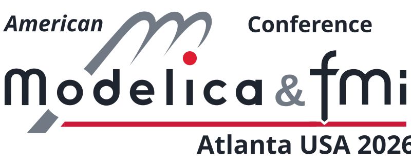
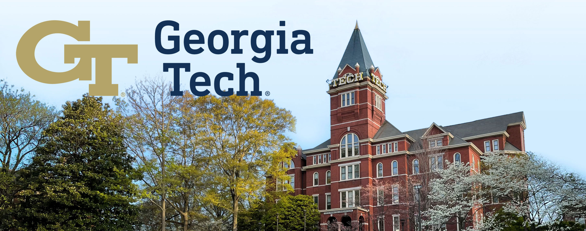
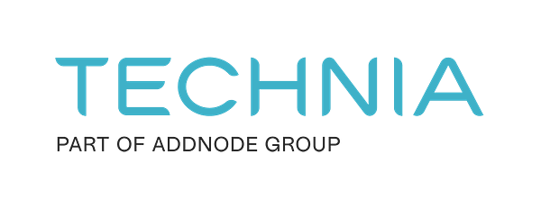
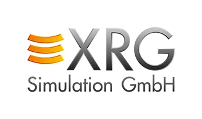
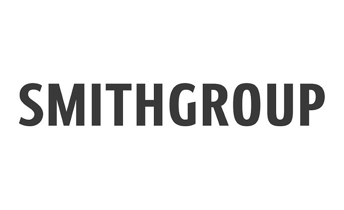
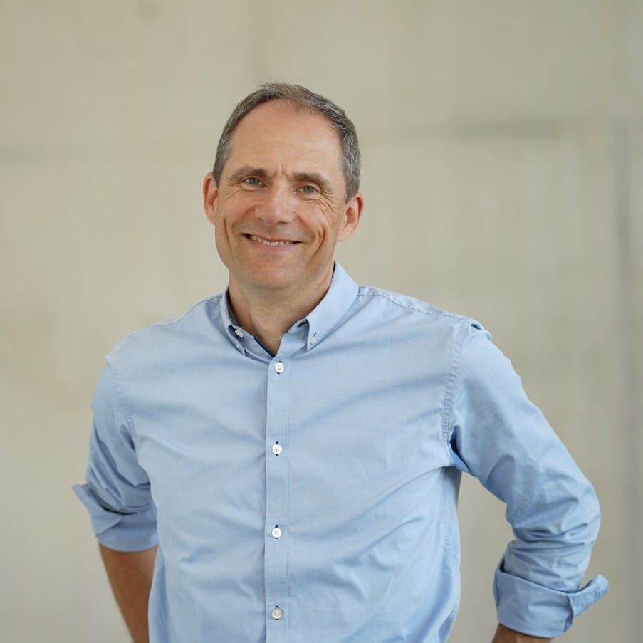
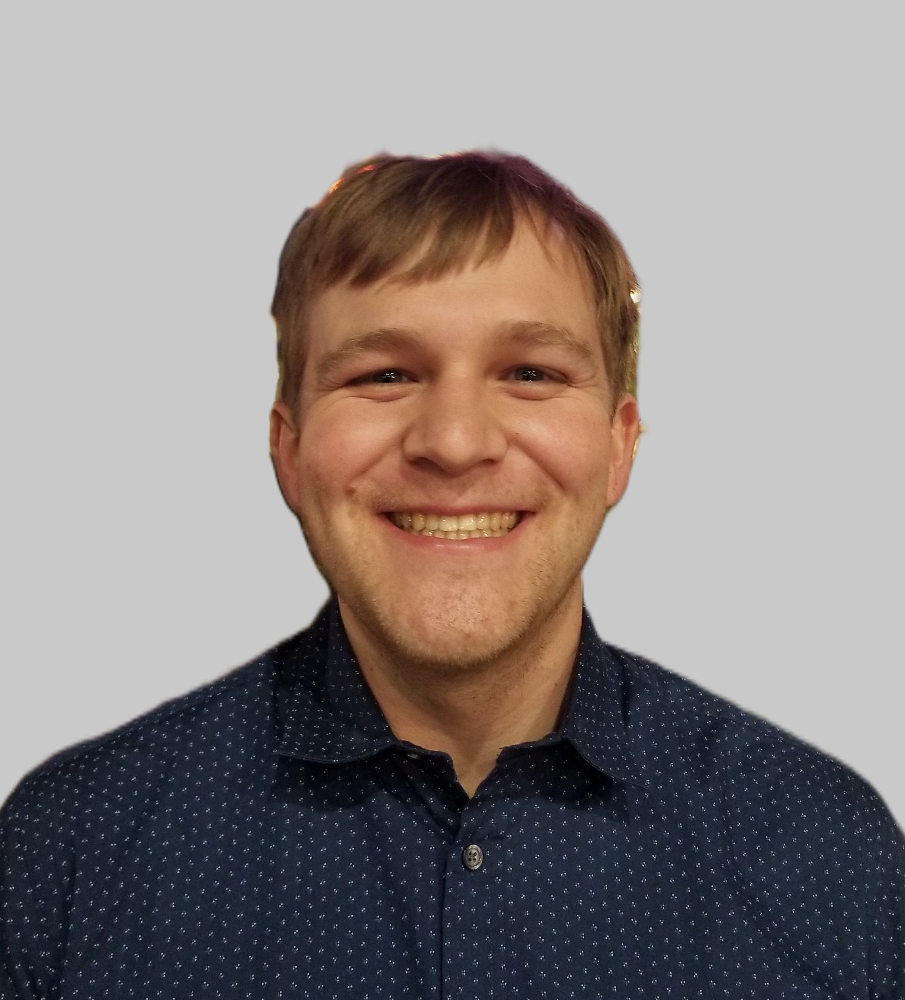


<picture>
  <source media="(prefers-color-scheme: light)" srcset="images/american-2026-logo-light.svg">
  <source media="(prefers-color-scheme: dark)" srcset="images/american-2026-logo-dark.svg">
  
</picture>


The **American Modelica & FMI Conference 2026** will be an in-person conference event. 
The conference will take place at the **Georgia Institute of Technology** in the [Aerospace Systems Design Laboratory](https://www.asdl.gatech.edu/) 
from **October 12–14, 2026**. It is organized by [NAMUG](https://namug.org/), the North American Modelica Users Group, 
in cooperation with the [Modelica Association](/association/). Join us in person in Atlanta!



## About the Conference

The Modelica & FMI Conference is the main event for users, library developers, tool vendors and language designers to share their knowledge and learn about the latest scientific and 
industrial progress related to [Modelica](/), [FMI](https://fmi-standard.org/), [SSP](https://ssp-standard.org/), [eFMI](http://efmi-standard.org/), [DCP](https://dcp-standard.org/)
and methods and tools for equation oriented languages. Please take a look at the [Call for Papers](cfp) if you are interested in submitting.

 1. The program will cover processes and tools for the modeling of complex physical and cyber-physical systems as applied to a wide range of research and industrial applications,
 and will have a new track in this conference that covers technical contributions from equation-oriented languages other than Modelica.  

 1. It is supported by many [Modelica and non-Modelica tools](https://modelica.org/tools/) and is the key to utilizing Modelica models in non-Modelica environments. 

For the 2026 conference we will include a new track on the structure and application of equation-oriented modeling languages other than Modelica into the program, 
since we see many similarities that will enrich a conversation centered on principles of equation-oriented modeling.  
We invite users of these other modeling languages to submit their technical publications to this conference, and hope 
that the broader scope will benefit the growth of equation-oriented modeling.   

In addition to paper presentations, the conference features several Modelica tutorials for beginners and advanced users, as well as user presentations, vendor sessions, and an exhibition.  
<!-- The previous [American Modelica conference in 2024](https://2022.american.conference.modelica.org/) was also streamed, giving many Modelicans in Europe the opportunity to watch presentations on the latest updates on Modelica-related research and innovation.  
In this version of the conference, we want to combine the ease of attendance by remote participants from other continents with the stimulating environment of an in person event with lively discussions in the breaks and an in-person conference dinner! 
Please note that **full paper presentations are required to be in person**, while industrial user presentations can be given remotely.-->

Workshops and Tutorials will be given on the afternoon of October 12th 2026, the keynotes, paper presentations and other parts of the program will be on October 13th and 14th. 

In building on the successes of the previous American Modelica conference, we are also happy to announce a Student Best Paper competition.  
Additional details are available in the [call for papers](cfp).

## Registration now open!
Registration is now open on [Eventbrite](https://www.eventbrite.com/e/american-modelica-and-fmi-conference-2026-tickets-1982451921062?aff=oddtdtcreator) This site can also be used for registereing as sponsors by buying a sponsorship ticket. If you plan to attend a workshop, please register also on [Eventbrite](https://www.eventbrite.com/e/american-modelica-and-fmi-conference-2026-tickets-1982451921062?aff=oddtdtcreator) for no more than 2 non-overlapping workshops that are not in parallel. Workshop attendance is free of charge, but we need to know attendance in order to assign the right sized rooms. 

## Schedule

### October 12

| Time | Room | Workshop |
| --- | --- | --- |
| **10:00-1:00** | ASDL Cove | Hands-On with Rumoca: Modelica Source, Simulation, and Algebraic Backends in VS Code |
| **10:00-1:00** | ASDL Code | Physics + AI in Practice: Accelerating Modelica Workflows with Modelon Impact |
| **10:00-1:00** | SSC | SMArtInt+ - Hands-on AI: Generation and Integration of Neural Networks and Surrogate Models into Modelica |
| **1:00-2:30** | — | Lunch |
| **2:30-5:30** | ASDL Cove | Agentic Modeling and Simulation with Julia/Dyad |
| **2:30-5:30** | ASDL Code | Modeling HVAC and Control Systems with the Modelica Buildings Library |
| **2:30-5:30** | SSC | Introduction to Object Oriented Modeling, Simulation, Debugging and Dynamic Optimization with Modelica using OpenModelica |

### October 13

| Time | Session |
| --- | --- |
| **8:00–8:30** | Arrival |
| **8:30-8:45** | Conference welcome |
| **8:45–9:45** | Vendor sessions |
| **9:45-10:00** | Break |
| **10:00-11:05** | Vendor sessions |
| **11:05–12:00** | Keynote 1: Oliver Lenord |
| **12:00–1:00** | Lunch |
| **1:00–2:40** | Paper Session 1: FMI / Building Systems |
| **2:45–3:15** | Coffee break |
| **3:15–4:30** | Paper Session 2: Emerging Tools 1 / Power Systems |
| **4:30–6:00** | Transit to Paschal's |

### October 14

| Time | Session |
| --- | --- |
| **8:15–8:50** | MA/FMI updates |
| **8:50–9:45** | Keynote 2: Daniel Mikkelson |
| **9:45–10:15** | Coffee break |
| **10:20–12:00** | Paper Session 3: Emerging Tools 2 / Automotive |
| **12:00–1:00** | Lunch |
| **1:00–2:15** | Paper Session 4: Data Centers / Novel Applications |
| **2:20–4:00** | Industrial Presentations 1 and 2 |
| **4:00–4:15** | Coffee break |
| **4:15–5:00** | Podium discussion |

### Detailed Sessions

#### Day 2

##### Paper Session 1A: FMI

Room: ASDL Cove  

**Towards an FMI Layered Standard for DAE—Applications for Simulation and Optimization** 
Elmir Nahodovic – Dassault Systèmes, Andreas Heuermann – Santa Anna IT Research Institute, Joel Andersson – FMIOPT AS, Adwait Verulkar – General Motors, Srikanth Sivaramakrishnan – General Motors, Masoud Najafi – Siemens, Linus Langenkamp – Bielefeld University of Applied Sciences and Arts, Christian Bertsch – Bosch Research, Erik Henningsson – Dassault Systèmes, Hans Olsson – Dassault Systèmes, Bernhard Bachmann

**From Gazebo to FMI: A Modelica-Based Cyber-Physical Simulation Architecture for Firmware-Integrated Robotic Vehicles** 
Minhyun Cho – Purdue University, Minjoon Lee – Purdue University, Micah Condie – Purdue University, Michael Rooney – Purdue University, Evan English – Purdue University, James Goppert – Purdue University, Arslan Khan – Penn State University, Dongyan Xu – Purdue University, Inseok Hwang – Purdue University

**Implementation of a High Fidelity Model of a Racecar into a Path Optimization Problem using Functional Mock-Up Units** 
Angel Zarate Villazon – Georgia Institute of Technology, Michael Balchanos – Georgia Institute of Technology, Dimitri Mavris – Georgia Institute of Technology

**Terminals in SSP** 
Dag Brück – Dassault Systèmes

##### Paper Session 1B: Building Systems

Room: ASDL Code  

**Modelica Buildings Requirements Library** 
David Blum – Lawrence Berkeley National Laboratory, Ettore Zanetti – Lawrence Berkeley National Laboratory, Michael Wetter – Lawrence Berkeley National Laboratory

**Towards Replicable Implementations of ASHRAE Guideline 36 for Waterside Economizers** 
Julia Ho – Penn State University, Cary Faulkner – Pacific Northwest National Laboratory, Wangda Zuo – Penn State University, National Laboratory of the Rockies

**A Unified Multi-Fidelity Modelica Library for Desiccant Wheel Simulation** 
Hang Guan – Texas A&M University, Mingzhe Liu – Texas A&M University, Zhiyao Yang – Texas A&M University, Zheng O'Neill – Texas A&M University

**A Templated Modelica Model for Decoupling Physical System and Control in Resilient Community Energy Systems** 
Juan Diego Flores Garcia – Penn State University, Tahiya Hossain – Penn State University, Viswanathan Ganesh – Penn State University, Wangda Zuo – Penn State University

##### Paper Session 2A: Emerging Tools 1

Room: ASDL Cove  

**Rumoca: Modelica as a Universal Algebraic Frontend via a Rust-Native Compiler** 
Micah Condie – Purdue University, Abigaile Woodbury – Purdue University, Thomas Meschede – Xyntopia LLC, Joel Andersson – FMIOPT AS, James Goppert – Purdue University

**Differentiable Parameter Optimization for DAEs with State-Dependent Events** 
Ion Matei – Fujitsu Research of America, Maksym Zhenirovsky – Fujitsu Research of America, Anthony Wong – Fujitsu Research of America

**ModelScript: Rethinking the Digital Thread with a Web-Native, Polyglot Compiler for Modelica, SysMLv2 & Beyond** 
Mohamad Omar Nachawati – Independent Researcher

##### Paper Session 2B: Power Systems

Room: ASDL Code  

**MMChvdcLibrary: Modeling Arm Average Value Modular Multilevel Converters in Modelica for Power System Simulation** 
Md Nazmul Hassan Chowdhury – Rensselaer Polytechnic Institute, Luigi Vanfretti – Rensselaer Polytechnic Institute

**Real-time simulation and CHiL testing of power system stabilizers on microcontrollers with Modelica and eFMI** 
Luigi Vanfretti – Rensselaer Polytechnic Institute, Christoff Bürger – Dassault Systèmes AB, Joseph Pizzimenti – Rensselaer Polytechnic Institute, Kyle Wilt – Rensselaer Polytechnic Institute, Hao Chang – Rensselaer Polytechnic Institute

**Deploying OpenIPSL Models into DIgSILENT PowerFactory via FMI Model Exchange** 
Hao Chang – Rensselaer Polytechnic Institute, Luigi Vanfretti – Rensselaer Polytechnic Institute

#### Day 3

##### Paper Session 3A: Emerging Tools 2

Room: ASDL Cove  

**Discontinuity-Aware Solvers for Vapor-Compression Cycles** 
Shreyas Ekanathan – University of Texas at Austin, Avinash Subramanian – JuliaHub, Inc., Oscar Smith – JuliaHub, Inc., Yingbo Ma – Independent researcher, Chris Rackauckas – JuliaHub, Inc., Christopher Laughman – Mitsubishi Electric Research Laboratories

**Toward Equation-Based Building Energy System Modeling in Julia: A Modular Prototype and Validation Study** 
Ruizhi Song – Texas A&M University, Mingzhe Liu – Texas A&M University, Zhiyao Yang – Texas A&M University, Zheng O'Neill – Texas A&M University

**Implementation of OpenIPSL in Dyad** 
John Batteh – JuliaHub, Inc., Luigi Vanfretti – Rensselaer Polytechnic Institute

##### Paper Session 3B: Automotive

Room: ASDL Code  

**A Single-Element Multi-Point Compliance for Rigid-Body Connections** 
Behzad Danaei – General Motors, Srikanth Sivaramakrishnan – General Motors

**A 2-DOF MultiBody Track Joint for Race Car Optimization** 
Srikanth Sivaramakrishnan – General Motors, Adwait Verulkar – General Motors, Behzad Danaei – General Motors, Ryan Trinter – General Motors

**A Singularity Avoiding Track Model for Race Car Optimization** 
Adwait Verulkar – General Motors, Behzad Danaei – General Motors, Srikanth Sivaramakrishnan – General Motors, Ryan Trinter – General Motors

**Five-Link Rear Suspension for F1: A Two-Stage Agentic AI Study with the Vehicle Dynamics Library** 
Rebecka Eldh – Modelon AB, Johan Andreasson – Modelon AB, Mathias Strandberg – Modelon AB

##### Paper Session 4A: Data Centers

Room: ASDL Cove  

**A Modelica-based Virtual Testbed for Hybrid-Cooled Data Centers** 
Hongjun Li – Pennsylvania State University, Viswanathan Ganesh – Pennsylvania State University, Wangda Zuo – Pennsylvania State University

**Integrated Microclimate Model in Modelica for Data Center Chiller Farms** 
Kaustubh Phalak – Jacobs, Pouya Javidmand – Trane, Zhanwei He – Trane, Gang Wang – Trane, Sean Guo – Trane

**Agent-Assisted Construction of Modelica System Models from Validated Components: A Data Center Cooling Case Study** 
Nithish Selvan – Modelon Engineering Private Limited, Johan Andreasson – Modelon AB, Pratyush Agarwal – Modelon AB

##### Paper Session 4B: Novel Applications

Room: ASDL Code  

**A Unified Dynamic System Testing Framework** 
Scott Greenwood – Oak Ridge National Laboratory

**Data-Driven Refinement of a Native Modelica Model Predictive Controller for Multi-Variable Gas Turbine Hydrogen Blending Control** 
James Harper – Electric Power Research Institute (EPRI), Paolo Pezzini – Electric Power Research Institute (EPRI)

**Quantum Algorithms for Patent Portfolio Analysis Using OpenModelica and IBM Qiskit** 
Mark Myers – McCormick, Paulding & Huber PLLC

##### Industrial Presentations 1

Room: ASDL Cove  

**A Free-Open-Source Modelica Simulation Package for Air Conditioning and Refrigeration Cycle (SPARC)** 
Chenjiyu Liang – Lawrence Berkeley National Laboratory, Donghun Kim – Lawrence Berkeley National Laboratory, Jiacheng Ma – Carrier Global Corporation

**A Novel Modular Framework for Unified Data Center Cooling Virtual Testbed** 
Viswanathan Ganesh – Pennsylvania State University, Hongjun Li – Pennsylvania State University, Michael Maloney – Pennsylvania State University, Wangda Zuo – Pennsylvania State University

**Rapid De-Risking and Sizing of GSHP Systems in Modelica** 
Victor Braciszewski – SmithGroup, Lone Meertens – KU Leuven, Lieve Helsen – KU Leuven

**De-Risking Energy System Integration through Platform-Based Design and Modelica** 
Michael Wetter – Lawrence Berkeley National Laboratory, Matthias Sulzer – Lawrence Berkeley National Laboratory

**A Workflow for Enabling Modelica Building and District Models for DRTS-Ready FMUs** 
Nicholas Long – National Laboratory of the Rockies, Brian Ball – National Laboratory of the Rockies, Andy Olson – National Laboratory of the Rockies, Nischal Guruwacharya – National Laboratory of the Rockies, Rebecca Barney – National Laboratory of the Rockies, Whitney Trainor Guitton – National Laboratory of the Rockies

##### Industrial Presentations 2

Room: ASDL Code  

**Real-Code Models for Electromagnetic Transient Simulations: Interoperability with Modelica** 
Luigi Vanfretti – Rensselaer Polytechnic Institute, Hao Chang – Rensselaer Polytechnic Institute

**Optimization of a Green Hydrogen Production Case Study Utilizing a Sigmoid Function** 
Nicholas Pilot – Electric Power Research Institute (EPRI), Garrett Doty – Electric Power Research Institute (EPRI), James Harper – Electric Power Research Institute (EPRI), Behrooz Motealleh – Electric Power Research Institute (EPRI), Paolo Pezzini – Electric Power Research Institute (EPRI)

**Simulating Renewable Load-Following Hydrogen Electrolysis Plant Controls** 
Garrett Doty – Electric Power Research Institute (EPRI), Nicholas Pilot – Electric Power Research Institute (EPRI), James Harper – Electric Power Research Institute (EPRI), Paolo Pezzini – Electric Power Research Institute (EPRI)

**Towards Collaborative and AI-Assisted Engineering Workflows with Modelica as a System-Level Backbone** 
Rodion Mamin – LunCo, Rina Faber – LunCo, Yan Barros – LunCo, Stefan Aleksa Djurdjevic – LunCo

## Our Sponsors


<table>
    <tr>
        <td><b>Platinum</b></td>
        <td colspan="2" align="center"></td>
    </tr>
    <tr>
        <td><b>Gold</b></td>
        <td></td>
        <td></td>
    </tr>
    <tr>     
        <td><b>Gold</b></td>
        <td></td>
        <td></td>
    </tr>
    <tr>
        <td><b>Silver</b></td>
        <td  colspan="2" align="center"></td>
    </tr>
</table>


## Sponsorship opportunities

The American Modelica conference will be your opportunity to meet your customers again in a personal setting, at a great location. Please stay tuned for details about our sponsorship opportunities, we will post them here in the near future. 
Note that all sponsors will have the opportunity to exhibit at the conference, and that we don't offer a separate way to exhibit at the conference.  

The **American Modelica Conference 2026** relies heavily on sponsors to maintain the affordability of the ticket prices. If you are interested in sponsoring the conference, 
please check out the conditions at in our [call for sponsors](https://modelica.org/events/american2026/callforsponsors) and contact us as soon as possible at 
**[modelicaNA2026@groups.liu.se](mailto:modelicaNA2026@groups.liu.se)**. 

## Keynotes

### Pushing the Limits by Open Standards: Enabling Larger, Faster, and More Credible System Simulations





**Oliver Lenord**, Research and Development Engineer at Bosch Corporate Research, Project leader of OpenScaling project.

Scalability of virtual engineering has become an increasingly critical demand driven by the innovation pressure towards carbon neutral, energy-efficient and cost-effective solutions. 
Open standards like Modelica, FMI, eFMI and SSP play a major role in making system simulation accessible to a broad user base, fostering a rich ecosystem of research and technology deOvelopment across academia and industry.
The European publicly funded project OpenSCALING (Open Standards for SCALable Virual EngineerING) has further strengthened this ecosystem through standard enhancements and new methods, enabling simulation and credible processes to scale to the next level.
This talk will highlight key project achievements in the fields of:

 * Modelica compiler enhancements
 * Integration of scientific machine learning with Modelica
 * Uncertainty quantification and credible workflows
 

Reference to newly developed methods and standard enhancements are given including array-preserving compilation, pre-compiled components, and 
improved support of sensitivities in FMI. In addition the newly proposed layered standards ls-sa (for sensitivity analysis) and ls-uq (for uncertainty quantification) are briefly introduced.

Benchmarks and examples will illustrate these advances, demonstrating the ability to:

 * Increase maximum model size by orders of magnitude
 * Drastically reduce compile and simulation start-up times
 * Accelerate simulations by orders of magnitude using surrogate modeling and machine learning
 * Integrate and efficiently process Artificial Neural Networks within Modelica
 * Leverage FMI in diverse machine learning environments for robust model training
 * Enable traceable credibility workflows through standardized metadata in FMI and SSP
 * The practical relevance of these advances will be demonstrated referring to selected industrial use cases from different application domains.

Finally, an outlook will be given on the future potential of agentic AI for Modelica and the proposed Base Modelica language.

### Nuclear System Modeling for Integrated Energy Systems Analyses





**Dr. Daniel Mikkelson** is an integrated energy modeling and simulation engineer at Idaho National Laboratory. 

The HYBRID modeling repository has been developed to analyze the control, dispatch, and feedback of integrated energy systems that leverage nuclear power for thermal and electrical applications. 
As global priorities endorse nuclear energy, enabling rapid, open-source, dynamic evaluation of potential nuclear applications can enable faster development of integrated systems that will improve 
the utilization of nuclear energy in diverse applications for both brownfield and greenfield integrations. An overview of the nuclear approach to modeling and simulation will present areas where 
Modelica presents an ideal tool to investigate configuration viability in dynamic deployment scenarios.

## Workshops

The workshops below are offered free of charge to all Conference attendees. Workshop registration on [Eventbrite](https://www.eventbrite.com/e/american-modelica-and-fmi-conference-2026-tickets-1982451921062?aff=oddtdtcreator) is now open. All workshops will be on Monday, October 12 2026, starting at 10:00am, in order to allow East-Coast travellers to arrive in time for the workshops when traveling in the morning.

| Title | Duration |
| --- | --- |
| Introduction to Object Oriented Modeling, Simulation, Debugging and Dynamic Optimization with Modelica using OpenModelica | 3h-4h with breaks included. |
| Agentic Modeling and Simulation with Julia/Dyad | 4 hours |
| Modeling HVAC and Control Systems with the Modelica Buildings Library | 3-4 hours |
| Hands-On with Rumoca: Modelica Source, Simulation, and Algebraic Backends in VS Code | 2 hours |
| Physics + AI in Practice: Accelerating Modelica Workflows with Modelon Impact | 3 hours |
| SMArtInt+ - Hands-on AI: Generation and Integration of Neural Networks and Surrogate Models into Modelica | 3 hours |

### Introduction to Object Oriented Modeling, Simulation, Debugging and Dynamic Optimization with Modelica using OpenModelica

This tutorial gives an introduction to the Modelica language, the OpenModelica environment, and an overview of modeling and simulation in a number of application areas. Some advanced features of OpenModelica will be presented, including debugging, profiling, clocked synchronous support, real-time embedded code generation, OMPython, OMJulia, FMI export, etc. A number of hands-on exercises will be done during the tutorial, both graphical modeling using the Modelica Standard Library (MSL) and textual modeling. Bring your laptop for exercises.

**Presenters:** Adrian Pop (Linköping University) – online, Luigi Vanfretti (Rensselaer Polytechnic Institute) – on site

### Agentic Modeling and Simulation with Julia/Dyad

In this workshop, we will present the latest information about Dyad, our platform for modeling and simulation. We will leverage the Dyad agent so participants can hit the ground running and explore all that the Dyad platform has to offer.

Included in the presentation will be how to build graphical models from within VS Code. Discussions about best practices for using Dyad. Demonstrating how the Dyad agent flattens the learning curve and how it extends not just to modeling and simulation but assisting users with fully leveraging the incredible Julia ecosystem as well.

Participants should come prepared with some tasks to give the agent so they can see how much progress they can make in a short amount of time.

**Presenter:** Michael Tiller (JuliaHub)

### Modeling HVAC and Control Systems with the Modelica Buildings Library

This workshop introduces modeling for HVAC and control systems for buildings, districts, and data centers using the Modelica Buildings Library. While focused on these applications, the course is structured to benefit modelers of any thermo-fluid system. Following an overview of the library's scope, we will cover best practices for model configuration and troubleshooting. Through hands-on exercises, participants will develop simple HVAC system models, connect them to thermal loads, and implement feedback control. The instructors will demonstrate using OpenModelica, though participants are welcome to use Modelon Impact or Dassault Systemes' Dymola.

**Presenters:** Michael Wetter (LBNL), David Blum (LBNL), Ettore Zanetti (LBNL)

### Hands-On with Rumoca: Modelica Source, Simulation, and Algebraic Backends in VS Code

This two-hour hands-on tutorial introduces Rumoca, an open-source, Rust-native Modelica compiler, and its VS Code development environment. Participants will follow a guided workflow from Modelica source through editing, diagnostics, compilation, simulation, visualization, and export to algebraic and numerical backends.

Using curated example models, attendees will edit code, inspect diagnostics, run simulations, view results in the editor, and, where applicable, interact with an editable 3D view. From the same model, they will generate backend artifacts for CasADi, SymPy, JAX, and FMI-oriented workflows, then load representative outputs into Python or Jupyter to inspect equations and evaluate generated functions.

The tutorial demonstrates a modern Modelica workflow in which one model serves as a reusable algebraic specification for simulation, optimization, automatic differentiation, machine learning, and model exchange. No prior Rumoca experience is required; basic Modelica, VS Code, and Python familiarity is helpful.

**Presenters:** James Goppert and Micah Condie (Purdue University)

### Physics + AI in Practice: Accelerating Modelica Workflows with Modelon Impact

AI assistants are becoming common in engineering software, but their value depends on whether they can support the physics-based work engineers actually need to do. In this hands-on workshop, participants will explore how AI-assisted development in Modelon Impact can help reduce workflow friction while keeping engineers in control of the modeling, simulation, and validation process.

Using Modelon Impact, we will build and analyze an industry-relevant system model, progressing from component selection and model assembly through simulation setup, troubleshooting, and interpretation of results. Along the way, participants will see how the AI assistant supports common engineering tasks: surfacing relevant documentation, guiding model development, helping configure experiments, diagnosing errors and logs, and making results easier to understand.

The session will also provide a practical introduction to Modelon Impact's cloud-based workflows and validated, robust Modelica library content. Participants will leave with a clearer understanding of what "Physics + AI" means in practice: AI that accelerates modeling work while preserving the transparency, reusability, and trust expected from physics-based simulation.

**Presenters:** Mathias Strandberg (Product Manager, Modelon), Pratyush Agarwal (Solutions Engineer, Modelon)

### SMArtInt+ - Hands-on AI: Generation and Integration of Neural Networks and Surrogate Models into Modelica

There is an increasing need for hybrid models consisting of physical and machine-learning or surrogate model parts. XRG has developed the SMArtInt+ Library, that enables the easy generation and integration of neural networks from different sources and types. This tutorial provides a hands-on introduction to the use of this library, which also includes a Python toolbox. The main use case is the creation and integration of a transient surrogate model for a thermodynamic application.

The tutorial focuses on the generation and utilization of training data, as well as the definition and training of neural network architectures, with the objective of developing high-performance surrogate models. Participants will be introduced to different concepts and approaches for creating data-driven surrogate models and will gain an understanding of the underlying methodologies and best practices.

A central part of the tutorial is the integration of the trained neural networks and surrogate models into Modelica models using the SMArtInt+ Interface-Blocks, allowing seamless substitution of physical components with learned surrogates. Additionally, several concepts of hybrid modeling that combine physical and data-driven approaches are introduced, with a strong focus on the practical integration of trained neural networks and surrogate models within the Modelica environment.

Finally, model performance is evaluated through comparisons with the original physical model.

Expected experience of participants: basic knowledge of neural networks/AI and Python required, and basic Modelica knowledge.

Software requirements: Windows 10 or 11, Dymola 2026 Refresh 1 or OpenModelica 1.26 (backup), and a Python IDE (PyCharm preferred).

More information: [xrg-simulation.com/en/seiten/smartint](https://xrg-simulation.com/en/seiten/smartint)

**Presenter:** Tim Hanke, XRG Simulation GmbH

<!-- We are looking forward to seeing you in Dallas. As a first for a Modelica conference, we are planning to organize a **Modelica-oriented job fair** at the in-person event in Dallas that gives a unique opportunity for employers, students about to graduate, and Modelica practitioners to get to know each other. More details will be forthcoming at this site as the conference date comes closer.   -->

## Scope of the Conference

[Modelica](/) is a freely available, equation-based, object-oriented language for convenient and efficient modeling of complex, multi-domain cyber-physical systems described by ordinary differential, difference and algebraic equations. The Modelica language and the companion Modelica Standard Library have been utilized in a variety of demanding industrial applications, including full vehicle dynamics, power systems, robotics, buildings and district energy systems, hardware-in-the-loop simulations and embedded control systems. The [Functional Mock-up Interface (FMI)](https://www.fmi-standard.org/) is an open standard for the tool-independent exchange of models and for co-simulation. It is supported by many [Modelica and non-Modelica tools](/tools/) and is the key to utilizing Modelica models in non-Modelica environments.

Development in the Modelica Association is organized in [Modelica Association Projects](/association/#modelica-association-projects):

- LANG - Modelica Language
- LIB - Modelica Libraries
- FMI - Functional Mock-up Interface
- eFMI - Functional Mock-up Interface for embedded systems
- SSP - System Structure and Parameterization of Components for Virtual System Design
- DCP - Distributed Co-Simulation Protocol

These projects collaborate to design and maintain a set of coordinated standards for modeling and simulation of complex physical systems.

The Modelica & FMI Conference will bring together people using Modelica and/or other Modelica Association standards for modeling, simulation, and control applications, 
such as Modelica language designers, tool vendors and library developers. The Modelica & FMI Conference provides Modelica users with the opportunity to stay informed about the latest 
language, library, and tool developments, and to get in touch with people working on similar modeling problems. The conference will cover topics such as the following:

 *	Multi-engineering modeling and simulation with Modelica or other equation-oriented modeling languages (mechanics, electrical, hydraulics, thermal, fluid, media, chemical, building, automotive, aircraft, …)
 *	Automotive applications
 *	Thermodynamic and energy systems applications
 *	Mechatronics and robotics applications
 *	Medicine and biology applications
 *	Other industrial applications, such as electric drives, power systems, aerospace, etc.
 *	Large-scale system modelling
 *	Real-time and hardware-in-the-loop simulation
 *	Simulation and code generation for embedded control systems
 *	Simulation acceleration by use of many CPU cores or GPU cores
 *	Applications of modeling techniques for optimization and optimal control
 *	Modeling, simulation and design tools
 *	Symbolic algorithms and numerical methods for model transformation and simulation
 *	Discrete modeling techniques − FEM, CFD, DEM (Discrete Element Method), …
 *	New features of the Modelica language and of FMI
 *	Experimental language designs and implementations
 *	Use of languages for teaching and education
 *	FMI applications and tools
 *	Applications and tools related to Modelica Association standards, including FMI, eFMI, SSP, and DCP

## Call for papers, user presentations and tutorials

Please see the [call for papers](cfp) for details about paper submissions, and the calls for [user presentations](cfp), both via [submission on Easychair](https://easychair.org/my/conference?conf=namugamc2026), tutorials, and vendor presentations. Please look at the [author instructions](authors) before submitting. The submission deadlines are as follows:  

- May 31, 2026 Submission of [full papers on Easychair](https://easychair.org/my/conference?conf=namugamc2026)
- June 15, 2026 Submission of extended abstracts for presentation-only contributions, [Extended Abstracts on Easychair](https://easychair.org/my/conference?conf=namugamc2026)
- June 15, 2026 Submission of [workshop and tutorial abstracts](https://docs.google.com/forms/d/e/1FAIpQLSelZCdRQzg8qHhTdjf_J39wCVQMR2H2WHQDR6GLfcur25gK7g/viewform?usp=header)
- July 20, 2026 Reviews for full paper submissions
- August 14, 2026 Notification of acceptance for papers and presentations 
- September 4th, 2026 Submission of final papers and one-page abstracts
- October 7th, 2026 Submission of final presentations

## Organization and Contact

The conference is organized by NAMUG in cooperation with the [Modelica Association](/).

**For general questions, please send an email to:** **[modelicaNA2026@groups.liu.se](mailto:modelicaNA2026@groups.liu.se)**

### Conference Board

  -  **Conference Co-Chair** Dr. Michael Tiller, Juliahub
  -  **Conference Co-Chair** Dr. Hubertus Tummescheit, Model Based Innovation LLC
  -  **Local Co-Chair** Prof. Dimitri Mavris, Georgia Institute of Technology 
  -  **Program Chair** Prof. Luigi Vanfretti, Rensselaer Polytechnic Insitute
  -  **Program Chair** Dr. Michael Wetter,Lawrence Berkeley National Laboratory
  -  **Conference Excecutive Coordinator** Dr. Christopher Laughman, Mitsubishi Electric Research Laboratories
  -  Behnam Afsharpoya, Dassault Systemes

