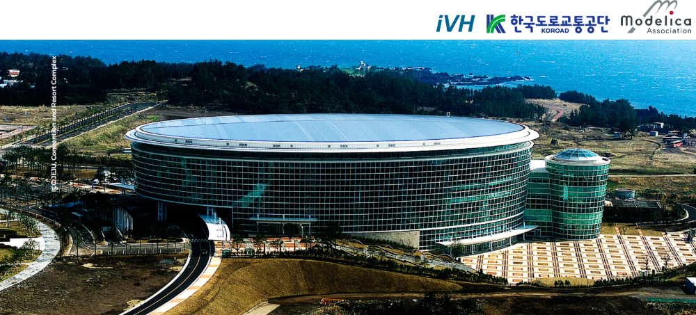

# Asian Modelica Conference 2024

The **Asian Modelica Conference 2024** will be an in-person conference event. The conference will take place at the **ICC Hotel in Jeju - Island** in South Korea from **December 12–13, 2024**. It is organized by [iVH](http://www.ivh.co.kr/) in cooperation with the [Modelica Association](https://modelica.org/association/). Join us in person in Jeju - Island at [ICC](http://www.iccjeju.co.kr/)).

## About the Conference

The Modelica Conference is the main event for users, library developers, tool vendors and language designers to share their knowledge and learn about the latest scientific and industrial progress related to [Modelica](/), [FMI](https://fmi-standard.org/), [SSP](https://ssp-standard.org/), [eFMI](http://efmi-standard.org/) and [DCP](https://dcp-standard.org/).
The program will cover processes and tools for the modeling of complex physical and cyber-physical systems as applied to a wide range of research and industrial applications.

In addition to paper presentations, the conference features several Modelica tutorials for beginners and advanced users, as well as industrial user presentations, vendor sessions, and an exhibition.  

By streaming the presentation, we will be able to share what we are researching in Asian with Modelicans on other continents. Additionally, technology sharing and networking among Modelicans will be possible through breaks, discussions, and dinner. Please note that full paper presentations are **required to be in person.**
We hope many of you will attend.

**Registration is now open** on [Eventbrite](https://www.eventbrite.com/o/modelica-association-ivh-89743647663)

<!-- We are looking forward to seeing you in Dallas. As a first for a Modelica conference, we are planning to organize a **Modelica-oriented job fair** at the in-person event in Dallas that gives a unique opportunity for employers, students about to graduate, and Modelica practitioners to get to know each other. More details will be forthcoming at this site as the conference date comes closer.   -->

## Our Sponsors

The **Asian Modelica Conference 2024** relies heavily on sponsors to maintain the affordability of the ticket prices. If you are interested in sponsoring the conference please contact us as soon as possible at **[ivh@ivh.co.kr](mailto:ivh@ivh.co.kr)** 

<!-- Please visit our [Sponsor page](https://2022.american.conference.modelica.org/Sponsors.html), and also take the time to check out the sponsor exhibition at the conference. -->

## Scope of the Conference

[Modelica](/) is a freely available, equation-based, object-oriented language for convenient and efficient modeling of complex, multi-domain cyber-physical systems described by ordinary differential, difference and algebraic equations. The Modelica language and the companion Modelica Standard Library have been utilized in a variety of demanding industrial applications, including full vehicle dynamics, power systems, robotics, buildings and district energy systems, hardware-in-the-loop simulations and embedded control systems. The [Functional Mock-up Interface (FMI)](https://www.fmi-standard.org/) is an open standard for the tool-independent exchange of models and for co-simulation. It is supported by many [Modelica and non-Modelica tools](/tools/) and is the key to utilizing Modelica models in non-Modelica environments.

Development in the Modelica Association is organized in [Modelica Association Projects](/association/#modelica-association-projects):

- LANG - Modelica Language
- LIB - Modelica Libraries
- FMI - Functional Mock-up Interface
- eFMI - Functional Mock-up Interface for embedded systems
- SSP - System Structure and Parameterization of Components for Virtual System Design
- DCP - Distributed Co-Simulation Protocol

These projects collaborate to design and maintain a set of coordinated standards for modeling and simulation of complex physical systems.

The Modelica conference will bring together people using Modelica and/or other Modelica Association standards for modeling, simulation, and control applications, such as Modelica language designers, tool vendors and library developers. The Modelica Conference provides Modelica users with the opportunity to stay informed about the latest language, library, and tool developments, and to get in touch with people working on similar modeling problems. The conference will cover topics such as the following:
- Multi-engineering modeling and simulation with free and commercial Modelica libraries (mechanics, electrical, hydraulics, thermal, fluid, media, chemical, building, automotive, aircraft, ...)
- Automotive applications
- Thermodynamic and energy systems applications
- Mechatronics and robotics applications
- Medicine and biology applications
- Other industrial applications, such as electric drives, power systems, aerospace, etc.
- Large-scale system modeling
- Real-time and hardware-in-the-loop simulation
- Simulation and code generation for embedded control systems
- Simulation acceleration by use of many CPU cores or GPU cores
- Applications of Modelica for optimization and optimal control
- Modelica modeling, simulation and design tools
- Symbolic algorithms and numerical methods for model transformation and simulation
- Discrete modeling techniques − FEM, CFD, DEM (Discrete Element Method), ...
- New features of the Modelica language and of FMI
- Experimental language designs and implementations related to Modelica
- Modelica in other application areas (mathematical programming, databases etc.)
- Modelica for teaching and education
- FMI in Modelica and non-Modelica applications and tools

## Call for papers, user presentations and tutorials

Please see the [call for papers](call2024) for details about paper submissions, and the calls for [industrial user presentations](call2024), tutorials, and vendor presentations. Please look at the [author instructions](authors) before submitting. The submission deadlines are as follows:  

- August 1, 2024 Submission of full papers
- October 5th, 2024 Submission of extended full papers
-	September 1, 2024 Submission of extended abstracts for presentation-only contributions, workshops and tutorials
-	October 1, 2024 Notification of acceptance for papers and presentations
-	October 30th, 2024 Notification of acceptance for papers and presentations
-	November 15th, 2024 Submission of final papers.
-	November 25th, 2024 Submission of final presentations

## Sponsorship opportunities

The Asian Modelica conference will be your opportunity to meet your customers again in a personal setting, at a great location. Please stay tuned for details about our sponsorship opportunities, we will post them here in the near future. Note that all sponsors will have the opportunity to exhibit at the conference, and that we don't offer a separate way to exhibit at the conference.  

## Organization and Contact

The conference is organized by [iVH](http://www.ivh.co.kr/) in cooperation with the [Modelica Association](https://modelica.org/association/).

**For general questions, please send an email to:** **[ivh@ivh.co.kr](mailto:ivh@ivh.co.kr)** 

### Conference Board

- Research Fellow YongHa Han, HMC, Korea
- Dr. Daeoh Kang, iVH, Korea
- Dr. Rui Gao, RIGO TECH Co., Ltd, Japan
- Dr. Beomsub Kim, HyunDai AutoEver
- Professor Hwang Sung-Ho, SungkyunGwan University, Korea
- Professor Woongchul Choi, Kookmin University, Korea
- Dr. Martin Otter, DLR, Germany
- Prof. Dr. Martin Sjölund, Linköping University, Sweden
- Dr. Hubertus Tummescheit, Modelon Inc, West Hartford, USA

