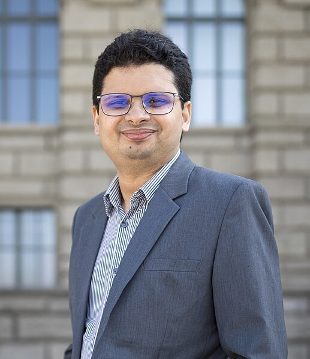
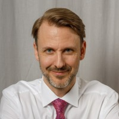



<table>
  <thead>
      <tr>
          <th style="text-align: left"></th>
          <th style="text-align: center"></th>
          <th style="text-align: right"></th>
      </tr>
  </thead>
  <tbody>
      <tr>
          <td style="text-align: left"> <h1>The 16th International   Modelica & FMI Conference</h1> 
</td>
          <td style="text-align: center">   </td>
          <td style="text-align: right">  
</td>
      </tr>
  </tbody>
</table>
  

We are glad to announce the **16th International Modelica & FMI Conference**. It will take place at the marvelous city of **Lucerne in Switzerland from September 8-10, 2025**. It is organized by [HSLU](https://www.hslu.ch/en/), the University of Applied Sciences and Arts Lucerne, in cooperation with the [Modelica Association](/association/). This is the first visit of this conference series in Switzerland. 

## About the Conference

The International Modelica & FMI Conference is the main event for users, library developers, tool vendors and language designers to share their knowledge and learn about the latest scientific and industrial progress related to [Modelica](/), [FMI](https://fmi-standard.org/), [SSP](https://ssp-standard.org/), [eFMI](http://efmi-standard.org/) and [DCP](https://dcp-standard.org/).
The program will cover processes and tools for the modeling of complex physical and cyber-physical systems as applied to a wide range of research and industrial applications. 

In addition to paper presentations, the conference features several Modelica tutorials for beginners and advanced users, as well as industrial user presentations, vendor sessions, and an exhibition. 

## [Call for Sponsors](callforsponsors25)

The **International Modelica & FMI Conference** relies heavily on sponsors to maintain the affordability of the ticket prices. As a sponsor you are also given the opportunity to exhibit at the conference site. If you are interested in sponsoring the conference, please check out the conditions at in our [call for sponsors](callforsponsors25). 

<!-- 
<table>
    <tr>
        <td><b>Platinum</b></td>
        <td colspan="2" align="center"></td>
    </tr>
    <tr>
        <td><b>Gold</b></td>
        <td></td>
        <td></td>
    </tr>
    <tr>     
        <td><b>Gold</b></td>
        <td></td>
        <td></td>
    </tr>
    <tr>
        <td><b>Silver</b></td>
        <td  colspan="2" align="center"></td>
    </tr>
</table>
 -->

## Important Dates

| Date | |
| --- | --- |
|January 6, 2025 |Call for papers |
|April 17, 2025 |Deadline for submissions|
|June 1, 2025 | Deadline for Workshops and Tutorials, and Vendor Presentations|
|June 1, 2025 | Deadline for Industrial User Presentation submissions|
|June 16, 2025|Notification of acceptance for papers and presentations|
|June 30, 2025|Deadline for early registration|
|August 1, 2025|Submission of final papers, presentations, and one-page abstracts|
|September 8-10, 2025| 16th International Modelica & FMI Conference|

## Keynote Speakers 
<!-- and Presentation Titles, and the titles of their presentations:  -->
We are proud to announce our keynote speakers: 

Tuesday, September 9th: 

|     |     |
| :-: | :----- |
|     |**Mishra Siddhartha,** Professor and Deputy Head of the Seminar for Applied Mathematics at ETH Zürich|
<!-- | | **Coupling of AI / Physics-Informed Neural Networks (PINNs) with System Models**|  -->

 Wednesday, September 10th: 
|     |     |
| :-: | :----- |
|     | **Johan R Åkesson,** Associate Director for Computational Engineering at Carrier, Former CTO Modelon AB  |
<!-- | | **The Future of Modeling and Simulation – An Industrial Perspective** | -->

## Registration and Accommodation

**Registration is now open at [Eventfrog](https://eventfrog.ch/en/p/fairs/congress-conference/the-16th-international-modelica-fmi-conference-7297164051792011009.html)**. Please register soon to make planning easy for us. Early Bird tickets will be available until June 30th. The conference registration is offered at the following conditions.

| Registration | Valid | incl. Dinner | Early-Price | Price |
|--------------|--------------|--------------|--------------|--------------|
| Standard | Mon-Wed | yes | 750 CHF | 900 CHF|
| PhD | Mon-Wed | no | 400 CHF | 500 CHF|
| Student | Mon-Wed | no | 200 CHF | 250 CHF|
| Industrial User Presentation | only Tuesday | no | 200 CHF | 250 CHF|
| Dinner | Dinner | yes | 150 CHF | 150 CHF|

The conference will take place at the Rotkreuz campus of Lucerne University of Applied Sciences and Arts, which can be reached in as little as 13 minutes by train from Lucerne railroad station. We recommend taking the train to the campus, as the campus is located directly at Rotkreuz station. The university cannot provide parking spaces in Rotkreuz. There are parking spaces in the vicinity of the campus whose availability and prices are not subject to the university. 

Under the following [link](https://regis.buchertravel.ch/event/International_Modelica_Conference2025), conference participants will find a limited contingent of hotels in Lucerne and Rotkreuz at discounted rates. Please use the search window to view all available hotels and prices. We would like to point out that Lucerne offers significantly more tourist attractions than Rotkreuz. However, Lucerne is in high season during the conference, so accommodation costs may be higher. Cheaper alternatives can be found, for example, in youth hostels in the city of Lucerne, Airbnbs, or hotels in the vicinity of Lucerne and Rotkreuz with good rail connections.

## Scope of the Conference

[Modelica](/) is a freely available, equation-based, object-oriented language for convenient and efficient modeling of complex, multi-domain cyber-physical systems described by ordinary differential, difference and algebraic equations. The Modelica language and the companion Modelica Standard Library have been utilized in a variety of demanding industrial applications, including full vehicle dynamics, power systems, robotics, buildings and district energy systems, hardware-in-the-loop simulations and embedded control systems. The [Functional Mock-up Interface (FMI)](https://www.fmi-standard.org/) is an open standard for the tool-independent exchange of models and for co-simulation. It is supported by many [Modelica and non-Modelica tools](/tools/) and is the key to utilizing Modelica models in non-Modelica environments.

Development in the Modelica Association is organized in [Modelica Association Projects](/association/#modelica-association-projects):

- LANG - Modelica Language
- LIB - Modelica Libraries
- FMI - Functional Mock-up Interface
- eFMI - Functional Mock-up Interface for embedded systems
- SSP - System Structure and Parameterization of Components for Virtual System Design
- DCP - Distributed Co-Simulation Protocol

These projects collaborate to design and maintain a set of coordinated standards for modeling and simulation of complex physical systems.

The Modelica & FMI conference will bring together people using Modelica and/or other Modelica Association standards for modeling, simulation, and control applications, such as Modelica language designers, tool vendors and library developers. The Modelica Conference provides Modelica users with the opportunity to stay informed about the latest language, library, and tool developments, and to get in touch with people working on similar modeling problems. The conference will cover topics such as the following:

 -	Multi-engineering modeling and simulation with free or commercial Modelica libraries 
 -	Library Award for new Open-Source Modelica Libraries. 
 -	Applications and new tool developments for the Functional Mock-up Interface (FMI) and Layered Standards (LS)
 -	Applications and new tool developments for the System Structure and Parameterization (SSP) standard
 -	Applications and new tool developments for the FMI for embedded Systems (eFMI) standard 
 -	System Simulation as an integrative part of Model-based Systems Engineering (MBSE) 
 -	Machine Learning and AI in system simulation 
 -	Automotive applications
 -	Applications in thermodynamic, energy systems  and building physics
 -	Mechatronics and robotics applications
 -	Medicine and biology applications
 -	Maritime and offshore applications
 -	Other industrial applications, such as electric drives, power systems, aerospace, etc.
 -	Large-scale system modeling and simulation code generation for parallel computing architectures
 -	Real-time and hardware-in-the-loop applications; Code generation for embedded control systems 
 -	Use of Artificial Intelligence (AI) methods in simulation; SimToReal for AI training purposes
 -	Applications of Modelica and FMI for optimization and control design
 -	Modelica modeling, simulation and design tools
 -	Symbolic algorithms and numerical methods for model transformation and simulation
 -	Experimental language designs and implementations related to Modelica standards
 -	Modelica in other application areas (mathematical programming, databases etc.)
 -	Modelica for teaching and education

## [Call for papers, user presentations and tutorials](call2025)

<!-- The call for papers and further information will go out in January 2025.  -->

 Please see the [call for papers](call2025) for details about paper submissions, and the calls for [industrial user presentations](call2025), tutorials, and vendor presentations. Please look at the [author instructions](authors) before submitting. 
 You can also [download the Call for papers](Callforpapers-2025-01-06.pdf) and post it in your organization. Paper submission is open on [EasyChair](https://easychair.org/my/conference?conf=16imoc).
 <!--The submission deadlines are as follows:   -->
<!-- 
- June 15, 2024 Submission of full papers
- June 1, 2024 Submission of extended abstracts for presentation-only contributions, [workshops and tutorials]
(https://docs.google.com/forms/d/e/1FAIpQLScsRLAe-YwK7yAQoW6B5KQQ87M_SU4dgj6eKnvpjG3h53HMGw/viewform) 
- August 10, 2024 Notification of acceptance for papers and presentations
- August 30th, 2024 Submission of final papers and one-page abstracts
- October 7th, 2024 Submission of final presentations
- May 1th, 2025 Submission of full papers
- ?, 2025 Submission of extended abstracts for presentation-only contributions
- June 16th, 2025 Notification of acceptance for papers and presentations
- August 15th, 2025 Submission of final papers and one-page abstracts
- ?, 2025 Submission of final presentations  -->

<!-- ## Sponsorship opportunities

The American Modelica conference will be your opportunity to meet your customers again in a personal setting, at a great location. Please stay tuned for details about our sponsorship opportunities, we will post them here in the near future. Note that all sponsors will have the opportunity to exhibit at the conference, and that we don't offer a separate way to exhibit at the conference.   -->

## Organization and Contact

The conference is organized by Prof. Ulf Christian Müller from [HSLU](https://www.hslu.ch/en/), the University of Applied Sciences and Arts Lucerne in cooperation with the [Modelica Association](/association/)

**For general questions, please send an email to:** **[modelica25@modelica.org ](mailto:modelica25@modelica.org )**

### Conference Board

  - **Conference Co-Chair:** Prof. Dr. Ulf Christian Müller, University of Applied Sciences and Arts Lucerne
  - **Conference Co-Chair:** Dr. Dirk Zimmer, German Aerospace Center
  - **Board Member:** Prof. Francesco Casella, Politecnico di Milano
  - **Board Member:** Prof. Lars Mikelsons, University of Augsburg
  - **Board Member:** Dipl.-Math. Christian Bertsch, Robert Bosch GmbH
  - **Board Member:** Dr. Hubertus Tummescheit
  - **Board Member:** Dr. Rui Gao, RIGO TECH Co. Ltd.

  <!-- -  **Conference Co-Chair** Dr. Hubertus Tummescheit, Modelon ?
  -  **Conference Co-Chair** Dr. Rui Gao, RIGO TECH
  -  **Conference Co-Chair** Dr. Francesco Casella, Politecnico di Milano ?
  -  **Conference Co-Chair** Prof. Dr. Lars Mikelsons, Augsburg University ?
  -  **Conference Co-Chair** Dr. Martin Schüler,  ? -->

  <!-- -  **Conference Co-Chair** Dr. Michael Tiller, Juliahub
  -  **Local Co-Chair** Prof. George Bollas, University of Connecticut
  -  **Program Chair** Prof. Luigi Vanfretti, Rensselaer Polytechnic Insitute
  -  **Program Chair** Dr. Michael Wetter,Lawrence Berkeley National Laboratory
  -  **Conference Excecutive Coordinator** Dr. Christopher Laughman, Mitsubishi Electric Research Laboratories
  -  Behnam Afsharpoya, Dassault Systemes -->

