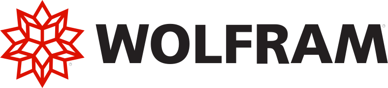





# The 16th International Modelica & FMI Conference

We are glad to announce the **16th International Modelica & FMI Conference**.
It will take place at the marvelous city of **Lucerne in Switzerland from September 8-10, 2025**.
It is organized by [HSLU](https://www.hslu.ch/en/), the University of Applied Sciences and Arts Lucerne, in cooperation with the [Modelica Association](/association/).
This is the first visit of this conference series in Switzerland.

**Important news:** Due to many, many requests, we have **extended the paper submission deadline to May 2.**
Please note that the EasyChair paper submission system enables updates even after the initial submission and early submissions hence help us organizing the reivew process. 



## Sponsors

[Become a sponsor](#call-for-sponsors) of the 16th International Modelica & FMI Conference!

### Platinum



  

    

      
    

  



### Gold



  

    

      
    

  



### Silver



  

    

      
    

  

  

    

      
    

  

  

    

      
    

  

  

    

      
    

  



## About the Conference

The International Modelica & FMI Conference is the main event for users, library developers, tool vendors and language designers to share their knowledge and learn about the latest scientific and industrial progress related to [Modelica](/), [FMI](https://fmi-standard.org/), [SSP](https://ssp-standard.org/), [eFMI](http://efmi-standard.org/) and [DCP](https://dcp-standard.org/).
The program will cover processes and tools for the modeling of complex physical and cyber-physical systems as applied to a wide range of research and industrial applications. 

In addition to paper presentations, the conference features several Modelica tutorials for beginners and advanced users, as well as industrial user presentations, vendor sessions, and an exhibition. 

## Agenda

The agenda is preliminary.

### Monday, September 8

|       |          |
|-------|----------|
| 11:30 | Arrival / Reception |
|       | Welcome Speech  |
|       | Tutorials - Part 1 |
| 13:30 | Coffee Break with Poster Presentations |
|       | Tutorials - Part 2 |
|       | Modelica & FMI Vendor Presentations  |
| 18:45 | Welcome Reception |

### Tuesday, September 9

|       |          |
|-------|----------|
|  9:00 | [Keynote: Prof. Mishra Siddhartha](#physics-informed-ai-tuesday-september-9th) |
|       | Coffee Break with Poster Presentations |
|       | Modelica & FMI News |
|       | Technical Sessions |
| 12:00 | Lunch |
|       | Technical Sessions |
|       | Industrial User Presentations |
|       | Coffee Break with Poster Presentations |
| 16:00 | Panel discussion on the value of open standards |
|       | Transfer to Lucerne is individual by Train (Boarding at KKL) |
| 18:00 | Boat-Cruise-Dinner |

### Wednesday, September 10

|       |          |
|-------|----------|
|  8:30 | [Keynote: Dr. Johan R Åkesson](#opportunities-and-challenges-in-design-and-operation-of-integrated-energy-systems-wednesday-september-10th) |
|       | Technical Sessions |
|       | Coffee Break with Poster Presentations |
|       | Technical Sessions |
| 12:40 | Lunch |
|       | Technical Sessions |
|       | Closing and Rewards |
| 16:00 | Coffee To Go |

## Call for Papers

You are encouraged to submit a full paper of at least 4 pages, with a maximum of 10 pages, on the following topics:

- Multi-engineering modeling and simulation with free or commercial Modelica libraries 
- Library Award for new Open-Source Modelica Libraries. 
- Applications and new tool developments for the Functional Mock-up Interface (FMI) and Layered Standards (LS)
- Applications and new tool developments for the System Structure and Parameterization (SSP) standard
- Applications and new tool developments for the FMI for embedded Systems (eFMI) standard 
- System Simulation as an integrative part of Model-based Systems Engineering (MBSE) 
- Machine Learning and AI in system simulation 
- Automotive applications
- Applications in thermodynamic, energy systems  and building physics
- Mechatronics and robotics applications
- Medicine and biology applications
- Maritime and offshore applications
- Other industrial applications, such as electric drives, power systems, aerospace, etc.
- Large-scale system modeling and simulation code generation for parallel computing architectures
- Real-time and hardware-in-the-loop applications; Code generation for embedded control systems 
- Use of Artificial Intelligence (AI) methods in simulation; SimToReal for AI training purposes
- Applications of Modelica and FMI for optimization and control design
- Modelica modeling, simulation and design tools
- Symbolic algorithms and numerical methods for model transformation and simulation
- Experimental language designs and implementations related to Modelica standards
- Modelica in other application areas (mathematical programming, databases etc.)
- Modelica for teaching and education

 Please see the  [Authors' Guide](#authors-guide) for further information. You can also [download the Call for papers](Callforpapers-2025-01-06.pdf) and post it in your organization. The submission of your paper will be handled through the EasyChair Conference Management System. Paper submission is open on [EasyChair](https://easychair.org/my/conference?conf=16imoc). Authors of papers that are not selected for presentation in the main conference sessions will have the opportunity to present their work as posters.

| Date |  |
| --- | --- |
|January 6, 2025 |Call for papers |
|~~April 17~~ **May 2, 2025** | **Deadline for paper submissions** |
|June 1, 2025 | Deadline for Workshops and Tutorials, and Vendor Presentations|
|June 1, 2025 | Deadline for Industrial User Presentation submissions|
|~~June 16~~ June 23,  2025|Notification of acceptance for papers and presentations|
|~~June 30~~ July 7, 2025|Deadline for early registration|
|August 1, 2025|Submission of final papers, presentations, and one-page abstracts|
|September 8-10, 2025| 16th International Modelica & FMI Conference|

Please note that the indicated deadline extension is final. Futhermore the EasyChair submission system enables to update your paper during the submission time. Uploading a draft early may help us organizing the reviews in time. 

If you plan to submit directly for a poster, then submit a (short) paper with a corresponding remark.

The conference proceedings will be published by the Modelica Association on its website and by  [Linköping University Electronic Press](http://www.ep.liu.se/).
Each paper will be individually referenced by a DOI. For selected papers we aim to enable a post-conference journal publication in [MCMDS](https://www.tandfonline.com/toc/nmcm20/current).

## Call for Industrial User Presentations

You are encouraged to submit an  **extended abstract**  of 1-2 pages, related to one of the existing or possibly new [Modelica Association Projects](https://modelica.org/community/projects/):

- [LANG](/language/) - Modelica Language
- [LIB](/libraries/) - Modelica Libraries
- [FMI](https://fmi-standard.org/) - Functional Mock-up Interface 
- [eFMI](https://efmi-standard.org/) - Functional Mock-up Interface for embedded systems
- [SSP](https://ssp-standard.org/) - System Structure and Parameterization of Components for Virtual System Design
- [DCP](https://dcp-standard.org/) - Distributed Co-Simulation Protocol

Please submit your abstract using the [EasyChair Conference Management System](https://easychair.org/my/conference?conf=16imoc) by **June 1st, 2025**. Please note, this link only works properly if you 1) Have an account on Easychair and 2) are logged into the account when you click the link.

Industrial user presentations are an excellent way to present recent results to the Modelica community with less effort and overhead than a full paper submission. Please indicate whether you plan to give your presentation on-site or remotely in the submission form. These industrial user presentations differ from paper presentations, which we expect to be in-person. These abstracts will be peer-reviewed by experts, but no corresponding papers will be published in the conference proceedings.

Please note that purely tool-related presentations are not permitted for these application-oriented presentations, and should instead be covered by vendor presentations. For more details on vendor presentations, please refer to the [call for sponsors](#call-for-sponsors).

## Call for Tutorials
At the Modelica Conference, several tutorials will be held in parallel. Each tutorial will last approximately 3-4 hours and will include a "hands-on experience" session (participants are expected to bring their own laptops; the presenter will provide the necessary tools).

If you're interested in hosting a tutorial, please send the required information listed below to [modelica25@modelica.org ](mailto:modelica25@modelica.org). The application deadline is **June 1st, 2025**. As only a limited number of tutorials can be held in parallel, we encourage early submission and application.

Please include the following details in your submission:
1. Title of the tutorial
2. Suggested duration of the tutorial  
3. Presenter(s) name(s) and affiliation(s)  
4. Abstract (around 200 Words)
5. Expected experience of participants  
6. Software requirements  
7. Link to further information

Please note that tutorials must involve hands-on activities and cannot be limited to commercial presentations or demonstrations. For product presentations, please refer to the Vendor Presentations section in the [call for sponsors](../callforsponsors25). The acceptance of tutorials will be based on the relevance to Modelica/FMI content and the timing of the application.

## Call for Libraries

You are encouraged to submit a free Modelica application library in Modelica source code form. The library should be sent to the program chair ([modelica25@modelica.org ](mailto:modelica25@modelica.org)) and provided under the [3-clause BSD License for the Modelica Association](https://modelica.org/licenses/modelica-3-clause-bsd). Please submit also a corresponding paper to the conference. If the paper gets accepted, you can present your library at the conference. Awards will be given to the best libraries. The exact number of awards and the amounts are still to be determined.

Libraries are evaluated according to the following criteria:

- How useful is the library for the Modelica community, especially for industrial applications?
- Basic design principle of the library (e.g. physical components are modeled in a declarative way and there are no un-physical restrictions how components can be connected together).
- Completeness and extent of the library (small or large library, examples).
- Usage of the library (component documentation, users guide, parameter menus, etc.)
- Accepted libraries will be included on the conference stick and linked from the Modelica web site.

## Call for Sponsors

The 16th International Conference will be the first in Switzerland, which hosts a very interesting market for modeling and simulation tools. In recent years, the Swiss economy has re-focused on its production and engineering sector, which is highly specialized and export-oriented. Whereas many European states shrank their industrial production in the last decade, Switzerland maintained [healthy growth](https://www.focus-economics.com/country-indicator/switzerland/industry/) in this important metric. Its economy is one of the [freest world-wide](https://www.heritage.org/index/pages/country-pages/switzerland), and almost 99% of all enterprises represent SMEs, reflecting the specialized nature of its industry. Classic system modeling and simulation have now become increasingly important for many of these SMEs. 

We are very glad that the Lucerne School of Engineering and Architecture took the initiative and provides us with a formidable venue right in the heart of Switzerland at the [Campus-Rotkreuz](https://www.hslu.ch/en/lucerne-school-of-information-technology/campus/). The venue is very well suited for exhibitors, since the exhibition rooms are aligned with the natural commute of the conference participants. Modelica conferences always had a healthy mixture of academia and industry among its participants. To further foster industry participation, we plan dedicated Industrial user sessions free of academic hurdles. 

### Sponsoring Options

We offer exhibition and sponsoring in 4 different options (prices without 8.1%-VAT).

| Option | Price CHF | No. of free registrations |
|--------------|--------------|--------------|
| Platinum | 12500 | 3 - each with a value of 900 CHF |
| Gold | 10000 | 2 - each with a value of 900 CHF| 
| Silver | 5000 | 1 - with a value of 900 CHF| 
| Bronze | 3000 | 0 | 

The number of spaces available for each option is limited, with a sponsoring deadline in mid-July or until all spots are filled. The exhibition spaces range from 8 to 20 m². Higher-level sponsors may choose their exhibition space first in order to secure a larger stand area. Depending on the option, the logos of the sponsoring partners will be positioned more prominently on the conference website and in the conference program. The [virtual 3D tour](https://dock.hslu.ch/rundgang/index.html?startscene=i) will give you a comprehensive impression of the venue. 

We hope to have sparked your interest and are looking forward to a personal conversation to discuss the best sponsorship option for your organization. Take a look at the further information section or feel free to reach out to Dr. Müller (contact below) with any questions or special requests. It would be our pleasure to welcome you as a partner at the 16th International Modelica Conference.

### Further Information

- [Sponsorship Options Overview](SponsoringDetails_16thModelicaFMI_EN20250218.pdf)
- [Conference Ground Floor Plan (Includes Exhibition)](GroundFloor_CampusRotkreuz_20250206.pdf)

### Sponsoring Agreements

*Ready to become a sponsor? We look forward to partnering with you!*
Download the Sponsorship Agreement of your preferred option. Add your company name, address, and representative (name and function) in the Sponsor header. In the Signature section, include place, date, name, function, and signature. Send the signed contract to Prof. Dr. Müller (see below).
[Annex 1: Fundraising Reglement (German Only)](2024FundraisingReglementderHSLUFoundation.pdf)

- [Platinum](Platinum_Sponsorship_agreement_HSLU.pdf)
- [Gold](Gold_Sponsorship_agreement_HSLU.pdf)
- [Silver](Silver_Sponsorship_agreement_HSLU.pdf)
- [Bronze](Bronze_Sponsorship_agreement_HSLU.pdf)

### Vendor Presentations

As stated in the sponsoring agreement, time slots for sponsoring/vendor presentations are reserved for Platinum and Gold sponsors, while Silver sponsors may receive a slot based on availability. Presentations are reviewed by the Conference Board to ensure they align with Modelica, FMI, and related standards (including tools, libraries, IDEs, and other supporting technologies).

Sponsors eligible for a presentation slot can submit their proposals to modelica25@modelica.org.

### Contact

Sponsoring contracts are signed directly with the local organization of the conference, headed by Prof. Dr. Ulf Christian Müller. 

[Head of Research Group System Modeling, Digital Twins at HSLU T&A, IME](https://www.hslu.ch/en/lucerne-school-of-engineering-architecture/about-us/organization/competence-centres-and-research-groups/engineering-and-technology/fluidmechanik-hydromaschinen/dynamische-stroemungs-und-prozesssimulationen/digital-twins/)   
**Prof. Dr. Ulf Christian Müller**   
ulfchristian.mueller@hslu.ch  
Phone: +41 41 349 39 53   

Technikumstrasse 21  
6048 Horw  
Switzerland  

The Modelica Association appreciates your support and will help you in your preparations for the conference. 

## Authors' guide

### Submission process

As in most previous Modelica conferences, the [EasyChair](https://easychair.org/conferences/submission_new?a=34399586) Conference Management System is used.
Please note, this link only works properly if you 1) Have an account on Easychair and 2) are logged into the account when you click the link. If you don't already have an easychair account, you first have to create one [here](https://easychair.org/account2/create).
Make sure that you use an email address for registering that remains valid until the conference. Please choose wether your submission is going to be a full, peer-reviewed paper, or an industrial user presentation.
Industrial user presentations require only an abstract and a presentation, and will be reviewed by the conference board.
Authors of accepted papers and user presentations will have to submit a **signed Copyright License** [(Word document)](CopyrightLicense2025.docx) or [(PDF)](CopyrightLicense2025.pdf) to EasyChair.

### Preparation of full papers and Extended Abstracts for Industrial User Presentations

The template has been updated for the 2021 conference, so do not use older versions of the template. Note that a nearly finished **draft paper** is the expected minimum for the submission deadline, papers with only an abstract, or only promised results, will be rejected. 
Please use the [LaTeX template](https://github.com/modelica-association/conference-templates/tree/master/LaTeX) for the creation of full papers.
There is also a [Word template](https://github.com/modelica-association/conference-templates/tree/master/MSWord) that is based on the LaTeX template.
The Word template contains some wording specific to LaTeX packages; when drafting a document in Word, please make the contents look similar to what the LaTeX templates produce.
For draft paper submissions, you may also use other templates (but include an extra page at the end stating you will use the correct template for the final submission).

Please make sure that your submission has been created according to the [Modelica Formatting Guidelines](#formatting-guidelines).

For the final submission, there will also be the possibility to submit Modelica example model files that correspond to your publication. These files will then be attached to your paper in the Modelica Association copy of the proceedings (but not the LiU e-press copy to which  the DOI points).

### Preparation of Industrial User Presentations. 

There are no specific templates for industrial user presentations. The presentations follow the same guidelines as for full papers.

### Technical equipment for presentations

Papers must be presented during the conference in person. Papers that are not presented will be retracted. Presentations will probably be 20 minutes long with an additional 5 minutes for questions.

### Industrial User Presentations instead of Poster Session

Papers that are not accepted for a full paper presentation may still qualify for an industrial user presentation, it it is industrially relevant content by end-users, but **not vendors**, if the content is interesting, but not qualifies for a rigorously reviewed paper. We will let authors know of that possibility at the time of the paper acceptance.   

### Formatting Guidelines

Guidelines for the formatting of Modelica Conference Papers

**Please note the maximum acceptable length of full papers is 10 pages.**
**It can be exceptionally extended up to 15 pages upon request to the Program Chair.**

The formatting guidelines for the Modelica Conference papers are listed here.

- **File format**: The final paper should be sent in Adobe PDF. Please embed all fonts in your final paper to avoid problems.
- **Language**: The paper has to be written in English.
- **Page format and margins**: Please use A4-size paper. Margins are left and right 1.8 cm, top and bottom 2.5 cm Justify text at the left and right margins.

Paper layout should be 2 column. If you use the [paper templates](https://github.com/modelica-association/conference-templates) without changing margins or paper format, they should be correct.

Detailed formatting instructions are included in the [paper templates](https://github.com/modelica-association/conference-templates). The following is just a summary.

- Page numbers and header/footer: Do not use any page numbers, headings, or footer lines, as these will automatically be added when preparing the conference proceedings. However, footers from references in the text (not footer lines) are allowed.
- Typeface: For the main text of your paper, use 10.5 pt Times New Roman, Times Roman type or the nearest equivalent font. Do not use any other fonts in your document except Courier or Courier New for verbatim code. Verbatim code in Courier font in separate paragraphs should be 9pt, whereas verbatim code snippets inserted within ordinary text paragraphs should have 9.5 pt size.
- First page: At the top margin, type the title of your paper (use 17 pt size boldface Times New Roman). Titles should not exceed three lines. Leave a space and type the author's name, organization and address. The authors name(s) should be in 12pt font, the organization and address lines should be in 10.5 pt font; but email addresses should be in 9.5pt Courier New font.
- Abstract: Following the author's name and address, type the abstract of your paper. Use 12 pt bold for the heading. Your abstract should be 100 to 150 words and should be an informative, self-explanatory summary of the paper.
- Keywords: After abstract, type some Keywords describing the content of your paper, using Italics characters. Try not to exceed 2 lines.
- Headings and subheadings: Use 14 pt boldface for headings, 12 pt boldface for subheadings, and 10.5 pt boldface for subsubheadings.
- Figures and tables: Figures and tables should be inserted into the the text just after they are mentioned in the text. Include a caption for each figure/table. Number the figures and tables as they appear in the text (Figure 1, Figure 2, etc). Type figure captions below the figure. Type table captions above the table.
  The proceedings will only be published in electronic form, so you can include color pictures; however, be aware that readers could print them using black&white laser printers, so the diagrams should also look reasonable when printed in grayscale. Use at least 10 or 11 pt font size for text in the figures (e.g. labels or legends), since it may become unreadable if the paper is resized for printing.
- References: At the end of your paper, include a list of references, using Harvard-style (author-date) citations. Make sure that every reference is cited in the text, e.g. as (Pantelides, 1988). For LaTeX, the paper [class](https://github.com/modelica-association/conference-templates/blob/d9ddd4700ef0f9a6f9c3d9fecd5736f2b9549e26/LaTeX/modelica.cls#L99) provides the options to use.
- Length of paper: The minimum requested length for papers is 4 pages. The maximum acceptable length is 10 pages. However, since we no longer provide hard copies of the proceedings, we'll accept full papers up to 15 pages, if the authors have very good reasons to exceed the 10-page limit.

## Important Dates 
(please note the final deadline extension)

|   |   |
|---|---|
|January 6, 2025 |Call for papers |
|~~April 17~~ May 2, 2025 |Deadline for submissions|
|June 1, 2025 | Deadline for Workshops and Tutorials, and Vendor Presentations|
|June 1, 2025 | Deadline for Industrial User Presentation submissions|
|~~June 16~~, June 23, 2025|Notification of acceptance for papers and presentations|
|~~June 30~~ July 7, 2025|Deadline for early registration|
|August 1, 2025|Submission of final papers, presentations, and one-page abstracts|
|September 8-10, 2025| 16th International Modelica & FMI Conference|

## Keynotes 

### Physics-Informed AI, Tuesday, September 9th





**Mishra Siddhartha,** Professor and Deputy Head of the Seminar for Applied Mathematics at ETH Zürich

AI is increasingly being used in the fast and accurate simulation of physical systems. In this keynote, we will discuss how knowledge of the underlying physics can be explicitly incorporated into AI systems for physical simulations. Key examples will highlight the potential gains as well as the involved challenges.

### Opportunities and Challenges in Design and Operation of Integrated Energy Systems, Wednesday, September 10th





**Johan R Åkesson,** Associate Director for Computational Engineering at Carrier, Former CTO Modelon AB

The complexity of modern integrated energy systems demands the systematic use of systems engineering methods and tools to address key challenges across product lifecycle. This keynote will explore three related and critical areas: 1) the demand for diverse model fidelities and analysis, 2) maintaining consistency across design layers, and 3) the importance of seamless tooling and integration. Real-world, HVAC-specific examples will highlight how these challenges are being tackled in practice and the opportunities they present. For over two decades, Carrier has relied on Modelica as a cornerstone technology for model-based product design. The journey began with the development of control systems for transportation refrigeration, where transient simulations allowed for rapid control function development and verification. Today, while controls development remains a vital application, Carrier has expanded Modelica's use across the entire product lifecycle—from conceptual design, through testing and verification, to business sales tools, and into operation with monitoring and diagnostics. Design and operation of highly integrated energy systems such as data centers and district heating systems also calls for new methods and tools. Differentiated applications has driven diversified analysis with Modelica models. Modelica-based steady-state simulation has emerged as a back-bone in product design, sales tools, as well as in field diagnostics. Steady-state and transient optimization is also a necessary element across the product life cycle. The need for diversified analysis and computation is further amplified by application of systems engineering methods where requirements, design space exploration, and validation and verification are key elements.

## Registration and Accommodation

**[Registration is now open at Eventfrog](https://eventfrog.ch/en/p/fairs/congress-conference/the-16th-international-modelica-fmi-conference-7297164051792011009.html)**. Please register soon to make planning easy for us. Early Bird tickets will be available until June 30th. The conference registration is offered at the following conditions.

| Registration | Valid | incl. Dinner | Early-Price | Price |
|--------------|--------------|--------------|--------------|--------------|
| Standard | Mon-Wed | yes | 750 CHF | 900 CHF|
| PhD | Mon-Wed | no | 400 CHF | 500 CHF|
| Student | Mon-Wed | no | 200 CHF | 250 CHF|
| Industrial User Presentation | only Tuesday | no | 200 CHF | 250 CHF|
| Dinner | Dinner | yes | 150 CHF | 150 CHF|

The conference will take place at the [Rotkreuz campus](https://dock.hslu.ch/rundgang/index.html?startscene=i)  of Lucerne University of Applied Sciences and Arts, which can be reached in as little as 13 minutes by train from Lucerne railroad station. We recommend taking the train to the campus, as the campus is located directly at Rotkreuz station. The university cannot provide parking spaces in Rotkreuz. There are parking spaces in the vicinity of the campus whose availability and prices are not subject to the university. 

Under the following link, conference participants will find a **[limited contingent of hotels in Lucerne and Rotkreuz at discounted rates.](https://regis.buchertravel.ch/event/International_Modelica_Conference2025)** Please use the search window to view all available hotels and prices. We would like to point out that Lucerne offers significantly more tourist attractions than Rotkreuz. However, Lucerne is in high season during the conference, so accommodation costs may be higher. Cheaper alternatives can be found, for example, in youth hostels in the city of Lucerne, Airbnbs, or hotels in the vicinity of Lucerne and Rotkreuz with good rail connections.

## Scope of the Conference

[Modelica](/) is a freely available, equation-based, object-oriented language for convenient and efficient modeling of complex, multi-domain cyber-physical systems described by ordinary differential, difference and algebraic equations. The Modelica language and the companion Modelica Standard Library have been utilized in a variety of demanding industrial applications, including full vehicle dynamics, power systems, robotics, buildings and district energy systems, hardware-in-the-loop simulations and embedded control systems. The [Functional Mock-up Interface (FMI)](https://www.fmi-standard.org/) is an open standard for the tool-independent exchange of models and for co-simulation. It is supported by many [Modelica and non-Modelica tools](/tools/) and is the key to utilizing Modelica models in non-Modelica environments.

Development in the Modelica Association is organized in [Modelica Association Projects](/association/#modelica-association-projects):

- [LANG](/language/) - Modelica Language
- [LIB](/libraries/) - Modelica Libraries
- [FMI](https://fmi-standard.org/) - Functional Mock-up Interface 
- [eFMI](https://efmi-standard.org/) - Functional Mock-up Interface for embedded systems
- [SSP](https://ssp-standard.org/) - System Structure and Parameterization of Components for Virtual System Design
- [DCP](https://dcp-standard.org/) - Distributed Co-Simulation Protocol

These projects collaborate to design and maintain a set of coordinated standards for modeling and simulation of complex physical systems.

The Modelica & FMI conference will bring together people using Modelica and/or other Modelica Association standards for modeling, simulation, and control applications, such as Modelica language designers, tool vendors and library developers. The Modelica Conference provides Modelica users with the opportunity to stay informed about the latest language, library, and tool developments, and to get in touch with people working on similar modeling problems. The conference will cover topics such as the following:

- Multi-engineering modeling and simulation with free or commercial Modelica libraries 
- Library Award for new Open-Source Modelica Libraries. 
- Applications and new tool developments for the Functional Mock-up Interface (FMI) and Layered Standards (LS)
- Applications and new tool developments for the System Structure and Parameterization (SSP) standard
- Applications and new tool developments for the FMI for embedded Systems (eFMI) standard 
- System Simulation as an integrative part of Model-based Systems Engineering (MBSE) 
- Machine Learning and AI in system simulation 
- Automotive applications
- Applications in thermodynamic, energy systems  and building physics
- Mechatronics and robotics applications
- Medicine and biology applications
- Maritime and offshore applications
- Other industrial applications, such as electric drives, power systems, aerospace, etc.
- Large-scale system modeling and simulation code generation for parallel computing architectures
- Real-time and hardware-in-the-loop applications; Code generation for embedded control systems 
- Use of Artificial Intelligence (AI) methods in simulation; SimToReal for AI training purposes
- Applications of Modelica and FMI for optimization and control design
- Modelica modeling, simulation and design tools
- Symbolic algorithms and numerical methods for model transformation and simulation
- Experimental language designs and implementations related to Modelica standards
- Modelica in other application areas (mathematical programming, databases etc.)
- Modelica for teaching and education

## Organization and Contact

The conference is organized by Prof. Ulf Christian Müller from [HSLU](https://www.hslu.ch/en/), the University of Applied Sciences and Arts Lucerne in cooperation with the [Modelica Association](/association/)

For general questions, please send an email to [modelica25@modelica.org](mailto:modelica25@modelica.org).

### Conference Board

- Prof. Dr. Ulf Christian Müller, University of Applied Sciences and Arts Lucerne (Conference Co-Chair)
- Dr. Dirk Zimmer, German Aerospace Center (Conference Co-Chair)
- Prof. Francesco Casella, Politecnico di Milano
- Prof. Lars Mikelsons, University of Augsburg
- Dipl.-Math. Christian Bertsch, Robert Bosch GmbH
- Dr. Hubertus Tummescheit, Model Based Innovation LLC
- Dr. Rui Gao, RIGO TECH Co. Ltd.
