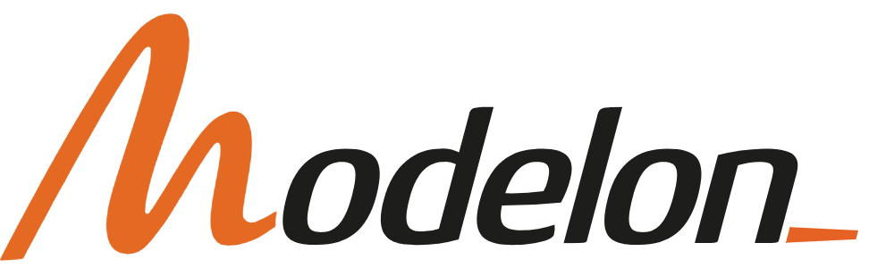
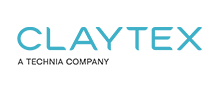
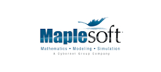
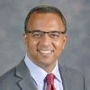

<!-- As discussed with Dirk the event page of the 16th Int. Modelica Confrence 2025 will be built up similar to the american in 2024 -->
# 16th International Modelica Conference

We are glad to announce the **16th International Modelica Conference**. It will take place at the marvelous city of **Lucerne in Switzerland from September 8-10, 2025**. It is organized by [HSLU](https://www.hslu.ch/en/), the University of Applied Sciences and Arts Lucerne, in cooperation with the [Modelica Association](/association/). This is the first visit of this conference series in Switzerland. 

## About the Conference

The International Modelica Conference is the main event for users, library developers, tool vendors and language designers to share their knowledge and learn about the latest scientific and industrial progress related to [Modelica](/), [FMI](https://fmi-standard.org/), [SSP](https://ssp-standard.org/), [eFMI](http://efmi-standard.org/) and [DCP](https://dcp-standard.org/).
The program will cover processes and tools for the modeling of complex physical and cyber-physical systems as applied to a wide range of research and industrial applications. 

In addition to paper presentations, the conference features several Modelica tutorials for beginners and advanced users, as well as industrial user presentations, vendor sessions, and an exhibition. 

## Call for Sponsors

The **International Modelica Conference** relies heavily on sponsors to maintain the affordability of the ticket prices. As a sponsor you are also given the opportunity to exhibit at the conference site. If you are interested in sponsoring the conference, please check out the conditions at in our [call for sponsors](callforsponsors25). 

<!-- 
<table>
    <tr>
        <td><b>Platinum</b></td>
        <td colspan="2" align="center"></td>
    </tr>
    <tr>
        <td><b>Gold</b></td>
        <td></td>
        <td></td>
    </tr>
    <tr>     
        <td><b>Gold</b></td>
        <td></td>
        <td></td>
    </tr>
    <tr>
        <td><b>Silver</b></td>
        <td  colspan="2" align="center"></td>
    </tr>
</table>
 -->

<!-- ## Keynote Speakers and Presentation Titles
We are proud to announce our keynote speakers and the titles of their presentations: 

Tuesday, October 15th: 

|     |     |
| :-: | :----- |
|  |**Swaminathan Gopalswamy**, Director, Connected Autonomous Safe Technologies (CAST) Lab|
| | **Modeling, Simulation,  and Autonomous Vehicles:  the challenges and opportunities**| 

 Wednesday, October 16th:
|     |     |
| :-: | :----- |
|  | **Clas A. Jacobson** Senior Fellow, Systems Engineering at Carrier |
| | **Energy Urgency, Computation and Role of "Systems" Methods & Tools** | -->

## Registration and Accommodation

<!-- Registration is now open at [Eventbrite](https://www.eventbrite.com/e/american-modelica-conference-2024-tickets-794519207337?aff=oddtdtcreator). Please register soon to make planning easy for us. Early Bird tickets will be available until August 10th. If you need a hotel for the conference, we recommend the Graduate Hotel on the UCONN campus in waking distance to the conferene venue. You can reserve a room for a discounted room rate through [**this link**](https://www.hilton.com/en/book/reservation/deeplink/?ctyhocn=BDLGSGU&corporateCode=3439604). Other hotels are available in the vicinity, but are in 10-15 minutes of driving distance from the conference.  -->

<!-- Registration and accommodation recommendations are not yet available.  -->
The conference registration will be offered at the following conditions. Details regarding registration and accommodation recommendations will be provided in due course.

| Registration | Valid | incl. Dinner | Early | Late |
|--------------|--------------|--------------|--------------|--------------|
| Standard | Mon-Wed | yes | 750 CHF | 900 CHF|
| PhD | Mon-Wed | no | 400 CHF | 500 CHF|
| Student | Mon-Wed | no | 200 CHF | 250 CHF|
| Industrial User Presentation ?  | only Tuesday | yes | ? CHF | ? CHF|
| Dinner | Dinner | yes | 150 CHF | 150 CHF|

## Scope of the Conference

[Modelica](/) is a freely available, equation-based, object-oriented language for convenient and efficient modeling of complex, multi-domain cyber-physical systems described by ordinary differential, difference and algebraic equations. The Modelica language and the companion Modelica Standard Library have been utilized in a variety of demanding industrial applications, including full vehicle dynamics, power systems, robotics, buildings and district energy systems, hardware-in-the-loop simulations and embedded control systems. The [Functional Mock-up Interface (FMI)](https://www.fmi-standard.org/) is an open standard for the tool-independent exchange of models and for co-simulation. It is supported by many [Modelica and non-Modelica tools](/tools/) and is the key to utilizing Modelica models in non-Modelica environments.

Development in the Modelica Association is organized in [Modelica Association Projects](/association/#modelica-association-projects):

- LANG - Modelica Language
- LIB - Modelica Libraries
- FMI - Functional Mock-up Interface
- eFMI - Functional Mock-up Interface for embedded systems
- SSP - System Structure and Parameterization of Components for Virtual System Design
- DCP - Distributed Co-Simulation Protocol

These projects collaborate to design and maintain a set of coordinated standards for modeling and simulation of complex physical systems.

The Modelica conference will bring together people using Modelica and/or other Modelica Association standards for modeling, simulation, and control applications, such as Modelica language designers, tool vendors and library developers. The Modelica Conference provides Modelica users with the opportunity to stay informed about the latest language, library, and tool developments, and to get in touch with people working on similar modeling problems. The conference will cover topics such as the following:
- Multi-engineering modeling and simulation with free and commercial Modelica libraries (mechanics, electrical, hydraulics, thermal, fluid, media, chemical, building, automotive, aircraft, ...)
- Automotive applications
- Thermodynamic and energy systems applications
- Mechatronics and robotics applications
- Medicine and biology applications
- Other industrial applications, such as electric drives, power systems, aerospace, etc.
- Large-scale system modeling
- Real-time and hardware-in-the-loop simulation
- Simulation and code generation for embedded control systems
- Simulation acceleration by use of many CPU cores or GPU cores
- Applications of Modelica for optimization and optimal control
- Modelica modeling, simulation and design tools
- Symbolic algorithms and numerical methods for model transformation and simulation
- Discrete modeling techniques − FEM, CFD, DEM (Discrete Element Method), ...
- New features of the Modelica language and of FMI
- Experimental language designs and implementations related to Modelica
- Modelica in other application areas (mathematical programming, databases etc.)
- Modelica for teaching and education
- FMI in Modelica and non-Modelica applications and tools

## Call for papers, user presentations and tutorials

The call for papers and further information will go out in January 2025

<!-- Please see the [call for papers](call2025) for details about paper submissions, and the calls for [industrial user presentations](call2025), tutorials, and vendor presentations. Please look at the [author instructions](authors) before submitting. The submission deadlines are as follows:  

- June 15, 2024 Submission of full papers
- June 1, 2024 Submission of extended abstracts for presentation-only contributions, [workshops and tutorials]
(https://docs.google.com/forms/d/e/1FAIpQLScsRLAe-YwK7yAQoW6B5KQQ87M_SU4dgj6eKnvpjG3h53HMGw/viewform) 
- August 10, 2024 Notification of acceptance for papers and presentations
- August 30th, 2024 Submission of final papers and one-page abstracts
- October 7th, 2024 Submission of final presentations
- May 1th, 2025 Submission of full papers
- ?, 2025 Submission of extended abstracts for presentation-only contributions
- June 16th, 2025 Notification of acceptance for papers and presentations
- August 15th, 2025 Submission of final papers and one-page abstracts
- ?, 2025 Submission of final presentations  -->

<!-- ## Sponsorship opportunities

The American Modelica conference will be your opportunity to meet your customers again in a personal setting, at a great location. Please stay tuned for details about our sponsorship opportunities, we will post them here in the near future. Note that all sponsors will have the opportunity to exhibit at the conference, and that we don't offer a separate way to exhibit at the conference.   -->

## Organization and Contact

The conference is organized by Prof. Ulf Christian Müller from [HSLU](https://www.hslu.ch/en/), the University of Applied Sciences and Arts Lucerne in cooperation with the [Modelica Association](/association/)

<!-- **For general questions, please send an email to:** **[modelicaNA2024@groups.liu.se](mailto:modelicaNA2024@groups.liu.se)** -->
**For general questions, please send an email to:** **to be determined ulfchristian**

### Conference Board

  -  **Conference Co-Chair** Prof. Dr. Ulf Christian Müller, University of Applied Sciences and Arts Lucerne
  -  **Conference Co-Chair** Dr. Dirk Zimmer, German Aerospace Center
  -  **Conference Co-Chair** Dr. Hubertus Tummescheit, Modelon ?
  -  **Conference Co-Chair** Dr. Rui Gao, RIGO TECH
  -  **Conference Co-Chair** Dr. Francesco Casella, Politecnico di Milano ?
  -  **Conference Co-Chair** Prof. Dr. Lars Mikelsons, Augsburg University ?
  -  **Conference Co-Chair** Dr. Martin Schüler,  ?

  <!-- -  **Conference Co-Chair** Dr. Michael Tiller, Juliahub
  -  **Local Co-Chair** Prof. George Bollas, University of Connecticut
  -  **Program Chair** Prof. Luigi Vanfretti, Rensselaer Polytechnic Insitute
  -  **Program Chair** Dr. Michael Wetter,Lawrence Berkeley National Laboratory
  -  **Conference Excecutive Coordinator** Dr. Christopher Laughman, Mitsubishi Electric Research Laboratories
  -  Behnam Afsharpoya, Dassault Systemes -->

