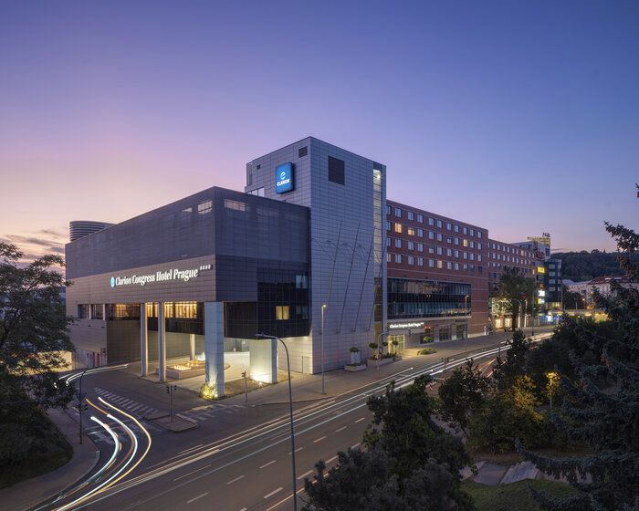

 ---
title: Modelica and FMI Conference 2027
---


<picture>
  <source media="(prefers-color-scheme: dark)" srcset="https://www.modelicaprague.cz/images/logos/ModelicaAndFMI_darkScheme.svg">
  <source media="(prefers-color-scheme: light)" srcset="https://www.modelicaprague.cz/images/logos/ModelicaAndFMI.svg">
  
  
</picture>
<h1 style="text-align:center; color: #cc173a;" class="mb-5">Prague, Czech Republic, September 20-22, 2027</h1>


We are glad to announce the **17th International Modelica & FMI Conference**.
It will be held at **Clarion Congress Hotel Prague, Czech Republic, September 20–22, 2027**.
It is organized by  [Modelica Association](/association/), in cooperation with the [CSKI](https://www.cski.cz/) and a local organizer.  

------------------------------------



------------------------------------

## About the Conference

**The International Modelica & FMI Conference** is the main event for users, library developers, tool vendors and language designers to share their knowledge and learn about the latest scientific and industrial progress related to [Modelica](/), [FMI](https://fmi-standard.org/), [SSP](https://ssp-standard.org/), [eFMI](http://efmi-standard.org/) and [DCP](https://dcp-standard.org/).
The program will cover processes and tools for the modeling of complex physical and cyber-physical systems as applied to a wide range of research and industrial applications. 

In addition to paper presentations, the conference features several Modelica tutorials for beginners and advanced users, as well as industrial user presentations, vendor sessions, and an exhibition.

**We are looking forward to seeing you in Prague!**

<i class="fa-solid fa-map-location-dot me-2"></i>[Clarion Congress Hotel Prague, Freyova 945/33, 190 00 Praha 9-Vysočany](https://maps.app.goo.gl/CgHTQQF9DgQDeTUN6)

<i class="fa-solid fa-bed me-2"></i>[Conference Venue](https://modelicaprague.cz/venue.php)

------------------------------------

## Important Dates

| Date |  |
| --- | --- |
|April 19, 2027 | **Deadline for Paper Submissions** |
|June 7, 2027 | Deadline for Workshops and Tutorials, and Vendor Presentations|
|June 7, 2027 | **Deadline for Industrial User Presentation Submissions**|
|June 19,  2027|Notification of Acceptance for Papers and Presentations|
|July 5, 2027| **Deadline for Early Registration** | 
|August 8, 2027| Submission of Final Papers, Presentations, and One-Page Abstracts|
|September 15, 2027| Deadline for Late Registration|
|September 20-22, 2027| **17th International Modelica & FMI Conference**|
|September 23, 2027 | Post Conference Meeting: Public Modelica & FMI Design and Advisory Meeting  (not included in conference registration)|
|September 24, 2027 | Internal Post Conference Meeting: Modelica & FMI Design, Modelica Association and MAP members only |

------------------------------------

## Call for Papers

You are encouraged to submit a full paper of at least 4 pages, with a maximum of 10 pages, on the following topics:

- Multi-engineering modeling and simulation with free or commercial Modelica libraries 
- Library Award for new Open-Source Modelica Libraries. 
- Applications and new tool developments for the Functional Mock-up Interface (FMI) and Layered Standards (LS)
- Applications and new tool developments for the System Structure and Parameterization (SSP) standard
- Applications and new tool developments for the FMI for embedded Systems (eFMI) standard 
- System Simulation as an integrative part of Model-based Systems Engineering (MBSE) 
- Machine Learning and AI in system simulation 
- Automotive applications
- Applications in thermodynamic, energy systems  and building physics
- Mechatronics and robotics applications
- Medicine and biology applications
- Maritime and offshore applications
- Other industrial applications, such as electric drives, power systems, aerospace, etc.
- Large-scale system modeling and simulation code generation for parallel computing architectures
- Real-time and hardware-in-the-loop applications; Code generation for embedded control systems 
- Use of Artificial Intelligence (AI) methods in simulation; SimToReal for AI training purposes
- Applications of Modelica and FMI for optimization and control design
- Modelica modeling, simulation and design tools
- Symbolic algorithms and numerical methods for model transformation and simulation
- Experimental language designs and implementations related to Modelica standards
- Modelica in other application areas (mathematical programming, databases etc.)
- Modelica for teaching and education

If you plan to submit directly for a poster, then submit a (short) paper with a corresponding remark.

The conference proceedings will be published by the Modelica Association on its website.
Each paper will be individually referenced by a DOI. For selected papers we aim to enable a post-conference journal publication in [MCMDS](https://www.tandfonline.com/toc/nmcm20/current).

------------------------------------

### Best Paper Award
The 17th International Modelica & FMI Conference will recognize the authors of the best paper for their outstanding academic quality and relevance to the conference. All accepted papers are automatically considered for this honorary award.

------------------------------------

## Call for Industrial User Presentations

You are encouraged to submit an  **extended abstract**  of 1-2 pages, related to one of the existing or possibly new [Modelica Association Projects](https://modelica.org/community/projects/):

- [LANG](/language/) - Modelica Language
- [LIB](/libraries/) - Modelica Libraries
- [FMI](https://fmi-standard.org/) - Functional Mock-up Interface 
- [eFMI](https://efmi-standard.org/) - Functional Mock-up Interface for embedded systems
- [SSP](https://ssp-standard.org/) - System Structure and Parameterization of Components for Virtual System Design
- [DCP](https://dcp-standard.org/) - Distributed Co-Simulation Protocol

Industrial user presentations are an excellent way to present recent results to the Modelica community with less effort and overhead than a full paper submission. Please indicate whether you plan to give your presentation on-site or remotely in the submission form. These industrial user presentations differ from paper presentations, which we expect to be in-person. These abstracts will be peer-reviewed by experts, but no corresponding papers will be published in the conference proceedings.

Please note that purely tool-related presentations are not permitted for these application-oriented presentations, and should instead be covered by vendor presentations.

------------------------------------

## Call for Tutorials
At the Modelica Conference, several tutorials will be held in parallel. Each tutorial will a bit under 3 hours and will include a "hands-on experience" session (participants are expected to bring their own laptops; the presenter will provide the necessary tools).

Please note that tutorials must involve hands-on activities and cannot be limited to commercial presentations or demonstrations. For product presentations, please refer to the Vendor Presentations which will be announced at a later date as a part of Call for Sponsors. The acceptance of tutorials will be based on the relevance to Modelica/FMI content and the timing of the application.

------------------------------------

## Scope of the Conference

[Modelica](/) is a freely available, equation-based, object-oriented language for convenient and efficient modeling of complex, multi-domain cyber-physical systems described by ordinary differential, difference and algebraic equations. The Modelica language and the companion Modelica Standard Library have been utilized in a variety of demanding industrial applications, including full vehicle dynamics, power systems, robotics, buildings and district energy systems, hardware-in-the-loop simulations and embedded control systems. The [Functional Mock-up Interface (FMI)](https://www.fmi-standard.org/) is an open standard for the tool-independent exchange of models and for co-simulation. It is supported by many [Modelica and non-Modelica tools](/tools/) and is the key to utilizing Modelica models in non-Modelica environments.

Development in the Modelica Association is organized in [Modelica Association Projects](/association/#modelica-association-projects):

- [LANG](/language/) - Modelica Language
- [LIB](/libraries/) - Modelica Libraries
- [FMI](https://fmi-standard.org/) - Functional Mock-up Interface 
- [eFMI](https://efmi-standard.org/) - Functional Mock-up Interface for embedded systems
- [SSP](https://ssp-standard.org/) - System Structure and Parameterization of Components for Virtual System Design
- [DCP](https://dcp-standard.org/) - Distributed Co-Simulation Protocol

These projects collaborate to design and maintain a set of coordinated standards for modeling and simulation of complex physical systems.

The Modelica & FMI conference will bring together people using Modelica and/or other Modelica Association standards for modeling, simulation, and control applications, such as Modelica language designers, tool vendors and library developers. The Modelica Conference provides Modelica users with the opportunity to stay informed about the latest language, library, and tool developments, and to get in touch with people working on similar modeling problems. The conference will cover topics such as the following:

- Multi-engineering modeling and simulation with free or commercial Modelica libraries 
- Library Award for new Open-Source Modelica Libraries. 
- Applications and new tool developments for the Functional Mock-up Interface (FMI) and Layered Standards (LS)
- Applications and new tool developments for the System Structure and Parameterization (SSP) standard
- Applications and new tool developments for the FMI for embedded Systems (eFMI) standard 
- System Simulation as an integrative part of Model-based Systems Engineering (MBSE) 
- Machine Learning and AI in system simulation 
- Automotive applications
- Applications in thermodynamic, energy systems  and building physics
- Mechatronics and robotics applications
- Medicine and biology applications
- Maritime and offshore applications
- Other industrial applications, such as electric drives, power systems, aerospace, etc.
- Large-scale system modeling and simulation code generation for parallel computing architectures
- Real-time and hardware-in-the-loop applications; Code generation for embedded control systems 
- Use of Artificial Intelligence (AI) methods in simulation; SimToReal for AI training purposes
- Applications of Modelica and FMI for optimization and control design
- Modelica modeling, simulation and design tools
- Symbolic algorithms and numerical methods for model transformation and simulation
- Experimental language designs and implementations related to Modelica standards
- Modelica in other application areas (mathematical programming, databases etc.)
- Modelica for teaching and education

------------------------------------

### Conference Board
- Doc. MUDr. Jiří Kofránek, CSc., Charles University, CSKI, Czech Republic (Honorary  Chair)
- Mgr. Tomáš Kulhánek, Ph.D., VITO, Mol, Belgium (Local Conference Chair)
- Dr. Dirk Zimmer, German Aerospace Center, Germany (Program Conference Chair)
- Prof. Francesco Casella, Politecnico di Milano, Italy
- Prof. Lars Mikelsons, University of Augsburg, Germany
- Dipl. Math. Christian Bertsch, Robert Bosch GmbH, Germany
- Dr. Filip Ježek, First Faculty of Medicine, Charles University, Prague, Czech Republic
- Dr. Hubertus Tummescheit, Model Based Innovation LLC, USA
- Dr. Daeoh Kang, iVH, Korea
- Prof. Martin Sjölund, Linköping University, Sweden

## Local Organization
- Ing. Milena Zeithamlová, [Action M Agency](https://web.action-m.com/?lang=en), Czech Republic
- Bc. Eliáš Sýkora, DiS, Czech Republic

## Contacts
Please do not hesitate to contact the organizers on following emails regarding:
- local issues (registration, visa, etc.) [modelica@action-m.com](mailto:modelica@action-m.com) 
- scientific issues   [modelica2027@modelica.org](mailto:modelica2027@modelica.org) 
- partnership / sponsorship [partnersMC2027@modelica.org](mailto:partnersMC2027@modelica.org) 

