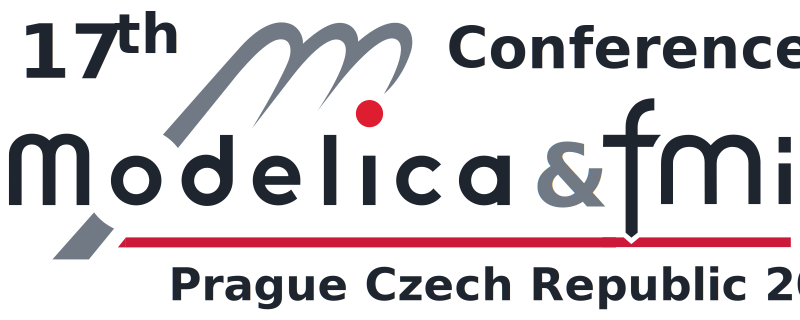
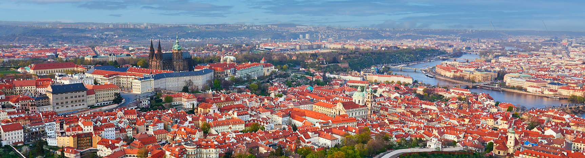

## Call for Sponsors


<picture>
  <source media="(prefers-color-scheme: light)" srcset="images/modelica-2027-logo-light.svg">
  <source media="(prefers-color-scheme: dark)" srcset="images/modelica-2027-logo-dark.svg">
  
</picture>


# 17th International Modelica and FMI Conference 
at Clarion Congress Hotel Prague, Czech Republic
in September 20-22, 2027

## Partnership Options in Detail 

This document outlines conference organizer´s partnership services and the partner's contributions. The specific terms, rights, and obligations are defined exclusively in the individual partnership agreement. 

**Services provided by conference organizers**

**Platinum partners** have access to the following benefits: 

1. The partner's logo will appear in the printed program and on the website. Size and placement depend on the partnership option. 
2. A reserved time slot for a Vendor Presentation is included. The Conference Board reviews presentations to ensure their content aligns with Modelica, FMI, and related standards (Tools, libraries, IDEs, etc. that support and foster these standards). 
3. An exhibition space of approximately 20 m² is provided. Including 1 table, 2 chairs, power supply, and Wi-Fi. Reservation or on-site allocation depends on the partnership category or follows the "first come, first served" principle.  
4. Includes 3 standard registrations for the conference (dinner included). 
5.Includes a 1-page Partner Presentation in the conference program. The content is provided by the partner in a ready-to-print format and styling. 
6. Organizers will distribute a giveaway provided by the partner at the start of the conference. 
 
 
**Gold partners** have access to the following benefits: 

1. The partner's logo will appear in the printed program and on the website. Size and placement depend on the partnership option. 
2. A reserved time slot for a Vendor Presentation is included. The Conference Board reviews presentations to ensure their content aligns with Modelica, FMI, and related standards (Tools, libraries, IDEs, etc. that support and foster these standards). 
3. An exhibition space of 10–12 m² is provided. Including 1 table, 2 chairs, power supply, and Wi-Fi. Reservation or on-site allocation depends on the partnership category or follows the "first come, first served" principle. 
4. Includes 2 standard registrations for the conference (dinner included). 
5. Includes a ½-page Partner Presentation in the conference program. The content is provided by the partner in a ready-to-print format and styling. 
6. Organizers will distribute a giveaway provided by the partner at the start of the conference. 
 
**Silver partners** have access to the following benefits: 
1. The partner's logo will appear in the printed program and on the website. Size and placement depend on the partnership option. 
2. A Vendor Presentation time slot is planned to be included, depending on availability. The Conference Board reviews presentations to ensure their content aligns with Modelica, FMI, and related standards (Tools, libraries, IDEs, etc. that support and foster these standards). 
3. An exhibition space of 8–10 m² is provided. Including 1 table, 2 chairs, power supply, and Wi-Fi. Reservation or on-site allocation depends on the partnership category or follows the "first come, first served" principle. 
4. Includes 1 standard registration for the conference (dinner included). 
5. Includes a ½-page Partner Presentation in the conference program. The content is provided by the partner in a ready-to-print format and styling. 
6. Organizers will distribute a giveaway provided by the partner at the start of the conference. 
 
**Bronze partners** have access to the following benefits: 
1. The partner's logo will appear in the printed program and on the website. Size and placement depend on the partnership option. 
2. An exhibition space of approximately 8 m² is provided. Including 1 table, 2 chairs, power supply, and Wi-Fi. Reservation or on-site allocation depends on the partnership category or follows the "first come, first served" principle.  
3. No registrations for the conference are included. 
4. Includes a ¼-page Partner Presentation in the conference program. The content is provided by the partner in a ready-to-print format and styling.  
5. Organizers will distribute a giveaway provided by the partner at the start of the conference. 

**Metal partners** have access to the following benefits:  
1. The partner's logo will appear in the printed program and on the website. Size and placement depend on the partnership option. 
2. A Vendor Presentation time slot is planned to be included, depending on availability. The Conference Board reviews presentations to ensure their content aligns with Modelica, FMI, and related standards (Tools, libraries, IDEs, etc. that support and foster these standards). 
3. No registrations for the conference are included. 
4. Organizers will distribute a giveaway provided by the Partner at the beginning of the conference. 

**Partnership Contributions**

In return for the services provided by organizer, the partner agrees to the following contributions: 

**Platinum:** 
14 000  EUR excluding VAT 

**Gold:**   
11 000  EUR excluding VAT 

**Silver:**   
6 000  EUR excluding VAT 

**Bronze:**  
4 000  EUR excluding  VAT 

**Metal:**
2 800 EUR excluding  VAT

The REVERSE CHARGE SYSTEM is applied, in case that Partner is registered in EU as VAT payer at [VIES - VAT Information Exchange System](https://ec.europa.eu/taxation_customs/vies/#/vat-validation).

