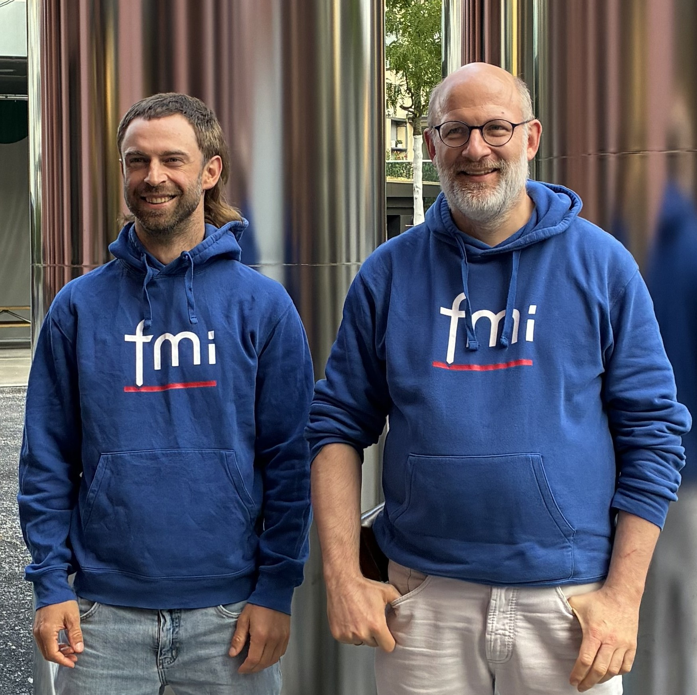
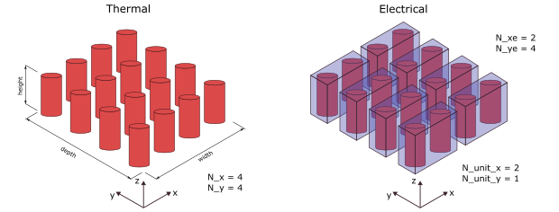
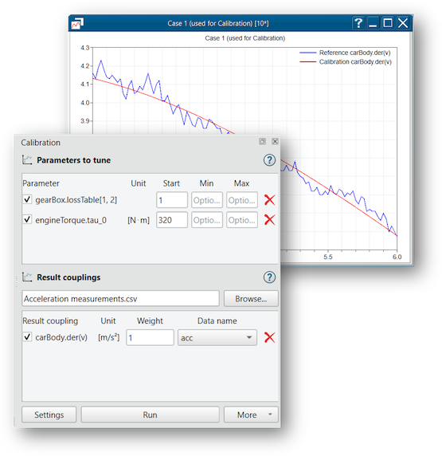
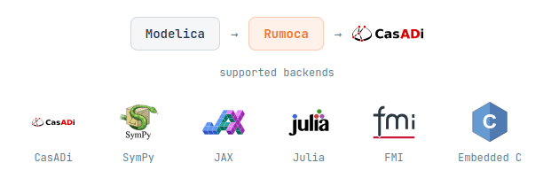
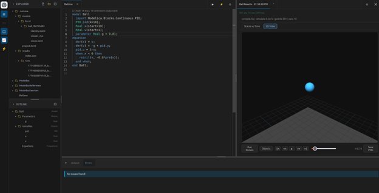
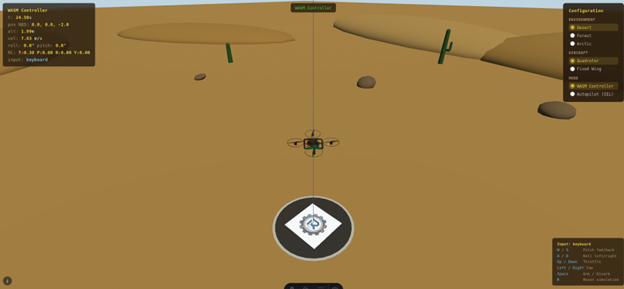



    



# Modelica Association Newsletter 2026-01

issued on March 5, 2026





    <i class="fa-regular fa-envelope" style="font-size:50px"></i>



## Letter from the Board



    <i class="fa-solid fa-building-columns" style="font-size:50px"></i>



## Modelica Association

### FMI Project News

#### FMI Project Leader and Deputy re-elected

On March 17, 2026 the FMI Steering Committee has unanimously re-elected Christian Bertsch, BOSCH Research, as the project leader and Torsten Sommer, Dassault Systèmes, as the deputy for a two-years term.

#### FMI Face-2-Face Design Meeting Munich June 8-10 2026

Dassault Systems will host the next in-person FMI Design meeting.
Please drop us a note to contact@fmi-stanard.org if you are interested in participating as a guest.

#### 280+ tools supporting FMI listed on the FMI tools page´!

The number of tools supporting the FMI Standard is still growing! Now we have more than 280 tools listed on https://fmi-standard.org/tools/ !

#### News on FMI Layered Standards

#####  Pre-Release of FMI Layered Standard References (FMI-LS-REF) v1.0.0-alpha.1

The FMI Project is happy to announce the alpha pre-release of the FMI Layered Standard References (FMI-LS-REF), which allows the inclusion of related files into an FMU.
Thanks to the FMI Project Team and especially to Pierre Mai (PMSF IT Consulting Pierre R. Mai) for the work!

This layered standard provides the capability to clearly designate the roles of additional related files included in an FMU in a structured way.
These files are described in the layered standard manifest file, which is part of the FMU archive. In this way, an FMU can be shipped together with related files that are helpful in understanding and correctly using the FMU in a recognizable way.
Note that this layered standard does not mandate the inclusion of any related files with an FMU. It only provides a structured way to describe such files, if they are included. The included related files can be of arbitrary types, as long as their roles are described in the layered standard manifest file. This layered standard can be used in addition to other layered standards, and allows the central description of related files included with the FMU, independently of their use in other layered standards.
Thus an implementation can treat the related files described in this layered standard in a uniform way, regardless of whether they are used in other layered standards or not, and regardless of whether the other layered standards are supported by the implementation or not.

This supports the following use cases, among others:

- Inclusion of requirements, specifications, model sources, and other related files that are helpful in understanding and correctly using the FMU in a recognizable way.
- The ability to provide multiple parameter sets with an FMU as part of the FMU archive.
- Inclusion of additional experiments that provide sufficient information to enable smoke test validation of an FMU in a new simulation environment.

Learn more [on the Release page on Github](https://github.com/modelica/fmi-ls-ref/releases/tag/v1.0.0-alpha.1).

##### Pre-Release of FMI Layered Standard for Network Communication (FMI-LS-BUS) v1.3.0-alpha.1 with LIN support available

The FMI Project is happy to announce that we have just published the 1.3.0-alpha.1 version of the FMI-LS-BUS standard, that version that finally adds the long-awaited LIN support. 
This version includes the common Physical Signal Abstraction, that fits for all bus types, and the Network Abstraction that currently supports CAN, CAN FD, CAN XL (from v1.0.0), FlexRay (from v1.1.0; currently in Beta state), Ethernet (from v1.2.0; currently in Alpha state) and LIN. 
Check out our roadmap to get more information about the expansion plans of the FMI-LS-BUS.  \
Learn more [on the Release page on Github](https://github.com/modelica/fmi-ls-bus/releases/tag/v1.3.0-alpha.1). \
Currently intensive cross-checking of FMI-LS-BUS v1.3.0-alpha.1 is going on with prototype implementations from different tool vendors with the working group of the FMI project.

##### FMI Layered Standard for Structures (FMI-LS-STRUCT)

For many use cases, the grouping of variables gives the user a better overview about the usage of variables. For certain groupings the importing tool might be able to provide a more user-friendly interface. FMUs might use maps/functions sampled on the vertices of a grid to calculate output values.
The values at these sampling points and even the locations of the sampling points might get exposed as parameter variables of the FMU to allow calibrations.
However, the FMI standard only defines n-dimensional array variable but doesn’t define any relation between these variables. This layered standard defines how to group variables to represent maps.

This layered standard uses terminals of the FMI 3.0 standard to represent structures like maps by grouping variables in terminals.
Terminals are used to group variables and already define means to connect its variables between FMUs. Such a connections could ensure that the same map values are used by different FMUs or allow one FMU to provide the map values to be used by other FMUs.

A pre-release v1.0-beta.1 of the MI Layered Standard for Structures (FMI-LS-STRUCT) will be coming soon! Stay tuned on https://github.com/modelica/fmi-ls-struct/.
Thanks to the FMI Project Team and especially to Klaus Schuch (AVL) for this work!

##### Differential Algebraic Equations (DAE): New working group founded. 

A new working group for support for Differential-Algebraic Equations (DAE) support (possibly as a layered standard) in FMI has been formed and is working actively. It is lead by Joel Andersson (FMIOPT) and Andreas Heuermann (Santa Barabara Research Institute).
A differential-algebraic system of equations (DAE) is a system of equations that either contains differential equations and algebraic equations, or is equivalent to such a system.

The motivations of DAE support in FMI is to

* Avoid the requirement of index reduction inside of FMUs: This may improve accuracy due to better drift handling.
* Avoid local nonlinear equation solvers inside of FMUs: This may improve accuracy and avoid problems with different local and global error tolerances.
* Preserve the sparseness of DAE systems which is lost for the corresponding reduced ODE systems: This may improve the performance by usage of the sparseness.
* Allow connections between constraint FMUs: Connecting reduced ODE FMUs may lead globally to a non-solvable (singular) system but not for unreduced DAE FMUs.

You can follow the development on Github https://github.com/modelica/fmi-ls-dae.

#### Asian and American Modelica _and FMI_ Conferences 2026

FMI will be a hot topic and the Asian and American Modelida & FMI Conferences, which is reflected by now having "FMI" in the conference title.
We see a lot of interest in FMI both in America and Asia, so this is a very attractive conference.
FMI Project Leader Christian Bertsch will be giving a keynote and a tutorial on FMI at the Asian Conference.

#### Other Resources for FMI

* Visit the [FMI tools page](https://fmi-standard.org/tools) listing 280+ tools supporting FMI!
* Join the [LinkedIn FMI community](https://www.linkedin.com/groups/7477473/) to get the latest news on FMI, FMI supporting tools and discussions within the user community.
* Report problems of the standard itself or suggestions for new features in form of issues or discussions on [fmi-standard.org](https://github.com/modelica/fmi-standard)

<!-- END Modelica Association -->



    <i class="fa-solid fa-users" style="font-size:50px"></i>



## Conferences and user meetings

## ThermoSim 2026 – Conference for Thermal System Simulation

**ThermoSim 2026** brings together engineers, researchers, and industry professionals working with system simulation, Modelica, and FMI.
The conference focuses on practical applications, exchange of experience, and discussion of current developments in simulation technology.

#### Event Details

- **Date:** 22–23 September 2026  
- **Location:** Aachen, Germany  
- **Language:** Primarily German  
  (support for English-speaking participants can be arranged)

#### Topics include

- Industrial applications of system simulation  
- Modelica and FMI in engineering workflows  
- Energy systems, thermal processes, and digital engineering  
- Exchange of practical experience between users and developers  

#### More Information

Further details about the program, speakers, and registration are available on the official event website:
https://tlk-energy.de/en/events/thermosim-conference-2026

#### Registration

To register or request further information, please contact **Email:** [thermosim@tlk-energy.de](mailto:thermosim@tlk-energy.de)

*This article is provided Lina Rosenthal ([TLK Energy GmbH](tlk-energy.de))*

<!-- END Conferences and user meetings -->



    <i class="fa-solid fa-industry" style="font-size:50px"></i>



## Vendor news
### Dymola Sustainable Supply Systems Library Update

Dassault Systèmes is happy to announce an update to the [Sustainable Supply Systems library (SuSy)](https://blog.3ds.com/brands/catia/catia-dymola-from-concept-to-prototype-in-minutes-simplifying-hybrid-energy-system-modeling-with-the-sustainable-supply-systems-library/).  
Version 1.1.0 represents a substantial update and expansion of scope of the library.  
Key new features and changes include:

- Techno-economic assessments
  - CAPEX, OPEX, Levelized Cost of Energy for both components and systems
- Emission tracking per scope
  - Emissions split into scope 1 and scope 2 as per [The Greenhouse Gas Protocol](https://ghgprotocol.org/sites/default/files/standards/ghg-protocol-revised.pdf)
  - Electricity carbon intensity tracked at electrical ports
- Examples
  - Methanol cruise ship with methanol to hydrogen reformer
  - Green hydrogen production with electrolyzer
  - Green ammonia with ammonia plant component

This article is provided by Markus Andres ([Dassault Systemes Austria GmbH](https://www.3ds.com/))

### Siemens Digital Industries Software

#### Simcenter Amesim 2604 released
[Siemens Digital Industries Software](https://www.sw.siemens.com/) is pleased to announce the recent release of **Simcenter&nbsp;Amesim&nbsp;2604** as part of its [system simulation solutions](https://blogs.sw.siemens.com/simcenter/simcenter-systems-release-2604/). This release introduces key updates, notably:

* Major enhancements to the so-called **Battery Pack Assistant**, to further support electrification (modeling capabilities and workflow).
* Expanded **gas system simulation capabilities**, serving applications like pneumatic controls in industrial automation, compressors in HVAC systems, or specialized gas handling in extreme environments.

More detail can be found [here](https://blogs.sw.siemens.com/simcenter/simcenter-systems-release-2604/ ). Several changes have also been specifically applied to **exported&nbsp;FMUs**, in terms of <i>licensing policy</i> as well as <i>integration and collaboration capabilities</i>. These specific updates as described hereafter.  

#### Export of full-featured standalone (license-free) FMUs

The previous restriction on the specific export option allowing to create license-free (standalone) FMUs for Windows or Linux standard platforms has been removed. 

Prior to release 2604, such FMUs were limited to models without a solver (model exchange) or those using only a fixed-step solver (co-simulation). Now, this highly requested licensing policy change brings several key benefits:
* **Avoided rework**: users can now avoid the need to rework models or tune third-party solvers, which is especially useful for Model-in-the-Loop (MiL) applications.
* **Reliable deployment**: deploy validated **Simcenter&nbsp;Amesim** models with their native solver embedded, ensuring repeatable results.
* **Standalone apps**: create and share standalone applications leveraging **Simcenter&nbsp;Amesim**'s modeling and solving capabilities.

This means even large, sophisticated models with their native &mdash;&nbsp;best-adapted&nbsp;&mdash; solver can be deployed as lightweight FMUs (a few megabytes) with no external dependencies, which greatly facilitates model reuse and collaboration with partners, suppliers, or other departments.

#### Unified FMU export for real-time

To address the challenge of exporting, validating, and deploying FMUs for real-time simulation while avoiding fragmented workflows and/or late issue discovery, **Simcenter&nbsp;Amesim&nbsp;2604** now adds binaries for standard platforms (Windows and Linux), in addition to the source code for the chosen real-time target, within the exported &ldquo;FMUs for real-time&rdquo;. The compilation of these binaries is similar to that of the real-time target's toolchain. The expected concrete benefits for users are:
* **Easier pre-checks** (on Windows or Linux) before sharing FMUs to real-time target users.
* **Built-in continuity, consistency and traceability** (same FMU used <i>offline</i> and <i>online</i>).
* **No need for any external compiler** for generating/compiling these FMUs. 
* **Flexible deployment**: offline tests possible on machines with no **Simcenter&nbsp;Amesim** license or installation.

Each of these FMUs can be seen as a **unified model container** now also usable for offline tests in any FMI compatible software. This feature avoids the need to export multiple FMUs and represents a step towards unification of FMI based and Simulink based model export workflows of real-time capable **Simcenter&nbsp;Amesim** models. 

#### Export of 3.0 FMUs with arrays to represent vectors

With **Simcenter&nbsp;Amesim&nbsp;2604**, exporting 3.0 FMUs now includes support for fixed-size arrays. This enhancement allows users to easily create arrays by simply connecting vectored signals directly to and/or from export interface blocks. Arrays are a cornerstone feature of FMI 3.0, offering significantly simpler and more usable model layouts by reducing the need for numerous individual connections. For instance, the automotive application example below demonstrates two **Simcenter&nbsp;Amesim** 3.0 FMUs co-simulated within [**Simcenter&nbsp;Twin&nbsp;Activate**](https://altair.com/twin-activate ). Here, arrays conveniently group the vehicle's wheel speeds and brake forces as vectors, streamlining the connections between the FMUs.

For more information on **Simcenter&nbsp;Amesim**, please visit our [website](https://www.siemens.com/en-us/products/simcenter/systems-simulation/amesim/ ).

*This article is provided by Bruno Loyer ([Siemens Digital Industries Software](https://www.sw.siemens.com/ ))*

### Dymola Battery Library 2.9.0

Battery Library version 2.9.0 introduces two major functional extensions: **battery modules** and **failure modelling**.

The new **battery modules** allow independent discretization of thermal and electrical behavior. They enable aggregation of the electric models of multiple cells, reducing electrical model complexity while maintaining simulation accuracy. This flexibility allows model resolutions to be adapted to the analysis objective and improves computational performance in simulations of large battery packs.

The second feature is the introduction of **failure modelling**. The failure model is integrated into the cell model, enabling the simulation of failures on both cell and pack level. The Battery Library provides models for several failure mechanisms, including **thermal runaway** (three modelling approaches for onset and heat generation), **broken circuits** (interruption of current paths due to connector or tab failures) and **short circuits** (unintended low-resistance paths that lead to high currents and rapid heat generation).

*This article is provided by Nils Modrow ([Dassault Systèmes AB](https://www.3ds.com/))*

### Introducing MLQT: A Modern Desktop Tool for Managing Modelica Libraries

MLQT started from a familiar frustration: every time a Modelica tool saved a file, it would introduce a flurry of whitespace and formatting changes that cluttered commits, obscured the real edits in diffs, and made code review painful. The original goal was simple — put a layer between Modelica tools and the repository that applied consistent formatting to every `.mo` file before it was committed, so that Git and SVN diffs showed meaningful changes rather than stylistic churn. MLQT replaces your generic Git or SVN client with a Modelica-aware one: keep using whichever editor you prefer, and let MLQT sit between the editor and the repository, giving you a full VCS workflow — browse models, review pending changes, commit, pull updates, create and switch branches, merge, push — with the formatting noise filtered out.

From that starting point, MLQT grew into a broader set of tools for working with Modelica code. The same parser that powers the formatter also drives configurable style checking, dependency impact analysis, and external resource tracking. When you modify a model, MLQT can show you exactly which other models are affected, helping you catch issues before they reach your team. It also integrates with Dymola and OpenModelica for model checking, so you can validate changes against your simulation tools directly from the same interface. MLQT is an open source project using the MIT license.

**Key features and benefits:**

- **Integrated revision control** — Full Git and SVN support including commit, update, branch, merge, and history browsing
- **Modelica-aware code analysis** — Parses your code to understand model structure, dependencies, and relationships
- **Impact analysis** — Interactive dependency graphs show the ripple effects of changes across your library
- **Automatic code formatting** — Applies consistent formatting rules across your entire library on save
- **Configurable style checking** — Enforces team coding standards with customizable rules for naming, documentation, structure, and more
- **External resource tracking** — Monitors data files, C libraries, images, and other resources referenced by your models
- **Simulation tool integration** — Connect to Dymola and OpenModelica for model checking without switching applications

MLQT is available for Windows today, with a Linux version on the roadmap. To learn more, visit the open-source [repository on GitHub](https://github.com/mdempse1/MLQT).

*This article is provided by Mike Dempsey ([M Dempsey Ltd](https://dempsey.me.uk/))*

### Dymola Testing Library 2.0.0

The Testing library received a major update and is released as 2.0.0 with Dymola 2026x Refresh 1.
The target was to harmonize clocked and continuous tests, simplify the library usage and improve the
visuals of test reports and animated results.

Some of the important changes are:
- New package structure, making clocked blocks the official solution for recordings
- Updated toolbar with clean structure
- Graphical indication of overall result
- Updated format of test reports printed to command line
- New concept for test cases functions: now checks and be added free without dealing with vector indices
- Simpler handling of negative tests with new test results XFAIL and XPASS.
- Legacy package to run existing tests without changes when upgrading

Existing tests are almost fully compatible after running the provided conversion script.
See the release notes of the Testing library inside Dymola for the full list of changes and more details
regarding the upgrade of some corner cases.

*This article is provided by Marco Keßler ([Dassault Systèmes Austria GmbH](https://www.3ds.com/))*

### Dymola 2026x Refresh 1

We are pleased to announce that Dymola 2026x Refresh 1 has been released on Friday, 17 April 2026. Summary of key features:

**Model development**
- Icons in the variable browser. Makes browsing of the simulation result easier.
- LEO virtual companion (AI) for model development and analysis, requires integration with 3DEXPERIENCE (Beta).

**Simulation**
- Integrated calibration of model parameters (new user interface).
- Parameter sweep with grouping.
- Dynamic optimization of FMUs using e.g. CasADi (Beta).

**Other**
- Library improvements.
- Integrated eFMI production code generation. Code generation on cloud not needed.
- Upgraded FLEXnet license server with recent security patches.

See [latest release](https://www.3ds.com/products/catia/dymola/latest-release) for more details.

*This article is provided by Dag Brück ([Dassault Systèmes](https://www.3ds.com/products/catia/dymola))*

### OpenModelica 1.26.3 and new developments

Summary: 
- OpenModelica 1.26.0 was released in winter 2025, followed by a series of bug-fix releases 1.26.1, 1.26.2, and 1.26.3 which addressed some GUI issues and improved overall stability.
- A new version 4.0.0 of the OMPython interface to OpenModelica was released in October 2025, with a patch release 4.0.1 issued in April 2026.
- The next release 1.27.0 of OpenModelica is planned for May 2026.
- AI comes to OMEdit: MCP server integration

#### Main highlights of OpenModelica 1.26.3
- OMEdit now allows to **load and save** models and packages with **syntax errors** during code development.
- **Improved sizing of parameter editing dialogs** in OMEdit, for better user experience.
- OpenModelica now implements **`break` to [remove modifiers](https://specification.modelica.org/maint/3.6/inheritance-modification-and-redeclaration.html#removing-modifiers-break) and for [selective model extension](https://specification.modelica.org/maint/3.6/inheritance-modification-and-redeclaration.html#selective-model-extension)**.
- OpenModelica now implements **less restrictive rules for the use of conditional components**, as specified in the [draft of the next Modelica Language Specification](https://specification.modelica.org/master/class-predefined-types-and-declarations.html#conditional-component-declaration).
- **Improved operation of debugging features in OMEdit**: the generation of Equation Operations in the Equation-Based Debugger is now activated by default and it is also possible to activate profiling at runtime after running a model for the first time.
- Improved handling of **large result files** in OMEdit.
- Old **deprecated and poorly supported solvers were removed from the runtime** - [gbode](https://openmodelica.org/doc/OpenModelicaUsersGuide/latest/solving.html#gbode) should be used instead.
- A new solver strategy was implemented in GBODE, which drastically reduces the number of iterations of the nonlinear solver in the implicit integration methods at each stage, while preserving the same accuracy of the solution. This makes it competitive with DASSL and IDA on models with many events. See the discussion in [#14089](https://github.com/OpenModelica/OpenModelica/issues/14089), [#14022](https://github.com/OpenModelica/OpenModelica/issues/14022).
This can be activated with flags `-gbnls=internal`, `-gberr=embedded`.
- Many improvements and fixes to FMI export, in particular regarding the generation of external events upon discrete variable input changes in FMI-ME.

For more details, see the full [1.26.0 release notes](https://github.com/OpenModelica/OpenModelica/releases/tag/v1.26.0).

#### OMPython 4.0.1 released

The new 4.0.0 version of the [OMPython](https://github.com/OpenModelica/OMPython) interface to OpenModelica was released on Oct 20, 2025, with substantial improvements over the previous version , see the [release notes](https://github.com/OpenModelica/OMPython/releases/tag/v4.0.0). A patch release [4.0.1](https://github.com/OpenModelica/OMPython/releases/tag/v4.0.0) followed in April 2026.

#### Next release OpenModelica 1.27.0

The next release of OpenModelica is planned for May 2026.

#### AI comes to OMEdit: MCP server integration

We're excited to share that the upcoming release will ship with a built-in MCP (Model Context Protocol) server integrated into the OMEdit GUI.
This lets AI assistants — anything that speaks MCP, your own local agents or cloud services — work directly inside your modeling session: reading the active model, editing it, running simulations, and inspecting results, all while you watch it happen in OMEdit.

##### What the MCP server can do today

The current prototype already supports several common modeling tasks:
- Diagram and icon editing, including connections and drawing shapes.
- Listing and setting a component's parameters.
- Simulation and re-simulation — simulate a class with its default settings, or re-simulate efficiently by tweaking parameters and start-values without rebuilding the executable.
- Awareness of the GUI state — ask which model or plot is currently active, and for multimodal models fetching the content of a digram or plot as an image.
- For when other tools don't exist: reading and writing Modelica code directly.

In practice this means you can ask an assistant things like "add a resistor in parallel with R1 and re-simulate with R2 = 50 Ω" or "minimize overshoot in this PI controller" and watch the changes appear in OMEdit.

##### We want to hear from you

This is just a start, not the finished article. Before we lock down the next batch of functionality exposed via MCP, we'd really like to hear how you are thinking about combining AI with your Modelica work:

* What workflows do you want to automate or accelerate?
* What functionality would unlock a real use case for you?
* Where do you see AI fitting into teaching, debugging, library development, or industrial modeling pipelines?

##### Help shape an AI benchmark for Modelica

Alongside the MCP work, we're putting together a benchmark suite of Modelica tasks that an AI can attempt directly and that can be auto-graded. This will allow us to recommend the models that are capable of Modelica modeling, and what parts they excel in.
If you have ideas for tasks worth including — anything from "build this small model from a spec" to "diagnose why this simulation fails" to "tune these parameters to match this reference output" — Martin Sjölund would love to hear from you by email.

Your input now will directly shape what ships next.

Download OpenModelica from: [https://openmodelica.org](https://openmodelica.org)

*This article is provided by Adeel Asghar, Francesco Casella and Martin Sjölund ([Open Source Modelica Consortium](https://www.openmodelica.org/))*

### Modelon Impact

#### Modelon Impact Code Studio: Work with AI Through Powerful APIs
Modelica development just got faster and more powerful. [Modelon Impact Code Studio](https://modelon.com/blog/introducing-modelon-impact-code-studio/) delivers a modern, cloud-native coding experience for Modelica developers, combining the power of VS Code with intelligent language support:
- Al-assisted modeling with leading copilots
- Real-time semantic error detection
- Zero set up and seamless integration with Impact's graphical UI
- Built on best-in-class Visual Studio Code 

#### New AI Assistant and Data Center Library Expand Simulation in Modelon Impact
Modelon is expanding the reach of physics-based system simulation with the launch of its new **Data Center Library**, arriving this spring for use with **Modelon Impact**. Built on Modelica, the library enables engineers to model and analyze complete data center cooling systems, including air, liquid, and emerging two-phase technologies, at the system level. 
Alongside this release, Modelon is introducing an integrated [AI Assistant](https://modelon.com/blog/new-ai-assistant-in-modelon-impact/) that works across projects in all industries, helping users ramp up faster, navigate complex models, and explore design and control scenarios more efficiently. These new capabilities make it easier to move from early concept to validated system behavior, supporting scalable, simulation-driven workflows.

*This article is provided by Lauren Caris ([Modelon](https://modelon.com))*

### XRG Simulation - Spring news

#### Modelica & FMI helps to develop real-life system control on a 70 m yacht

Building projects are always time-critical and usually take several years to be completed. Wouldn’t it be nice to save precious time by optimizing the system control with digital twins, before the system is installed?    

Read more about how foundation° and XRG Simulation successfully demonstrated how to use Modelica and FMI for a completely new energy harvesting system on board of a 70 m yacht.  

The final real-life control logic has been developed using an FMU containing the transient digital twin of the HVAC system. Engineers were able to design and tune the control before the hardware system was even installed.  

A challenging aspect of this project is that the Modelica model must always provide robust and reliable outputs for all inputs during testing, and it needs to execute much faster than in real-time.

For more details check out our [**paper**](https://doi.org/10.3384/ecp218801) on "Modelica driven development of the thermal management control system for a zero-emission yacht". It demonstrates how the exported FMU of the thermal energy system modelled with **HVAC Library** can be used to design the control logics outside of the Modelica tool (software in the loop simulation). Or visit the [**website of foundation°**](https://www.foundationzero.org/insights/modelica/).

#### Modelica Library Announcements

The following libraries provide important and valuable new features.

**HVAC Library 3.6.0** for HVAC system simulation

HVAC to MSL fluid adapter models (see package Basics.Adapter) can now also use **Buildings Library** media models for liquids and air. This feature enables coupling of Buildings Library models to HVAC Library models (see figure below). The idea is to merge complementary content of both libraries and enable the integration of open-source models into HVAC Library system models. In collaborative projects with suppliers or external partners these adapters help to facilitate exchange and creation of component models using license free Buildings Library and, e.g. **OpenModelica**. Two examples are shown in the figure below:
- A borehole heat exchanger (BHX) model for **bidirectional** charging and discharging has been integrated into a HVAC water glycol cycle model. The Buildings Library BHX model bridges the missing bidirectional balances in HVAC Library.
- A **discretized** air heat exchanger model has been integrated into a cooling water cycle. The missing feature in HVAC Library is the discretization of the air and liquid side for a detailed resolution of the fluid states.

A demo use case package can be requested on demand. Please contact **hvac@xrg-simulation.de**. 
   

Moreover, HVAC Library now also provides a **simple air zone model** for direct feedback of changing states. More detailed approaches for modelling air zones with modular finite volumes and partitions and much more are provided by the **HumanComfort and HumanComfort lite Library** which is also part of our new **XRG Suite**.     

**HumanComfort Library 2.21.0** for detailed air-zone modelling of vehicles and buildings 

- A new **air cavity model** within a partition model has been integrated (such as in window or wall models). This feature must be activated in the parameter dialog. The new model according to **ISO 15099:2003** takes more detailed heat transfer processes into account and, furthermore, a list of noble gases are provided in the material database.
- The library provides a new moist air model **“SimpleMoistAir”** for faster simulations using constant cp (only valid for systems with narrow bandwidth of temperatures). This model is also available in HVAC Library for coupled simulations.  

**ClaRa+ Library 1.9.0** for energy system simulation

- The new version of ClaRa+ bundle (incl. ClaRa_Grid) comes with a battery model with aging feature to simulate battery energy storage in energy systems (see figure below).
- The internal energy of solids is computed from the integral of the temperature-dependent heat capacity, ensuring a thermodynamically consistent transient heat equation.
     

#### New XRG partners

We are happy to welcome two new XRG product resellers in PR China and Japan:

- RigoTech Co., Ltd. (Japan) represented by the secretary of the Modelica Association **Rui Gao**
- Nanjing Yuansi SimTek Co., Ltd. (PR China)
     

*This article is provided by Stefan Wischhusen ([XRG Simulation GmbH](https://xrg-simulation.de/en))*

### Rumoca: Exploring Modelica Compilation for Algebraic Modeling Workflows

Rumoca is an open-source Modelica compiler project exploring how Modelica models can be translated into algebraic modeling and scientific computing environments such as CasADi, JAX, Julia, SymForce, and related toolchains. The project is intended to complement existing Modelica tools by focusing on compiler infrastructure for optimization, automatic differentiation, embedded code generation, advanced control, scientific machine learning, and portable web-based workflows.

Rumoca was presented at the 16th International Modelica & FMI Conference in the paper “Rumoca: Towards a Translator from Modelica to Algebraic Modeling Languages” by Micah Condie, Abigaile Woodbury, James Goppert, and Joel Andersson.

The central idea behind Rumoca is that Modelica can serve not only as a language for system simulation, but also as a universal symbolic frontend, that is, as a high-level source language for generating solver-friendly mathematical representations. Many modern engineering workflows require access to residual equations, Jacobians, sensitivities, constraints, and differentiable model representations. These are important for model predictive control, trajectory optimization, system identification, embedded autonomy, and physics-informed learning.
Rumoca is written in Rust and is being developed as a modular compiler infrastructure. Current work focuses on parsing and semantic analysis, Modelica flattening, DAE-oriented intermediate representations, and code generation for algebraic modeling backends. Modelica-to-JAX, Modelica-to-CasADi, and Modelica-to-Julia workflows remain central goals of the project.

A major development priority is improving compatibility with the Modelica Standard Library. The Rumoca team is actively working toward broad MSL coverage through a combination of expanded compiler support, extensive CI testing, specification-focused development, and carefully reviewed AI-assisted co-development practices. The team is also tracking Base Modelica closely. Since Base Modelica is expected to be a strict subset of Modelica, it provides a promising path for focused compiler support without requiring a separate parser. Rumoca’s roadmap includes Base Modelica support, and the team is interested in including high-quality Base Modelica test models in its CI suite.

At Purdue University, Rumoca is being developed in connection with research on autonomous aerial systems, robust autonomy, embedded control, digital twins, and formal methods for safety. One research direction is the automatic construction of Lyapunov- and contraction-theory-based reachability and safety proofs using Lie group theory. This requires access to the compiler’s internal representation of rigid body kinematics, nonlinear force and moment models, and their coupling in the generated equations. For this reason, having a flexible compiler stack in Rust is especially useful as a research platform.

Rumoca is also being used in embedded flight-control workflows. The Purdue team has already flown Modelica-to-Rumoca-to-CasADi-to-C generated code, as well as direct Modelica-to-Rumoca-to-C generated code, on a quadrotor vehicle running Zephyr RTOS through the CogniPilot Cerebri autopilot. The team is following eFMI developments closely and is interested in feedback from the community on embedded code generation, GALEC output, and related standardization efforts.

Ease of use and portability are also major goals. Rumoca includes a VS Code extension that provides a convenient development environment for Modelica users. The project is also exploring WebAssembly deployment so that the compiler can run directly in the browser without requiring a backend server. This has proven useful for teaching, demonstrations, and lightweight experimentation. A web-based Rumoca demo is available at: https://rumoca.cognipilot.org/

The team is also preparing control-engineering-focused teaching examples using WebAssembly and plans to submit a tutorial paper to the American Modelica Conference.
Looking forward, Rumoca is interested in supporting digital twin workflows for Purdue’s autonomous vehicle competitions and experimental infrastructure, including the Purdue UAS Research and Test Facility. Longer term, the team is also exploring how Modelica could be used not only for plant models, but also for control algorithm descriptions. For example, model predictive control expressed in a Modelica-like workflow may eventually require extensions for nonlinear programming that can be passed to tools such as CasADi, JAX, or Julia-based optimization environments.

Another active discussion concerns WebAssembly-based FMUs, which could provide an attractive path for portable, browser-friendly, and platform-independent simulation components. This direction may be especially useful for education, demonstrations, cloud deployment, and lightweight digital twin applications.

The Rumoca team welcomes feedback and collaboration from the Modelica community, especially around:

* Modelica Standard Library compatibility
* Base Modelica test cases
* compiler benchmarks and CI test models
* JAX, CasADi, and Julia code generation
* eFMI and embedded code generation workflows
* WebAssembly-based compiler and FMU deployment
* symbolic differentiation and scientific machine learning
* language-server and editor support for Modelica
  
Further information:

* Project repository: https://github.com/CogniPilot/rumoca
* Web demo: https://rumoca.cognipilot.org/
* Roadmap: https://github.com/orgs/CogniPilot/projects/7
* Base Modelica issue: https://github.com/CogniPilot/rumoca/issues/146
* WebAssembly FMU discussion: https://github.com/CogniPilot/rumoca/issues/34
* Purdue UAS Research and Test Facility: https://engineering.purdue.edu/PURT

Supported backends for Rumoca currently include CasADi, Sympy, Jax, Julia, FMI, and C for embedded systems.

Modelica models can be edited, simulated, visualized, and exported to various backends within a modern IDE interface through both the VS code extension, and the playground (shown above.)

Rumoca also supports realtime, interactive simulation. Above is an example of a quadrotor simulation taking controls from a gamepad in order to test an autopilot in realtime.

*This article is provided by Micah Condie and James Goppert, Purdue University.*

<!-- END Vendor news -->



    <i class="fa-solid fa-book" style="font-size:50px"></i>



## News from libraries

<!-- END News from libraries -->



    <i class="fa-solid fa-graduation-cap" style="font-size:50px"></i>



## Education news

### Dr. Clément Coïc | FMI 3.0 and FMPy cheat sheet

Since mid-September, [Clément Coïc](https://www.linkedin.com/in/clementcoic/) launched a LinkedIn newsletter: [Learn Modelica & FMI](https://www.linkedin.com/newsletters/learn-modelica-fmi-7373084674463719424/).    
Since then, 27 articles have been written! Check them out on LinkedIn or on the [dedicated website](https://dr-clementcoic.github.io/LearnModelicaFMI/)!    

On top of these articles, a brand new and quite complete [cheat sheet for FMI 3.0 and FMPy](https://dr-clementcoic.github.io/fmi-cheat-sheet/) has been published, with [runnable examples](https://colab.research.google.com/github/Dr-ClementCoic/fmi-cheat-sheet/blob/feature/notebook/fmpy_cheatsheet_notebook.ipynb). Try them out!

While the newsletter is the perfect companion for your Saturday's morning cup of tea 🫖 or coffee ☕️, this cheat sheet - almost a cheat book! - should be bookmarked to help you in your daily FMI work.

Hope this helps,     
Clem
*This article is provided by [Clément Coïc](https://www.linkedin.com/in/clementcoic/)*

### From Intent to Insight: AI-Driven, Physics-Based Modeling with Modelica
Artificial intelligence is accelerating engineering workflows, but its effectiveness depends on the structure and transparency of the underlying models. In this article, Modelon experts explore how Modelica naturally aligns with modern AI capabilities. The result is a more seamless path from engineering intent to actionable insight. [Read the post](https://modelon.com/blog/from-intent-to-insight-ai-driven-physics-based-modeling-with-modelica/). 

*This article is provided by Lauren Caris ([Modelon](https://modelon.com))*

<!-- END Education news -->
