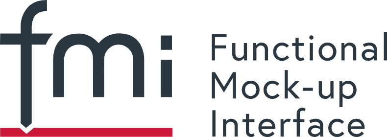



    



# Modelica Association Newsletter 2026-01

issued on March 5, 2026





    <i class="fa-regular fa-envelope" style="font-size:50px"></i>



## Letter from the Board



    <i class="fa-solid fa-building-columns" style="font-size:50px"></i>



## Modelica Association

### FMI Project News

#### FMI Project Leader and Deputy re-elected

On March 17, 2026 the FMI Steering Committee has unanimously re-elected Christian Bertsch, BOSCH Research, as the project leader and Torsten Sommer, Dassault Systèmes, as the deputy for a two-years term.

#### FMI Face-2-Face Design Meeting Munich June 8-10 2026

Dassault Systems will host the next in-person FMI Design meeting.\
Please drop us a note to contact@fmi-stanard.org if you are interested in participating as a guest.

#### FMI Advisory Committee Meeting April 22 2026

#### 280+ tools supporting FMI listed on the FMI tools page

The number of tools supporting the FMI Standard is still growing! Now we have more than 280 tools listed on https://fmi-standard.org/tools/ !

#### News on FMI Layered Standards

#####  Pre-Release of FMI Layered Standard References (FMI-LS-REF) v1.0.0-alpha.1

The FMI Project is happy to announce the alpha pre-release of the FMI Layered Standard References (FMI-LS-REF), which allows the inclusion of related files into an FMU.
Thanks to the FMI Project Team and especially to Pierre Mai (PMSF IT Consulting Pierre R. Mai) for the work!

Summary: This layered standard provides the capability to clearly designate the roles of additional related files included in an FMU in a structured way. These files are described in the layered standard manifest file, which is part of the FMU archive. In this way, an FMU can be shipped together with related files that are helpful in understanding and correctly using the FMU in a recognizable way.
Note that this layered standard does not mandate the inclusion of any related files with an FMU. It only provides a structured way to describe such files, if they are included. The included related files can be of arbitrary types, as long as their roles are described in the layered standard manifest file. This layered standard can be used in addition to other layered standards, and allows the central description of related files included with the FMU, independently of their use in other layered standards. Thus an implementation can treat the related files described in this layered standard in a uniform way, regardless of whether they are used in other layered standards or not, and regardless of whether the other layered standards are supported by the implementation or not.

This supports the following use cases, among others:

- Inclusion of requirements, specifications, model sources, and other related files that are helpful in understanding and correctly using the FMU in a recognizable way.
- The ability to provide multiple parameter sets with an FMU as part of the FMU archive.
- Inclusion of additional experiments that provide sufficient information to enable smoke test validation of an FMU in a new simulation environment.

The pre-release note of v1.0.0-alpha.1 is available here: https://github.com/modelica/fmi-ls-ref/releases/tag/v1.0.0-alpha.1 \
You can inspect the current development version of this Layered Standard here: https://lnkd.in/eNW-y46v](https://modelica.github.io/fmi-ls-ref/main/ \
For the the general concept of Layered Standards to the FMI Standards see this paper: https://doi.org/10.3384/ecp204381 \
Learn more [on the Release page on Github](https://github.com/modelica/fmi-ls-ref/releases/tag/v1.0.0-alpha.1).

##### Pre-Release of FMI Layered Standard for Network Communication (FMI-LS-BUS) v1.3.0-alpha.1 with LIN support available

The FMI Project is happy to announce we have just published the 1.3.0-alpha.1 version of the FMI-LS-BUS standard, that version that finally adds the long-awaited LIN support. 
This version includes the common Physical Signal Abstraction, that fits for all bus types, and the Network Abstraction that currently supports CAN, CAN FD, CAN XL (from v1.0.0), FlexRay (from v1.1.0; currently in Beta state), Ethernet (from v1.2.0; currently in Alpha state) and LIN. 
Check out our roadmap to get more information about the expansion plans of the FMI-LS-BUS.  \
Learn more [on the Release page on Github](https://github.com/modelica/fmi-ls-bus/releases/tag/v1.3.0-alpha.1). \
Currently intensive cross-checking of FMI-LS-BUS v1.3.0-alpha.1 is going on with prototype implementations from different tool vendors with the working group of the FMI project.

##### FMI Layered Standard for Structures (FMI-LS-STRUCT)

A pre-release v1.0-beta.1 of the MI Layered Standard for Structures (FMI-LS-STRUCT) will be coming soon! Stay tuned on https://github.com/modelica/fmi-ls-struct/.

##### Differential ALgebraich Equations (DAE): New working group founded. 

A new working group for support for Differential-Algebraic Equations (DAE) support (possibly as a layered standard) in FMI has been formed. You can follow the development on Github https://github.com/modelica/fmi-ls-dae.

#### Asian and American Modelica _and FMI_ Conferences 2026

FMI will be a hot topic and the Asian and American Modelida & FMI Conferences, which is reflected by now having "FMI" in the conference title. We see a lot of interest in FMI both in America and Asia, so this is a very attractive conference. FMI Project Leader Christian Bertsch will be giving a keynote and a tutorial on FMI at the Asian Conference.

#### Other Resources for FMI

* Visit the [FMI tools page](https://fmi-standard.org/tools) listing 260 tools supporting FMI!
* Join the [LinkedIn FMI community](https://www.linkedin.com/groups/7477473/) to get the latest news on FMI, FMI supporting tools and discussions within the user community.
* Report problems of the standard itself or suggestions for new features in form of issues or discussions on [fmi-standard.org](https://github.com/modelica/fmi-standard)

<!-- END Modelica Association -->



    <i class="fa-solid fa-users" style="font-size:50px"></i>



## Conferences and user meetings

<!-- END Conferences and user meetings -->



    <i class="fa-solid fa-industry" style="font-size:50px"></i>



## Vendor news

<!-- END Vendor news -->



    <i class="fa-solid fa-book" style="font-size:50px"></i>



## News from libraries

<!-- END News from libraries -->



    <i class="fa-solid fa-graduation-cap" style="font-size:50px"></i>



## Education news

<!-- END Education news -->
