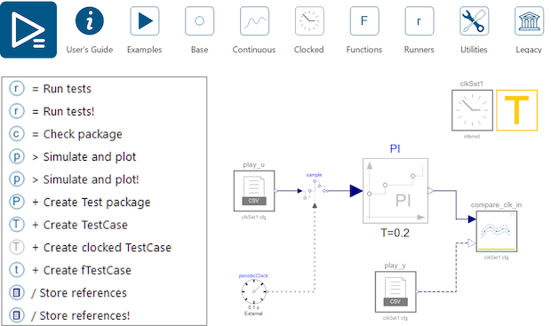



    



# Modelica Association Newsletter 2026-01

issued on March 5, 2026





    <i class="fa-regular fa-envelope" style="font-size:50px"></i>



## Letter from the Board

Dear Modelica, FMI, SSP, DCP, eFMI interested,

In the year 2026, we put the focus on our regional events in America and Asia. The paper deadline for both conferences is approaching fast: 

Deadline for the submission of scientific papers: **May 15**.

- [Asian Modelica & FMI Conference](https://modelica.org/events/asian2026/) in Hangzhou, China, September 20-22
- [American Modelica & FMI Conference](https://modelica.org/events/american2026/) in Atlanta, Georgia, USA, October 12-14

Please note, that both conferences also offer industrial user presentations and tutorials. Please inform yourself at the corresponding conference website on the corresponding deadlines (approx. in June). Furthermore, both conferences are open for sponsors. Furthermore the sponsorship conditions for the international conference in Prague will soon be available.

Having worked for many years in the field of aviation, I am very glad that Prof. Dimitri Marvis who is directing the highly renowned [Aerospace Systems Design Laboratory](https://www.asdl.gatech.edu/) is offering to host the American Modelica & FMI conference at the site of Georgia Tech. Modelica has been applied more and more in Aerospace and this event will further strengthen our presence in this domain.

The Asian Modelica & FMI Conference is already worth attending just for its impressive keynotes:
- **Zhong Yilin**, Vice President of the **BYD** Automotive Engineering Research Institute will demonstrate what is needed Model-based Digital Engineering Practice in one of the most dynamic sectors of Chinas industry. 
- **Prof. Xu Yangzeng** will show how to transfer the modeling expertise acquired for hydraulic system to the modern era of **Digitial Twins**.
- **Dr. Hilding Elmqvist** (Mogram AB) formed the whole history Modelica from its very beginning and is eager to enter with his work into the era of **cloud technologies and intelligent automation**.
- **Christian Bertsch** form Bosch Research, who is **leading the FMI development** can give an equally exciting story on the development of FMI, its enormous world-wide success and also on the upcoming future developments.

The next event for me personally is however close by: I am looking forward to speak at the [Community Meetup of Modelica in Process Engineering](https://tlk-energy.de/events/meetup-modelica-process-engineering). 

In addition to the conference, the Modelica Association is also driving things forward internally, getting ready for this years **assembly meeting on May 19**. The Modelica Language Group has just met in Lund, Sweden in order to prepare two new release versions of the Language Specification, the FMI Group is planning its next physical meeting at the beginning of June in Munich. This month, we have held an inaugural meeting on the topic of Visualization, particularly 3D Visualization and feedback from 3D environments. Since this topic is interesting for FMI and Modelica, this working group shall become part of a new effort dedicated for cross-standard coordination. This will be one of the topics of our assembly meeting.

Regarding the technical development, I am getting increasingly optimistic and excited. I have seen the simulation of very large Modelica models enabled by refined modeling techniques and different compilation approaches. Many of these upcoming improvements are supported by the ITEA project OpenScaling. Also, I have noticed an increasing demand for Modelica in robotics and we all recognize that Agentic AI tools get more and more applicable for Modelica & FMI tasks.

Exciting times ahead!

Dirk Zimmer on April 24, 2026 \
*Chair of the Modelica Association*



    <i class="fa-solid fa-building-columns" style="font-size:50px"></i>



## Modelica Association

### FMI Project News

#### FMI Project Leader and Deputy re-elected

On March 17, 2026 the FMI Steering Committee has unanimously re-elected Christian Bertsch, BOSCH Research, as the project leader and Torsten Sommer, Dassault Systèmes, as the deputy for a two-years term.

#### FMI Face-2-Face Design Meeting Munich June 8-10 2026

Dassault Systems will host the next in-person FMI Design meeting.\
Please drop us a note to contact@fmi-stanard.org if you are interested in participating as a guest.

#### FMI Advisory Committee Meeting April 22 2026

#### 280+ tools supporting FMI listed on the FMI tools page

The number of tools supporting the FMI Standard is still growing! Now we have more than 280 tools listed on https://fmi-standard.org/tools/ !

#### News on FMI Layered Standards

#####  Pre-Release of FMI Layered Standard References (FMI-LS-REF) v1.0.0-alpha.1

The FMI Project is happy to announce the alpha pre-release of the FMI Layered Standard References (FMI-LS-REF), which allows the inclusion of related files into an FMU.
Thanks to the FMI Project Team and especially to Pierre Mai (PMSF IT Consulting Pierre R. Mai) for the work!

Summary: This layered standard provides the capability to clearly designate the roles of additional related files included in an FMU in a structured way. These files are described in the layered standard manifest file, which is part of the FMU archive. In this way, an FMU can be shipped together with related files that are helpful in understanding and correctly using the FMU in a recognizable way.
Note that this layered standard does not mandate the inclusion of any related files with an FMU. It only provides a structured way to describe such files, if they are included. The included related files can be of arbitrary types, as long as their roles are described in the layered standard manifest file. This layered standard can be used in addition to other layered standards, and allows the central description of related files included with the FMU, independently of their use in other layered standards. Thus an implementation can treat the related files described in this layered standard in a uniform way, regardless of whether they are used in other layered standards or not, and regardless of whether the other layered standards are supported by the implementation or not.

This supports the following use cases, among others:

- Inclusion of requirements, specifications, model sources, and other related files that are helpful in understanding and correctly using the FMU in a recognizable way.
- The ability to provide multiple parameter sets with an FMU as part of the FMU archive.
- Inclusion of additional experiments that provide sufficient information to enable smoke test validation of an FMU in a new simulation environment.

The pre-release note of v1.0.0-alpha.1 is available here: https://github.com/modelica/fmi-ls-ref/releases/tag/v1.0.0-alpha.1 \
You can inspect the current development version of this Layered Standard here: https://lnkd.in/eNW-y46v](https://modelica.github.io/fmi-ls-ref/main/ \
For the the general concept of Layered Standards to the FMI Standards see this paper: https://doi.org/10.3384/ecp204381 \
Learn more [on the Release page on Github](https://github.com/modelica/fmi-ls-ref/releases/tag/v1.0.0-alpha.1).

##### Pre-Release of FMI Layered Standard for Network Communication (FMI-LS-BUS) v1.3.0-alpha.1 with LIN support available

The FMI Project is happy to announce we have just published the 1.3.0-alpha.1 version of the FMI-LS-BUS standard, that version that finally adds the long-awaited LIN support. 
This version includes the common Physical Signal Abstraction, that fits for all bus types, and the Network Abstraction that currently supports CAN, CAN FD, CAN XL (from v1.0.0), FlexRay (from v1.1.0; currently in Beta state), Ethernet (from v1.2.0; currently in Alpha state) and LIN. 
Check out our roadmap to get more information about the expansion plans of the FMI-LS-BUS.  \
Learn more [on the Release page on Github](https://github.com/modelica/fmi-ls-bus/releases/tag/v1.3.0-alpha.1). \
Currently intensive cross-checking of FMI-LS-BUS v1.3.0-alpha.1 is going on with prototype implementations from different tool vendors with the working group of the FMI project.

##### FMI Layered Standard for Structures (FMI-LS-STRUCT)

A pre-release v1.0-beta.1 of the MI Layered Standard for Structures (FMI-LS-STRUCT) will be coming soon! Stay tuned on https://github.com/modelica/fmi-ls-struct/.

##### Differential ALgebraich Equations (DAE): New working group founded. 

A new working group for support for Differential-Algebraic Equations (DAE) support (possibly as a layered standard) in FMI has been formed. You can follow the development on Github https://github.com/modelica/fmi-ls-dae.

#### Asian and American Modelica _and FMI_ Conferences 2026

FMI will be a hot topic and the Asian and American Modelida & FMI Conferences, which is reflected by now having "FMI" in the conference title. We see a lot of interest in FMI both in America and Asia, so this is a very attractive conference. FMI Project Leader Christian Bertsch will be giving a keynote and a tutorial on FMI at the Asian Conference.

#### Other Resources for FMI

* Visit the [FMI tools page](https://fmi-standard.org/tools) listing 260 tools supporting FMI!
* Join the [LinkedIn FMI community](https://www.linkedin.com/groups/7477473/) to get the latest news on FMI, FMI supporting tools and discussions within the user community.
* Report problems of the standard itself or suggestions for new features in form of issues or discussions on [fmi-standard.org](https://github.com/modelica/fmi-standard)

<!-- END Modelica Association -->



    <i class="fa-solid fa-users" style="font-size:50px"></i>



## Conferences and user meetings

<!-- END Conferences and user meetings -->



    <i class="fa-solid fa-industry" style="font-size:50px"></i>



## Vendor news

### Siemens Digital Industries Software

#### Simcenter Amesim 2604 released
[Siemens Digital Industries Software](https://www.sw.siemens.com/) is pleased to announce the recent release of **Simcenter&nbsp;Amesim&nbsp;2604** as part of its [system simulation solutions](https://blogs.sw.siemens.com/simcenter/simcenter-systems-release-2604/). This release introduces key updates, notably:

* Major enhancements to the so-called **Battery Pack Assistant**, to further support electrification (modeling capabilities and workflow).
* Expanded **gas system simulation capabilities**, serving applications like pneumatic controls in industrial automation, compressors in HVAC systems, or specialized gas handling in extreme environments.

More detail can be found [here](https://blogs.sw.siemens.com/simcenter/simcenter-systems-release-2604/ ). Several changes have also been specifically applied to **exported&nbsp;FMUs**, in terms of <i>licensing policy</i> as well as <i>integration and collaboration capabilities</i>. These specific updates as described hereafter.  

#### Export of full-featured standalone (license-free) FMUs

The previous restriction on the specific export option allowing to create license-free (standalone) FMUs for Windows or Linux standard platforms has been removed. 

Prior to release 2604, such FMUs were limited to models without a solver (model exchange) or those using only a fixed-step solver (co-simulation). Now, this highly requested licensing policy change brings several key benefits:
* **Avoided rework**: users can now avoid the need to rework models or tune third-party solvers, which is especially useful for Model-in-the-Loop (MiL) applications.
* **Reliable deployment**: deploy validated **Simcenter&nbsp;Amesim** models with their native solver embedded, ensuring repeatable results.
* **Standalone apps**: create and share standalone applications leveraging **Simcenter&nbsp;Amesim**'s modeling and solving capabilities.

This means even large, sophisticated models with their native &mdash;&nbsp;best-adapted&nbsp;&mdash; solver can be deployed as lightweight FMUs (a few megabytes) with no external dependencies, which greatly facilitates model reuse and collaboration with partners, suppliers, or other departments.

#### Unified FMU export for real-time

To address the challenge of exporting, validating, and deploying FMUs for real-time simulation while avoiding fragmented workflows and/or late issue discovery, **Simcenter&nbsp;Amesim&nbsp;2604** now adds binaries for standard platforms (Windows and Linux), in addition to the source code for the chosen real-time target, within the exported &ldquo;FMUs for real-time&rdquo;. The compilation of these binaries is similar to that of the real-time target's toolchain. The expected concrete benefits for users are:
* **Easier pre-checks** (on Windows or Linux) before sharing FMUs to real-time target users.
* **Built-in continuity, consistency and traceability** (same FMU used <i>offline</i> and <i>online</i>).
* **No need for any external compiler** for generating/compiling these FMUs. 
* **Flexible deployment**: offline tests possible on machines with no **Simcenter&nbsp;Amesim** license or installation.

Each of these FMUs can be seen as a **unified model container** now also usable for offline tests in any FMI compatible software. This feature avoids the need to export multiple FMUs and represents a step towards unification of FMI based and Simulink based model export workflows of real-time capable **Simcenter&nbsp;Amesim** models. 

#### Export of 3.0 FMUs with arrays to represent vectors

With **Simcenter&nbsp;Amesim&nbsp;2604**, exporting 3.0 FMUs now includes support for fixed-size arrays. This enhancement allows users to easily create arrays by simply connecting vectored signals directly to and/or from export interface blocks. Arrays are a cornerstone feature of FMI 3.0, offering significantly simpler and more usable model layouts by reducing the need for numerous individual connections. For instance, the automotive application example below demonstrates two **Simcenter&nbsp;Amesim** 3.0 FMUs co-simulated within [**Simcenter&nbsp;Twin&nbsp;Activate**](https://altair.com/twin-activate ). Here, arrays conveniently group the vehicle's wheel speeds and brake forces as vectors, streamlining the connections between the FMUs.

For more information on **Simcenter&nbsp;Amesim**, please visit our [website](https://www.siemens.com/en-us/products/simcenter/systems-simulation/amesim/ ).

*This article is provided by Bruno Loyer ([Siemens Digital Industries Software](https://www.sw.siemens.com/ ))*

<!-- END Vendor news -->



    <i class="fa-solid fa-book" style="font-size:50px"></i>



## News from libraries

### Testing Library 2.0.0

The Testing library received a major update and is released as 2.0.0 with Dymola 2026x Refresh 1.
The target was to harmonize clocked and continuous tests, simplify the library usage and improve the
visuals of test reports and animated results.

Some of the important changes are:
- New package structure, making clocked blocks the official solution for recordings
- Updated toolbar with clean structure
- Graphical indication of overall result
- Updated format of test reports printed to command line
- New concept for test cases functions: now checks and be added free without dealing with vector indices
- Simpler handling of negative tests with new test results XFAIL and XPASS.
- Legacy package to run existing tests without changes when upgrading

Existing tests are almost fully compatible after running the provided conversion script.
See the release notes of the Testing library inside Dymola for the full list of changes and more details
regarding the upgrade of some corner cases.

*This article is provided by Marco Keßler ([Dassault Systèmes Austria GmbH](https://www.3ds.com/))*

<!-- END News from libraries -->



    <i class="fa-solid fa-graduation-cap" style="font-size:50px"></i>



## Education news

---
### Dr. Clément Coïc | FMI 3.0 and FMPy cheat sheet

Since mid-September, [Clément Coïc](https://www.linkedin.com/in/clementcoic/) launched a LinkedIn newsletter: [Learn Modelica & FMI](https://www.linkedin.com/newsletters/learn-modelica-fmi-7373084674463719424/).    
Since then, 27 articles have been written! Check them out on LinkedIn or on the [dedicated website](https://dr-clementcoic.github.io/LearnModelicaFMI/)!    

On top of these articles, a brand new and quite complete [cheat sheet for FMI 3.0 and FMPy](https://dr-clementcoic.github.io/fmi-cheat-sheet/) has been published, with [runnable examples](https://colab.research.google.com/github/Dr-ClementCoic/fmi-cheat-sheet/blob/feature/notebook/fmpy_cheatsheet_notebook.ipynb). Try them out!

While the newsletter is the perfect companion for your Saturday's morning cup of tea 🫖 or coffee ☕️, this cheat sheet - almost a cheat book! - should be bookmarked to help you in your daily FMI work.

Hope this helps,     
Clem

<!-- END Education news -->
