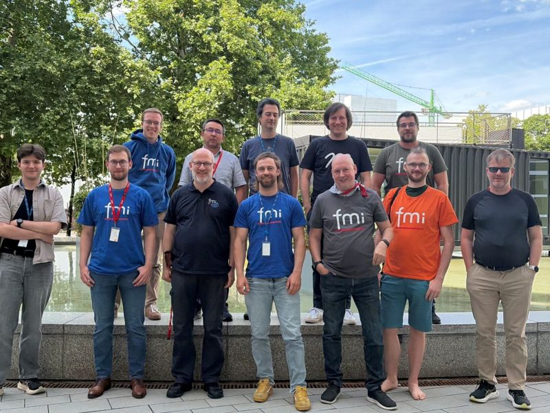
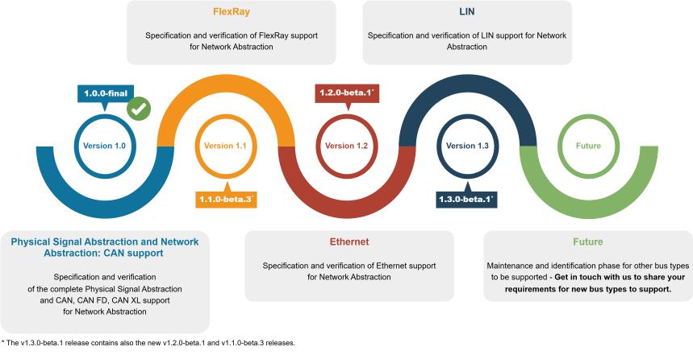
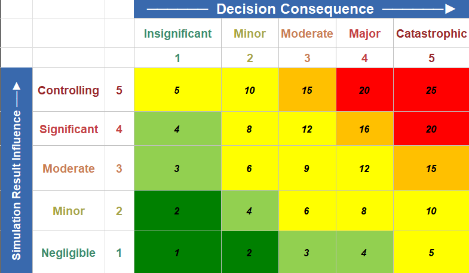
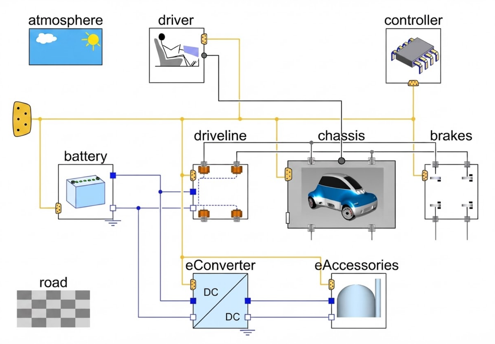
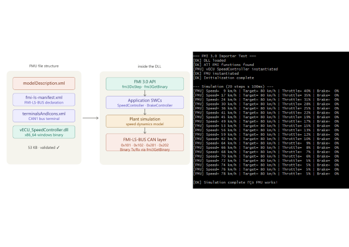
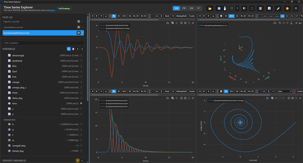



    



# Modelica Association Newsletter 2026-02

issued on August 3, 2026





    <i class="fa-regular fa-envelope" style="font-size:50px"></i>



## Letter from the Board

Dear Modelica, FMI, SSP, DCP, eFMI interested,

With a clear, unanimous vote at this year’s assembly meeting, we highly welcome [Dr. Clément Coïc](https://dr-clementcoic.github.io/LearnModelicaFMI/about.html) as new member of the board. He takes the lead for Technology. With his strong expertise in artificial intelligence, there will be a special focus on the interaction of Modelica & FMI standards and agentic AI.  His name will probably be already familiar to most readers of this newsletter. After all Clément Coïc is hosting his own very popular newsletter series [“Learn Modelica & FMI”](https://www.linkedin.com/newsletters/learn-modelica-fmi-7373084674463719424/). Of course, he will continue his efforts to proliferate his knowledge about modeling and simulation, not only in this form. We are very glad to have gained Clément as member of our board and are sure he will provide us with fresh impetus.

Many new contributions are also issued by our community form all over the world. We had an overall record number of submissions for our two regional conferences. Almost a hundred submissions have been submitted in total for the [American Modelica & FMI Conference](https://modelica.org/events/american2026/) and the [Asian Modelica & FMI Conference](https://modelica.org/events/asian2026/). We are thrilled to see this amount of content being generated between our large international conferences.

The [preliminary program](https://modelica.org/events/asian2026/prelprogram/) of the Asian Conference is already available. As you can see, it is a true Modelica & FMI conference offering separate tracks for both communities. Another remarkable point is the strong presence of Modelica in the application field of nuclear power generation. The American conference will offer very strong technical highlights: the [RuMoCa](https://github.com/CogniPilot/rumoca) Modelica compiler will be presented with an official paper and also the development of the [layered FMI standard for DAE representation](https://modelica.github.io/fmi-ls-dae/main/) will be prominently discussed. These are just two examples of many.

We from the board hope to meet you at one of these events!

Dirk Zimmer on July 30, 2026 \
*Chair of the Modelica Association*



    <i class="fa-solid fa-building-columns" style="font-size:50px"></i>



## Modelica Association

### FMI Project News

#### FMI Face-2-Face Design Meeting Munich June 8-10 2026

The FMI Project had a very productive in-person FMI Design meeting in Munich. Thanks to **Torsten Sommer** and **Dassault Systèmes** for hosting us - and to all participants from **Akkodis, Bosch, Dassault Systèmes, German Aerospace Center (DLR), Keysight Technologies, PMSF IT Consulting Pierre R. Mai, Santa Anna IT Research Institute, Synopsys Inc** and the participants in online sessions!

We made very good progress on 
- the coming **FMI 3.0.3** with important clarifications especially for clocks usage (that become important as many tools support them now, many of them in the context of the FMI-LS-BUS)
- **efficiency improvements** for large FMI3.0-based simulation systems
- the **FMI Layered Standards** for 
 * References (**FMI-LS-REF**)
 * Network Communication (**FMI-LS-BUS**), especially cross-checking the coming v1.3 with Flexray, Ethernet, LIN support
 * Differential Algebraic Equations (**FMI-LS-DAE**)
- Web Assembly (**WASM**) support in FMI (creating a first prototype and forming a working group)
And we had a lot of fun!

#### 286 tools supporting FMI listed on the FMI tools page!

The number of tools supporting the FMI Standard is still growing! Now we have 286 tools listed on https://fmi-standard.org/tools/ !
If you know of any additional tools missing please encourage the tool vendors or authors to add them!

#### fmusim re-implemented in Rust and separated out from the Reference FMUs repository

fmusim is a command line tool to inspect, validate, and simulate FMUs that creates plots, logs FMI calls, and builds platform binaries. 
Compared to the previous implementation in C which was part of the **Reference FMUs** (https://github.com/modelica/reference-fmus), the new fmusim is is now based on the **open source** [fmi-rs library](https://github.com/CATIA-Systems/fmi-rs), a completely new FMI library for FMI support implemented in **Rust** by **Torsten Sommer (Dassault Systèmes)**, and provided open source (https://github.com/modelica/fmusim) by the FMI Project within Modelica Association. Many Thanks, Torsten!!!

**fmusim is one of the recommended validation tools for FMUs, but can also be used as a simple simulator for single FMUs.**

#### News on FMI Layered Standards

##### FMI Layered Standard for Network Communication (FMI-LS-BUS) 

The FMI Project is happy to announce the **Pre-Release v1.3-beta.1** of the FMI Layered Standard for Network Communication (**FMI-LS-BUS**)!

In this release **Ethernet** and **LIN** support are going from Alpha to Beta state. Additionally it contains smaller adoptions for **FlexRay**.

Summarized this version includes the common **Physical Signal Abstraction**, that fits for all bus types, and the Network Abstraction that currently supports CAN, CAN FD, CAN XL (from v1.0.0), FlexRay (from v1.1.0; currently in Beta state), Ethernet (from v1.2.0; now in Beta state) and LIN (from v1.3.0; now in Beta state). Check out our roadmap to get more information about the expansion plans of the FMI-LS-BUS.

Many thanks to the whole FMI-LS-BUS **working group** (with members from **Akkodis, Altair, AVL, Beckhoff Automation, Bosch, dSPACE, PMSF IT Consulting Pierre R. Mai, Siemens Digital Industries Software, Synopsys Inc, VECTOR Informatik**)! And especially to Benedikt Menne for the release preparation!

Learn more here: https://github.com/modelica/fmi-ls-bus/ and https://github.com/modelica/fmi-ls-bus/releases/tag/v1.3.0-beta.1

##### FMI Layered Standard References (FMI-LS-REF)

The FMI Project is happy to announce the **Pre-Release v1.0.0-beta.1** of the FMI Layered Standard References (FMI-LS-REF)! Many thanks to the FMI Project - especially to the working group leader **Pierre R. Mai** - for their contributions!

This layered standard provides the capability to clearly designate the roles of additional **related files** included in an FMU in a structured way. These files are described in the layered standard manifest file, which is part of the FMU archive. In this way, an FMU can be shipped together with related files that are helpful in understanding and correctly using the FMU in a recognizable way. Note that this layered standard does not mandate the inclusion of any related files with an FMU. It only provides a structured way to describe such files, if they are included. The included related files can be of arbitrary types, as long as their roles are described in the layered standard manifest file. This layered standard can be used in addition to other layered standards, and allows the central description of related files included with the FMU, independently of their use in other layered standards. Thus an implementation can treat the related files described in this layered standard in a uniform way, regardless of whether they are used in other layered standards or not, and regardless of whether the other layered standards are supported by the implementation or not.

The experiments format that was formerly part of this layered standard can be used beyond FMI and will therefore be defined in the “harmonized specification” **ma-hs-experiments** developed by the new Coordination Project within Modelica Association, see https://github.com/modelica/ma-hs-experiments.

Learn more here: https://github.com/modelica/fmi-ls-ref/ and https://github.com/modelica/fmi-ls-ref/releases/tag/v1.0.0-beta.1

##### FMI Layered Standard WebAssembly (FMI-LS-WASM)

The FMI Project started working on supporting **WebAssembly (WASM)** as new "platform" besides platform specific binaries or source code.
WASM has several benefits w.r.t. **portability** and **cyber-security** (through inherent sandboxing).
We intend to support this in the form of a Layered Standard (FMI-LS-WASM), and created already a first prototype using the WebAssembly Component Model interface description language (WIT). (Many thanks to **Pierre Mai**!)

You can find the first **prototype** here: https://github.com/modelica/fmi-ls-wasm
Comments and feedback is very welcome - or become a contributor! (For that it is necessary that your organization signs the Contributor License Agreement). 

*This article is provided by the FMI Project*

##### FMI Layered Standard for Differential-Algebraic Equations (FMI-LS-DAE)

The working group on support for **Differential-Algebraic Equations (DAE)** in FMI, led by **Joel Andersson (FMIOPT)** and **Andreas Heuermann (Santa Anna IT Research Institute)**, is actively working on a layered standard FMI-LS-DAE. A first pre-release of the standard (v1.0.0-alpha.1) is planned for 2026.

The working group will present its progress in the paper *"Towards an FMI Layered Standard for DAE: Applications for Simulation and Optimization"* at the [American Modelica & FMI Conference 2026](https://modelica.org/events/american2026/).
A preprint is already available on [arXiv](https://arxiv.org/abs/2606.22544).

You can follow the development on [GitHub](https://github.com/modelica/fmi-ls-dae) and read the [current draft of the specification](https://modelica.github.io/fmi-ls-dae/main/).

*This article is provided by Andreas Heuermann, [Santa Anna IT Research Institute](https://www.santa-anna.se/)*

<!-- END Modelica Association -->



    <i class="fa-solid fa-users" style="font-size:50px"></i>



## Conferences and user meetings

<!-- TODO: Conferences and user meetings -->

### American Modelica & FMI Conference 2026

The **American Modelica & FMI Conference 2026** will be held in person at the [Georgia Institute of Technology](https://www.asdl.gatech.edu/) in Atlanta, in the Aerospace Systems Design Laboratory, from **October 12–14, 2026**. It is organized by [NAMUG](https://namug.org/), the North American Modelica Users Group, in cooperation with the [Modelica Association](https://modelica.org/association/). The conference brings together users, library developers, tool vendors, and language designers to share the latest work on Modelica, FMI, SSP, eFMI, DCP, and equation-oriented modeling more broadly.

For 2026 the program features **two tracks**: the established Modelica program alongside a new track covering the structure and application of equation-oriented modeling languages other than Modelica, broadening the conversation around shared modeling principles.

Workshops and tutorials for beginners and advanced users will be given on the afternoon of **October 12**, with keynotes, paper presentations, vendor sessions, and an exhibition on **October 13–14**.

Two keynotes are confirmed: **Oliver Lenord** (Bosch Corporate Research), on pushing the limits of system simulation through open standards, and **Dr. Daniel Mikkelson** (Idaho National Laboratory), on nuclear system modeling for integrated energy systems analyses.

Registration is open; full details are on the [conference page](https://modelica.org/events/american2026/).

*This article is provided by the American Modelica & FMI Conference 2026 organizing committee.*

### Asian Modelica & FMI Conference 2026

the **Asian Modelica & FMI Conference 2026**.
It will take place at the high-tech city of **Hangzhou, China from September 21-22, 2026** also famous of its stunning west lake scenery.
It is organized by the [Beihang University (at Hangzhou campus)](https://zfaien.buaa.edu.cn/About_Us/Overview.htm) and [Nanjing Yuansi SimTek Co., Ltd.](https://en.simtek.cc/) in cooperation with the [Modelica Association](/association/).
This is the first visit of the conference series in China.

The [preliminary program](https://modelica.org/events/asian2026/prelprogram/) of the conference is already available and features **four parallel tracks**. Two methods-oriented tracks on Modelica & FMI as well as agentic AI Usage and two application-oriented tracks with a strong focus on (nuclear) energy, buildings and (electric) automotive systems.

The program is further enriched by four prominent keynote speakers.

Registration for the conference is open! All details on the [conference page](https://modelica.org/events/asian2026/)
  
### Modelon Innovate 2027

**Physics-Driven. Agent-Powered.**\
**April 21-22, 2027 | Clarion Malmö Live | Malmö, Sweden**

Modelon Innovate returns in 2027 bringing together Modelon customers, partners, and industry experts for two in-person days of insight, education, and connection. 

The event will feature industry-focused presentations, customer success stories, partner perspectives, product updates, and keynote insights exploring the future of simulation and AI-enabled engineering. 

Participants will also experience applied, real-world training led by Modelon experts, with sessions focused on practical workflows in Modelon Impact, Modelica-based skills, troubleshooting, and ways to apply new capabilities to complex engineering challenges.

Learn more on the [Modelon Innovate website.](https://www.modelon.com/innovate-2027/) 

*This article is provided by Lauren Caris at Modelon.*

<!-- END Conferences and user meetings -->



    <i class="fa-solid fa-industry" style="font-size:50px"></i>



## Vendor news

<!-- TODO: other vendor submissions -->

### Model Based Innovation (MBI) Updates

MBI is the only one-stop shop for solutions based on the Modelica Association standards based in the United States. In addition to tool and library sales,
we also provide services to help you set up your processes to successfully use model based design for innovative product development.

#### [Tool Updates](https://modelbased.cloud/tools/)

As a **[Modelon Impact](https://www.modelon.com/modelon-impact/) Reseller**, MBI has developed a custom **MCP (Model Context Protocol) integration** that streamlines Modelica simulation and automated analysis workflows — turning simulation runs and report generation into simple, agent-driven steps. Alongside this, we've built specialized **skills files** tailored for advanced Modelica workflows in optimization and controls development, so your team can get more out of every modeling session.

 — inertia1.w, Modelica.Blocks.Examples.PID_Controller (16 samples, 0.0–5.0 s)')



<em>Sobol-sweep for PID controller response for varying plant parameters, generated with Modelon Impact MCP server</em>



#### [Libraries](https://modelbased.cloud/libraries/)

For Libraries, our main Modelica platform is Modelon Impact, but we work with other tools as well, especially for open-source libraries, and extending open-source libraries. MBI has adapted some open source libraries to fully work with Modelon Impact. For example, we have adapted the [Industrial Control Systems Library](https://github.com/hubertus65/IndustrialControlSystems) for Modelon Impact and provide support for it. Further libraries are in preparation.

#### [Services and Training](https://modelbased.cloud/services/)

<!-- TODO: add images -->

MBI offers **open enrollment Modelica courses** to help your team level up fast:

- **Modelica Basics** — build a solid foundation in acausal, equation-based modeling from day one.
- **Advanced Modelica** — sharpen your skills for tackling complex, multi-domain systems.
- **Modelica for Controls Development** — bridge system simulation and controls engineering with hands-on, practical techniques.
- **Agentic AI for Modelica Modeling and Simulation** — learn to accelerate your modeling workflow with curated skills files and purpose-built MCP integrations.

In collaboration with **eXXcellent Solutions GmbH**, MBI also offers a dedicated training course on implementing the **Credible Simulation Process** with **SSP** and **SSP-Traceability** in [easySSP](https://www.easy-ssp.com/) — bringing rigor and traceability to every simulation result.

For organizations ready to scale, MBI offers a course on building a **flexible, scalable governance structure for system simulation**, driven by automated, agentic-AI-based checking of process requirements. Governance depth and verification rigor are tailored to your needs through a simulation risk assessment based on the **NAFEMS ASSESS Engineering Simulation Risk model**, updated to the latest **NASA Modelica and Simulation Handbook 7009B** (2026 edition). [Contact us](mailto:hubertus.tummescheit@modelbased.cloud) to learn more.

 

With the above portfolio, [MBI LLC](https://modelbased.cloud/) will select the right solution for you, no matter where you are on your journey to standards-based system simulation!
Please [contact us](https://modelbased.cloud/company/) with your requests!

*This article is provided by Hubertus Tummescheit, [Model Based Innovation LLC](https://modelbased.cloud/)*

### Modelica MCP server from MLQT project

The MLQT 2026.3 release includes a new Modelica MCP server for creating, editing and checking Modelica models and libraries. The MCP server provides powerful and surgical Modelica editing tools that any AI agent that supports the MCP standard can utilise. The MCP server loads your Modelica libraries and provides the AI agent with efficient access to the information it needs dramatically reducing token usage when creating and editing Modelica models. To fully close the loop and empower your AI agent to simulate and verify models, you will also need an MCP server for your Modelica simulation tool of choice.

The latest release of the MLQT project also brings new features to the Modelica aware Git and SVN interface to improve the capabilities for checking and enforcing your coding style guidelines.  For example, spelling mistakes can be corrected through the MLQT tool without needing to return to your Modelica editor.

MLQT is available for Windows today, with a Linux version on the roadmap. To learn more, visit the open-source [repository on GitHub](https://github.com/mdempse1/MLQT).

*This article is provided by Mike Dempsey ([M Dempsey Ltd](https://dempsey.me.uk/))*

### Keysight Technologies: SimulationX 2026 Released

Keysight is pleased to announce the release of SimulationX 2026, introducing new capabilities that improve engineering productivity, model fidelity, and multi-domain system simulation across automotive, energy, industrial, and aerospace applications.

Highlights of this release include:

* **Vehicle Dynamics enhancements**, including automated road configuration, trajectory generation, regenerative braking examples, and standardized ISO 4138 validation workflows.
* **Advanced Heat Exchanger modeling**, featuring improved numerical robustness, enhanced boiling and condensation correlations, support for transcritical processes, and updated CoolProp integration.
* **Hydraulics library enhancements**, including new proportional solenoid models, improved density calculations, and enhanced graphical animations for easier model interpretation.
* **Enhanced FEM import and visualization** with support for VPS Structural Mechanics HDF5 files, rigid bodies, and improved computation.
* **Enhanced Modelica support** with Modelica Standard Library 4.1, SVG graphics, and improved unit handling.
* **Performance and usability improvements** delivering faster simulations, improved workflows, and a more streamlined user experience.

SimulationX continues to embrace open standards, supporting Modelica, the Functional Mock-up Interface (FMI), and co-simulation workflows that enable engineers to integrate multi-domain system models into larger engineering toolchains.

SimulationX 2026 also expands its extensive Modelica-based libraries for mechanical, electrical, thermal, hydraulics, pneumatics, controls, and vehicle systems, enabling engineers to build high-fidelity digital twins while maintaining an open and reusable modeling approach.

Learn more about **SimulationX 2026 release** [here](https://www.keysight.com/blogs/en/tech/sim-des/simulationx-2026-less-time-building-models-more-time-engineering-better-products).

*This article is provided by Majid Aziz ([Keysight](https://www.keysight.com/in/en/products/design-engineering-software/computer-aided-engineering-software/multi-domain-system.html))*

### FMU Manipulation Toolbox

**FMU Manipulation Toolbox** is an open-source Python package (BSD-2 license) for analyzing, modifying, and combining
Functional Mock-up Units (FMUs) without recompiling them. Both FMI-2.0 and FMI-3.0 are supported, currently limited
to Co-Simulation mode.

#### 🖥️ What's new?

Version 1.9.3 introduced 3 dedicated graphical interfaces:

- FMU Tool — Load an FMU, inspect its ports, batch rename variables, remove hierarchy levels, add
  [remoting interfaces](https://grouperenault.github.io/fmu_manipulation_toolbox/user-guide/fmutool/remoting/)
  (e.g. run a 32-bit FMU on a 64-bit host, or vice versa), and check FMI compliance — all with a few clicks.

- FMU Variable Editor — A spreadsheet-like interface to rename variables, edit descriptions, and adjust simulation
  experiment settings (start/stop time). Modified cells are highlighted in real-time.

- FMU Container Builder — A visual node-graph editor to assemble multiple FMUs into a single FMU Container.
  Drag & drop FMUs, draw wires between ports, configure connections, set start values, organize nested
  sub-containers — and export as FMU or JSON. It can also create an FMU Container from an existing SSP file.

All three tools are accessible from a single launcher: just type `fmutoolbox` in your terminal.

📦 Install in one line: `pip install fmu-manipulation-toolbox`

Try it out, and let us know what you build with it! Bug reports or feature requests are also welcome.

*This article is provided by [Nicolas LAURENT](https://github.com/nl78), [Renault Group](https://www.renaultgroup.com/)*

### ODE+: DLR PowerTrain, AI-native Component, and Exploration

#### Commercial Modelica libraries: DLR PowerTrain added

The August 2026 release of **ODE+ Component** adds support for the **DLR PowerTrain** library. Total-vehicle examples load, translate and simulate with diagram annotations, control bus and variant selection preserved. Support for further commercial DLR libraries, such as the Actuator Library, is in preparation.





#### Component: a rebuilt Modelica IDE

- **AI-assisted modeling** — the assistant builds a model from a natural-language description: selecting and connecting components, generating documentation and icons, and helping locate translation and simulation errors. Generated Modelica code stays editable at every step.
- **Teams** — users create and administer teams in the application. A team space holds shared component libraries and result data, with computing hours pooled across the team.
- **Elastic compute** — studies run on a scalable compute cluster rather than a fixed local machine. GPU instances will follow later.
- **Interactive canvas** — dials, switches, charts and 3D animation sit on the diagram and bind to simulation variables, so a model can be operated and read out in place.
- **Modelica Standard Library 4.1** — MSL 4.1 is supported for load, translate and simulate workflows.
- **Modelica Buildings Library 13** — the Buildings library version 13 is supported.





#### Exploration: optimisation with AI-assisted setup

**ODE+ Exploration**, also available from August 2026, solves single- and multi-objective problems over an analytic expression or a Modelica model. Tuners, objectives and constraints are defined in the interface; Pareto-front and parallel-coordinate views update while the study runs. Objectives that depend on a simulation result — overshoot, settling time, or an integral over a trajectory — can be generated from natural language as editable expressions; after a study completes, AI summarises the Pareto front and trade-offs. The optimisation engine is developed with [Empower Operations](https://empowerops.com).





#### New brand and website





The product family is renamed to **ODE Plus**, with a new logo and landing page. From August 2026, products are reached at [ode.plus](https://www.ode.plus) instead of [orthogonal.dev](https://www.orthogonal.dev).

*This article is provided by Dr. Yang Ji ([orthogonal GmbH](https://www.orthogonal.dev))*
### XRG Simulation - Summer news

#### Upcoming Events

##### Asian Modelica & FMI Conference 2026 (Hangzhou, PR China)

The event will take place at the high-tech city of Hangzhou, PR of China from **September 20-22, 2026**. XRG Simulation is happy to be Gold sponsor of the conference and will be present with a booth and an exciting tutorial about AI-driven surrogate modelling using XRG's **SMArtInt and SMArtInt+ Library**:

**SMArtInt+ - Hands-on AI: Generation and Integration of Neural Networks and Surrogate Models into Modelica**

The 3-hours workshop on Sunday afternoon will be conducted by Tim Hanke. If you intend to participate, please register through the conference registration platform in advance since some parts of the workshop require licensed software for an optimal user experience. The following simulation tools may be used in recent versions: **Dymola**, **OpenModelica** and **MWorks Sysplorer**.

Please also visit the [**Conference Website**](https://modelica.org/events/asian2026/) for more information.

##### ThermoSim2026 Aachen (Germany)

On **September 22 and 23, 2026**, the fourth ThermoSim will take place in Aachen – the expert conference on thermal system simulation with a focus on Modelica and FMI. The conference language will be German, with optional English translation available. XRG Simulation is one of the four organizers of **ThermoSim 2026** and will also be present as an exhibitor. We will be happy to welcome you at our booth and discuss our workflow for **whole-year building and building systems simulation**.

Furthermore, our colleagues Annika Kuhlmann and Jon Babst will give a talk about coupling HVAC Library models with the well-known **Buildings Library**:

**Best of Both Worlds – Integrating HVAC Library Heating and Cooling Systems with Models from the Buildings Library**

For more details, please visit the [**ThermoSim Conference Website**](https://tlk-energy.de/en/events/thermosim-conference-2026). 

##### American Modelica & FMI Conference 2026 (Atlanta, Georgia, USA)

This in-person conference event will take place at the Georgia Institute of Technology in the Aerospace Systems Design Laboratory from **October 12–14, 2026** and is sponsored by XRG Simulation GmbH. We will be present with a booth in the exhibition area and will be happy to discuss our software solutions (e.g., HVAC simulations and AI-driven surrogate modelling) with you.

For more information visit the [**Conference Website**](https://modelica.org/events/american2026/).  

#### New Research

XRG has joined the EU funded Horizon project **EVEREST** with 12 european partners from industry and research. EVEREST stands for: **Energy-efficient VEhicle Range Enhancement through Smart Thermal design and user-centric solutions**. The objective of EVEREST is to develop and demonstrate innovative, user-centric, and cost-effective thermal and energy management solutions for battery-electric light duty vehicles (LDVs) and light commercial vehicles (LCVs) 
that maintain driving range under extreme weather conditions while accounting for personalised thresholds of thermal 
comfort. This includes identifying and validating user requirements and acceptance thresholds, reducing climate related range loss by at least 30% compared to the state of the art, and achieving a 10% improvement in overall energy demand through intelligent, predictive- and AI-based control strategies integrated with future smart city standards. Technical solutions are developed with **virtual demonstrators** (simulation models), implemented in **real-world vehicle demonstrators**, and evaluated on test rigs.   

For more information about the research project, which is kindly funded through the EU grant agreement Horizon-CL5-2025-04-D5-05, visit the official [**Project Website**](https://ec.europa.eu/info/funding-tenders/opportunities/portal/screen/opportunities/topic-details/HORIZON-CL5-2025-04-D5-05?order=DESC&pageNumber=1&pageSize=50&sortBy=relevance&keywords=HORIZON-CL5-2025-04-D5-05&isExactMatch=true&status=31094501,31094502,31094503&frameworkProgramme=43108390&callIdentifier=HORIZON-CL5-2025-04)

#### References

 - Open-source SMArtInt version on [**SMArtInt Github**](https://github.com/xrg-simulation/SMArtInt)
 - [**SMArtInt paper**](https://doi.org/10.3384/ecp218459) "Status of the SMArtInt Library" 

*This article is provided by Stefan Wischhusen ([XRG Simulation GmbH](https://www.xrg-simulation.de/en))*

### OpenModelica 1.27.0

#### Main highlights:
- Experimental MCP server in OMEdit for interaction with AI agents.
- OMEdit now uses Qt6 instead of Qt5, better rendering on high-resolution monitors.
- State machines are now supported by the new frontend.
- Reverse model lookup.
- The Modifiers tab in the parameter dialog now collects all the modifiers applied to a component instance that were not previously displayed in the Parameters dialog.
- Improved formatting of parameter input dialogs.
- More responsive editing of diagrams in OMEdit.
- 60 Hz framerate animations of Multibody systems.
- Improved simulation of systems with implicit equations including if clauses.
- Previously compiled models can be re-simulated in a new session.
- Declarative equation-based debugger now handles models with more than 10.000 equations efficiently.
- FMU memory leaks fixed.
- Applying library conversion scripts preserves the original formatting.

For more details, see the full [1.27.0 release notes](https://github.com/OpenModelica/OpenModelica/releases/tag/v1.27.0).

#### OpenModelica Compiler (OMC)

##### Frontend

The new front end has been further improved with [29 issues resolved](https://github.com/OpenModelica/OpenModelica/issues?q=is%3Aissue%20milestone%3A1.27.0%20label%3ACOMP%2FOMC%2FFrontend%20state%3Aclosed%20-reason%3Anot-planned%20-reason%3Aduplicate%20). 

State machines ar now supported by the new frontend, see [#8162](https://github.com/OpenModelica/OpenModelica/issues/8162); since there are basically no open-source libraries using them for testing, the implementation may still be buggy or incomplete, testing by OpenModelica users is very welcome. 

Base Modelica export was improved, including alias simplification of flow variables in stream connectors for efficient mixed-integer optimization of thermo-fluid system models, [-d=flowAliasElimination](https://openmodelica.org/doc/OpenModelicaUsersGuide/latest/omchelptext.html#omcflag-debug-flowaliaselimination). 

The use of equality among Reals outside functions, which is prohibited by the Modelica Language Specification for good numerical reasons, is now deprecated, see #14940. It will not be accepted by future versions of the compiler, unless specifically required by a `--allowNonStandardModelica` flag.

##### Backend and Code Generation

A bug in the resolveLoops module causing completely wrong results to be computed was fixed, see #13292. Overall, [8 issues](https://github.com/OpenModelica/OpenModelica/issues?q=is%3Aissue%20state%3Aclosed%20milestone%3A1.27.0%20label%3A%22COMP%2FOMC%2FBackend%22%20-reason%3Anot-planned) were fixed in the currently used backend.

The work on the development of the new backend continued, with substantial improvements and over 80 [pull requests](https://github.com/OpenModelica/OpenModelica/issues?q=is%3Apr%20merged%3A2025-12-19..2026-06-06%20NB). 41% of the Modelica Standard Library and 48% of the models of the Buildings library are now simulated successfully. [11 issues](https://github.com/OpenModelica/OpenModelica/issues?q=is%3Aissue%20state%3Aclosed%20milestone%3A1.27.0%20label%3A%22COMP%2FOMC%2FNew%20Backend%22%20-reason%3Anot-planned%20-reason%3Aduplicate) were closed. 

Recall that the new backend, which is a lot more efficient than the currently used one, in particular when handling arrays, is still under development and experimentally available with the [`--newBackend`](https://openmodelica.org/doc/OpenModelicaUersGuide/latest/omchelptext.html#omcflag-newbackend) compiler flag. 

The experimental `initialSimplified()` operator was introduced in the new backend, see #11272. Its use and rationale are described in a paper submitted to the 2026 Asian Modelica Conference.

[5 issues](https://github.com/OpenModelica/OpenModelica/issues?q=is%3Aissue%20state%3Aclosed%20milestone%3A1.27.0%20-reason%3Anot-planned%20label%3ACOMP%2FOMC%2FCodegen) regarding code generation were also fixed.

##### C runtime

[Several improvements](https://github.com/OpenModelica/OpenModelica/issues?q=is%3Apr%20merged%3A2025-12-19..2026-06-20%20gbnls) were added to the internal nonlinear solver of GBODE, further improving its efficiency, which now can exceed multi-step methods such as DASSL and IDA for systems with many events. This can be activated with flags `-gbnls=internal`, `-gberr=embedded`.

A bug in the implementation of nonlinear solvers for systems including if-equations was fixed, drastically improving the speed and robustness of the solution for such systems, in particular piecewise-linear electrical circuit models, see #15718 for more details.

Overall [12 issues](https://github.com/OpenModelica/OpenModelica/issues?q=is%3Aissue%20milestone%3A1.27.0%20label%3ACOMP%2FSimRT%2FC%20state%3Aclosed%20-reason%3Anot-planned%20) regarding the runtime were addressed. 

#### Graphical Editor OMEdit

OMEdit 1.27.0 provides many new features and improvements:
- Qt6 is used instead of Qt5, leading to improved graphical rendering on wide high-resolution displays.
- Reverse model lookup: by right-clicking on a class in the Libraries Browser and selecting Find Usage, it is possible to get a list of all usages of that class in all the loaded model, see [#12915](https://github.com/OpenModelica/OpenModelica/issues/12915).
- The whole list of modifiers added to an instantiated model which are not already represented in the General and custom parameter tabs are now visible in the Modifiers tab, see [#14372](https://github.com/OpenModelica/OpenModelica/issues/14372). This includes:
  - binding equations for variables and input variables;
  - min/max/nominal attribute modifiers;
  - modifiers and redeclares applied to sub-components, possibly by the Show Element feature, which are now visible in the parameter dialog, tab Modifiers, of the top-level component.
- The formatting of input and text fields of parameter input dialogs was further improved.
- Many diagram editing operations that were previously very slow are now much faster, see [#14804](https://github.com/OpenModelica/OpenModelica/issues/14804).
- It is now possible to re-simulate a model that fails when simulating for the first time; previously, one had to recompile it, see [#5472](https://github.com/OpenModelica/OpenModelica/issues/5472).
- It is now possible to re-simulate a model that was compiled in a previous session, see [#14111](https://github.com/OpenModelica/OpenModelica/issues/14111).
- Multibody animations now run at 60 Hz framerate, see [#14851](https://github.com/OpenModelica/OpenModelica/issues/14851).
- The declarative equation-based debugger can now handle large models over 10,000 equations, see [#9977](https://github.com/OpenModelica/OpenModelica/issues/9977).
- Applying conversion scripts for newer versions of the used libraries preserves the original formatting, see [#13447](https://github.com/OpenModelica/OpenModelica/issues/13447).

Many OMEdit bugs were also fixed in this release. Overall, [52 issues](https://github.com/OpenModelica/OpenModelica/issues?q=milestone%3A1.27.0%20state%3Aclosed%20label%3ACOMP%2FGUI%2FOMEdit%20-reason%3Anot-planned%20is%3Aissue%20-reason%3Aduplicate) were addressed.

#### FMI export

Some bugs causing FMU memory leaks and eventually leading to out-of-memory errors were fixed, see [#12225](https://github.com/OpenModelica/OpenModelica/issues/12225), [#13488](https://github.com/OpenModelica/OpenModelica/issues/13488), and [#14509](https://github.com/OpenModelica/OpenModelica/issues/14509). A bug causing failure when exporting FMUs with directional derivatives was also fixed, see [#15537](https://github.com/OpenModelica/OpenModelica/issues/15537). 

Overall, [12  issues](https://github.com/OpenModelica/OpenModelica/issues?q=milestone%3A1.27.0%20label%3ACOMP%2FFMI%20state%3Aclosed%20-reason%3Anot-planned) regarding FMI export were addressed.

#### Experimental MCP server in OMEdit for interaction with AI agents

An experimental MCP server was implemented in OMEdit to allow AI agents to interact with OMEdit by writing, modifying, and running models, and then by analyzing the plotted results. See [#15385](https://github.com/OpenModelica/OpenModelica/issues/15385) and follow up [#15854](https://github.com/OpenModelica/OpenModelica/issues/15854). This server is switched off by default and can be activated by following [these instructions](https://github.com/OpenModelica/OpenModelica/blob/master/OMEdit/OMEditLIB/MCP/README.md). You are welcome to contribute to the discussion proposing ideas and requesting features in [#15854](https://github.com/OpenModelica/OpenModelica/issues/15854).

#### Next releases

The next release 1.28.0 is planned to be released at the end of 2026.

A major milestone in 1.28.0 will be FMI3 support. We are also planning to include much improved handling of conditional connectors and further improvements to the GUI such as a restructured Simulation Setup dialog, faster editing of large models in OMEdit, better plotting of clocked variables, support of the Figure annotation, etc.

We are also actively experimenting the option of running OMEdit in the browser, using local hardware resources through [Wasm](https://en.wikipedia.org/wiki/WebAssembly) technology. A mature enough version should become available when 1.28.0 is released. Until then, you can try the in-development version https://playground.openmodelica.org/latest/.

Download OpenModelica from: [https://openmodelica.org](https://openmodelica.org)

*This article is provided by Adeel Asghar, Francesco Casella and Martin Sjölund ([Open Source Modelica Consortium](https://www.openmodelica.org/))*
### Agent Skills: Let Your AI Assistant Build, Simulate and Analyze System Modeler Models

Wolfram has released a free set of agent skills that teach AI coding assistants — Claude Code, Codex
or any agent with command-line access — to work with [Wolfram System Modeler](https://www.wolfram.com/system-modeler/).

With the skills installed, your assistant can:

- **Create** — Build a Modelica model or a full library from a plain-language description,
  validated at every step.

- **Simulate & Plot** — Compile and run the model, then plot the trajectories you ask for.

- **Diagnose** — Look inside a slow or failing model — equation blocks, initialization,
  the flattened code — to pinpoint what is wrong and why.

- **Answer Questions** — Answer Modelica and System Modeler questions with citations from the
  Modelica Language Specification, the Modelica Standard Library documentation and the
  System Modeler documentation.

- **Post-Process** — Hand off to Wolfram Language via the Wolfram MCP server for parameter
  sweeps, calibration and machine learning on simulation results.

Short videos demonstrating each capability are available on the
[System Modeler LinkedIn page](https://www.linkedin.com/showcase/wolfram-systemmodeler/), and an
overview of all AI capabilities is at
[Augment AI with System Modeler](https://www.wolfram.com/system-modeler/features/feature-ai.php).

📦 [Get the skills and setup instructions](https://github.com/WolframResearch/system-modeler-ai-toolkit) — free to use with any AI assistant.

*This article is provided by [Ankit Naik](https://www.wolfram.com/), [Wolfram](https://www.wolfram.com/)*
### TLK-Thermo News

#### Modeling Modern Liquid-Cooled Data Centers

As computing power continues to grow, data center cooling is becoming a key challenge for efficiency, reliability and sustainability. As conventional air-cooling approaches reach their limits in managing growing heat loads, liquid cooling is emerging as an increasingly important solution. An exemplary system model of liquid-cooled CPU racks, implemented in **[TIL Suite 2026.1](https://www.tlk-thermo.com/en/software/til-suite)**, demonstrates how modern data center cooling systems can be modeled and simulated in Modelica. The example provides insights into the thermal behavior of complex cooling architectures and illustrates how simulation can support the design and optimization of next-generation data center infrastructure. This topic will also be presented at **[ThermoSim 2026](https://tlk-energy.de/en/events/thermosim-conference-2026)** in Aachen (22-23 September) by our Modelica and TIL Suite expert Ingo Frohböse.

#### Accelerating BTMS Development Through Fast 3D Modelica Simulation

Evaluating battery thermal management system (BTMS) concepts often requires computationally expensive CFD analyses, especially when dynamic operating conditions must be considered. The new **[TIL Add-On Battery](https://www.tlk-thermo.com/fileadmin/user_upload/SoftwareFiles/TILSuite/OnePager_AddOnBattery.pdf)** addresses this challenge by combining fast 1D methods with 3D-resolved battery models, enabling rapid simulation of temperatures, voltages, SoC, currents, and heat dissipation in battery stacks and complete systems, including their integration into cooling and refrigeration cycles. This approach supports rapid assessment of BTMS topologies and operating scenarios while reducing the effort associated with traditional CFD-based design iterations.

#### Meet Our Experts

Visit us at the [Asian Modelica & FMI Conference 2026](https://modelica.org/events/asian2026/) in Hangzhou, China (21-22 September), where our Head of Software Development, Christian Schulze, will be available at our booth to discuss our latest developments in Modelica-based simulation and software tools.

In addition, we will be exhibiting together with our partner TLK Energy at [Chillventa 2026](https://www.chillventa.de/en/exhibitors/tlk-thermo-gmbh-2557518), where we will showcase how simulation and testing can help address technical challenges in the development of refrigeration, HVAC and heat pump systems. Visitors can learn more about our software solutions and engineering services for efficient system development, validation and optimization.

*This article is provided by Lisa Busche, [TLK-Thermo GmbH](https://www.tlk-thermo.com/en/)*

 

### Introducing the Data Center Library for Modelon Impact
Modelon has launched the **Data Center Library for Modelon Impact**, a new Modelica-based library that helps engineers design, simulate, and optimize data center cooling systems in response to the growing demands of AI-driven infrastructure. The library provides a system-level approach, enabling users to evaluate interactions between cooling plants, distribution systems, rack-level cooling, and controls within a single simulation environment. 

The library includes configurable models for chillers, cooling towers, pumps, heat exchangers, CDUs, CRAHs, and air-, liquid-, and hybrid-cooled racks, along with reference system designs and calibrated vendor components. Engineers can compare cooling strategies, assess energy and water efficiency, validate control logic, and reduce design risk earlier in the development process more quickly with confidence in simulation results. 

Available exclusively in Modelon Impact, the Data Center Library also supports future digital twin initiatives by providing reusable, physics-based models that can be connected with operational data to improve long-term performance and optimization. [Learn more about the Data Center Library.](https://www.modelon.com/blog/introducing-the-data-center-library-for-modelon-impact/)

### Modelon Advances AI-Assisted Engineering with Agentic Simulation
Modelon has enhanced its [AI Assistant in Modelon Impact](https://www.modelon.com/blog/from-ai-guidance-to-agentic-simulation-in-modelon-impact/) with new agentic simulation capabilities, allowing engineers to interact directly with models using natural language. Users can explore model structures, analyze Modelica code, identify modeling issues, launch saved simulation experiments, and monitor simulation progress, all without navigating complex workflows manually. 

The updated assistant also introduces drag-and-drop functionality for creating plots from simulation results and adding recommended components directly to model diagrams. Built on a modular, context-aware architecture with support for Model Context Protocols (MCP), the technology is designed to streamline simulation workflows, reduce time spent on repetitive tasks, and help engineers move more quickly from questions to actionable insights while maintaining control over the engineering process.

*This article is provided by Lauren Caris, [Modelon](https://modelon.com/)*

### Rumoca: From a Modelica Controller to Fixed-Wing Flight with eFMI

[Rumoca](https://rumoca.cognipilot.org/) is an open-source Modelica compiler that generates code for CasADi, JAX, Julia, SymForce, and other scientific-computing environments. Recent work extends Rumoca with an [eFMI](https://www.efmi-standard.org/) workflow for deploying sampled control algorithms on embedded systems: a controller authored in Modelica is translated into an eFMI Algorithm Code representation in GALEC, from which Rumoca generates C Production Code and packages both into an embedded FMU. Models outside the supported profile of deterministic, fixed-period sampled controllers are rejected with compiler diagnostics.

The workflow was demonstrated on the outer-loop controller of a small autonomous fixed-wing aircraft. The Modelica controller, covering state estimation, waypoint guidance, a TECS-style outer loop, saturation, anti-windup, and fail-safe logic, was compiled by Rumoca and integrated into [Cerebri](https://github.com/CogniPilot/cerebri_cubs2), the Zephyr-RTOS flight software of the CogniPilot ecosystem, running at 50 Hz with Qualisys motion-capture feedback. After software-in-the-loop validation, the aircraft completed autonomous waypoint flight, demonstrating an end-to-end path from Modelica source to real-time embedded execution.

Future work will expand the supported language profiles and strengthen verification between the Modelica source, generated GALEC, and C code. The team welcomes collaboration; see the [Rumoca repository](https://github.com/CogniPilot/rumoca) and the [fixed-wing WebAssembly demo](https://cognipilot.github.io/rumoca_fixed_wing/).

*This article is provided by Pradyunn Kale, Micah Condie, and James Goppert, [Purdue University](https://engineering.purdue.edu/PURT)*

<!-- END Vendor news -->



    <i class="fa-solid fa-book" style="font-size:50px"></i>



## News from libraries

<!-- TODO: News from libraries -->

<!-- END News from libraries -->



    <i class="fa-solid fa-graduation-cap" style="font-size:50px"></i>



## Education news

<!-- TODO: Education news -->

### FMI 3.0 Co-Simulation FMU with FMI-LS-BUS CAN and Ethernet — built from scratch on Windows

An open-source walkthrough of building a complete SIL (Software-in-the-Loop) ECU virtualization 
stack on Windows using only open-source tooling — GCC (MinGW-w64), FreeRTOS, Vector SIL Kit, 
and the FMI 3.0 and FMI-LS-BUS headers from GitHub.

The project progresses through seven stages without changing the underlying application software 
(SpeedController, BrakeController, ActuatorSWC): from a Level 1 FreeRTOS vECU with a stubbed RTE, 
through Level 3 virtual CAN via SIL Kit, to validated FMI 3.0 Co-Simulation FMUs with 
FMI-LS-BUS CAN Low-Cut and Ethernet Low-Cut (v1.3-beta) terminals. A custom C FMI master 
algorithm orchestrates two-FMU closed-loop co-simulation, converging to 80 km/h without any 
commercial orchestrator.

Practical findings are documented for Windows/MinGW builds — including correct struct 
initialization for the SIL Kit C API (`SilKit_Struct_Init` vs `memset`), Binary variable 
`<Start value=""/>` syntax, FMU packaging with `jar cf` instead of PowerShell 
`Compress-Archive`, and FMI-LS-BUS Ethernet frame construction. A SIL Kit Coordinated 
lifecycle bug encountered during development was isolated to a minimal C repro, filed 
upstream, and resolved by the Vector maintainer.

Source code, build instructions, and documented fixes: 
[github.com/KBARMAN11/sil-ecu-virtualization](https://github.com/KBARMAN11/sil-ecu-virtualization)

*This article is provided by Karan Barman*

### Time Series Explorer: browser-based analysis of Modelica simulation results

[Time Series Explorer](https://ferrucci-franco.github.io/timeseries-explorer/) is a free, open-source, MIT-licensed application that opens OpenModelica `.mat` results and Dymola `dsres.mat` files directly. It runs entirely in the browser: parsing and visualization occur locally, and files are not uploaded. Desktop versions support fully offline work.

Developed as a teaching tool for dynamical systems, its state-space view animates a state vector **x** alongside its derivative **ẋ** in 2D or 3D. This helps connect equations such as **ẋ = f(x,t)** with the system's geometric evolution.

After resimulation, exactly the same result file can be reopened as a new run while its previous version remains in memory. This preserves comparisons when OpenModelica or Dymola overwrites the result file. A toolbar button locates and plots the same variables or curves in every open file, simplifying comparisons after parameter changes and repeated simulations.

The application also provides time plots, phase portraits, Fourier analysis, histograms, heatmaps, derived variables, and signal transformations. [Source code and issue tracking are available on GitHub](https://github.com/ferrucci-franco/timeseries-explorer).

*This article is provided by Franco Ferrucci, [University of French Polynesia](https://www.upf.pf/).*

### Why Two-Phase Direct-to-Chip Cooling is Reaching a Tipping Point

As AI data centers push cooling systems to new limits, **Modelon** and researchers from the **University of Maryland** are using Modelica-based, system-level simulation to evaluate the potential of two-phase direct-to-chip cooling. Their research highlights why transient simulation is essential for understanding dynamic behavior, control strategies, and system stability in next-generation cooling architectures. The article also demonstrates how physics-based modeling helps bridge experimental research and industrial decision-making, enabling engineers to explore complex interactions before hardware is built. Read the [full article](https://www.modelon.com/blog/why-two-phase-direct-to-chip-cooling-is-reaching-a-tipping-point/) for insights into an emerging application area where Modelica and system simulation are helping shape the future of AI infrastructure.

*This article is provided by Lauren Caris, [Modelon](https://modelon.com/)*

<!-- END Education news -->
