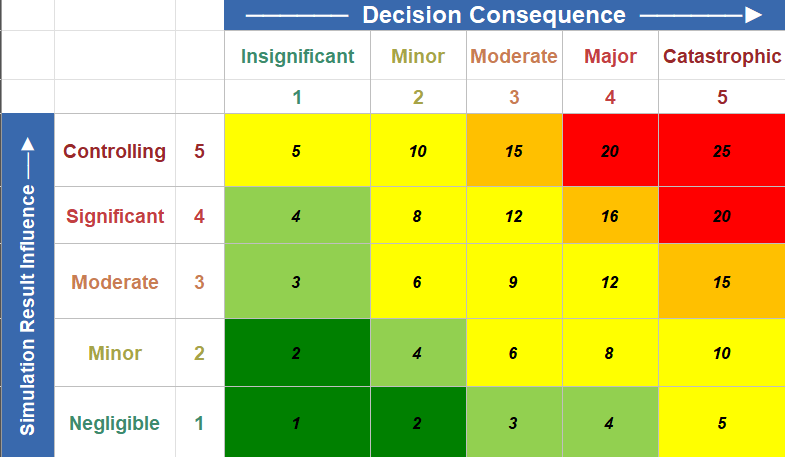



    



# Modelica Association Newsletter 2026-02

issued on <!-- TODO: issue date -->





    <i class="fa-regular fa-envelope" style="font-size:50px"></i>



## Letter from the Board

<!-- TODO: Letter from the Board -->



    <i class="fa-solid fa-building-columns" style="font-size:50px"></i>



## Modelica Association

### FMI Project News

<!-- TODO: FMI project news -->

<!-- END Modelica Association -->



    <i class="fa-solid fa-users" style="font-size:50px"></i>



## Conferences and user meetings

<!-- TODO: Conferences and user meetings -->

<!-- END Conferences and user meetings -->



    <i class="fa-solid fa-industry" style="font-size:50px"></i>



## Vendor news

<!-- TODO: other vendor submissions -->

### Model Based Innovation (MBI) Updates

MBI is the only one-stop shop for solutions based on the Modelica Association standards based in the United States. In addition to tool and library sales,
we also provide services to help you set up your processes to successfully use model based design for innovative product development.

#### [Tool Updates](https://modelbased.cloud/tools/)

As a **[Modelon Impact](https://www.modelon.com/modelon-impact/) Reseller**, MBI has developed a custom **MCP (Model Context Protocol) integration** that streamlines Modelica simulation and automated analysis workflows — turning simulation runs and report generation into simple, agent-driven steps. Alongside this, we've built specialized **skills files** tailored for advanced Modelica workflows in optimization and controls development, so your team can get more out of every modeling session.

 — inertia1.w, Modelica.Blocks.Examples.PID_Controller (16 samples, 0.0–5.0 s)')



<em>Sobol-sweep for PID controller response for varying plant parameters, generated with Modelon Imapct MCP server</em>



#### [Libraries](https://modelbased.cloud/libraries/)

For Libraries, our main Modelica platform is Modelon Impact, but we work with other tools as well, especially for open-source libraries, and extending open-source libraries. MBI has adapted some open source libraries to fully work with Modelon Impact. For example, we have adapted the [Industrial Control Systems Library](https://github.com/hubertus65/IndustrialControlSystems) for Modelon Impact and provide support for it. Further libraries are in preparation.

#### [Services and Training](https://modelbased.cloud/services/)

<!-- TODO: add images -->

MBI offers **open enrollment Modelica courses** to help your team level up fast:

- **Modelica Basics** — build a solid foundation in acausal, equation-based modeling from day one.
- **Advanced Modelica** — sharpen your skills for tackling complex, multi-domain systems.
- **Modelica for Controls Development** — bridge system simulation and controls engineering with hands-on, practical techniques.
- **Agentic AI for Modelica Modeling and Simulation** — learn to accelerate your modeling workflow with curated skills files and purpose-built MCP integrations.

In collaboration with **eXXcellent Solutions GmbH**, MBI also offers a dedicated training course on implementing the **Credible Simulation Process** with **SSP** and **SSP-Traceability** in [easySSP](https://www.easy-ssp.com/) — bringing rigor and traceability to every simulation result.

For organizations ready to scale, MBI offers a course on building a **flexible, scalable governance structure for system simulation**, driven by automated, agentic-AI-based checking of process requirements. Governance depth and verification rigor are tailored to your needs through a simulation risk assessment based on the **NAFEMS ASSESS Engineering Simulation Risk model**, updated to the latest **NASA Modelica and Simulation Handbook 7009B** (2026 edition). [Contact us](mailto:hubertus.tummescheit@modelbased.cloud) to learn more.

 

With the above portfolio, [MBI LLC](https://modelbased.cloud/) will select the right solution for you, no matter where you are on your journey to standards-based system simulation!
Please [contact us](https://modelbased.cloud/company/) with your requests!

*This article is provided by Hubertus Tummescheit, [Model Based Innovation LLC](https://modelbased.cloud/)*

<!-- END Vendor news -->



    <i class="fa-solid fa-book" style="font-size:50px"></i>



## News from libraries

<!-- TODO: News from libraries -->

<!-- END News from libraries -->



    <i class="fa-solid fa-graduation-cap" style="font-size:50px"></i>



## Education news

<!-- TODO: Education news -->

<!-- END Education news -->
